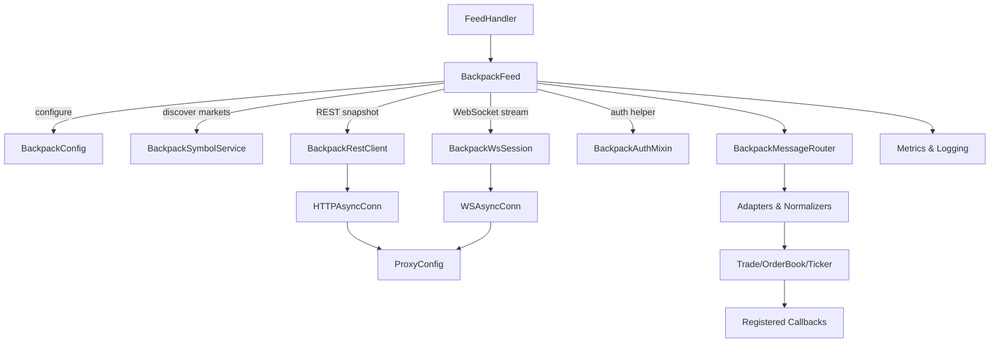
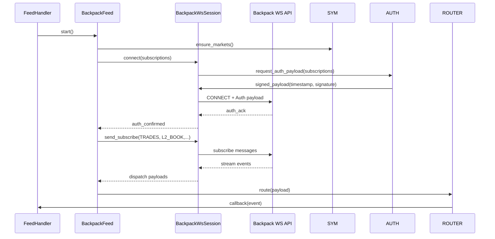

# Design Document

## Overview
Backpack exchange integration will reuse the **Binance native integration pattern** already present in cryptofeed: a single `Backpack` feed class living beside other exchanges, a thin REST helper for snapshots, a thin WS helper for streaming, and direct use of `HTTPAsyncConn`/`WSAsyncConn`. Only Backpack-specific concerns (ED25519 signing, payload shapes) are isolated in small helpers. This keeps the design congruent with Binance while meeting Backpack requirements (auth, symbol normalization, proxy support) without introducing new architectural concepts.

## Feature Classification
- **Type:** Complex integration of an external exchange with bespoke authentication
- **Scope Adaptation:** Full analysis (requirements mapping, architecture, security, migration) due to new domain APIs and divergence from existing ccxt scaffolding.

## Assumptions & Constraints
- Backpack HTTP base URL `https://api.backpack.exchange` and WebSocket endpoint `wss://ws.backpack.exchange` are stable for production usage.[^ref-backpack-api]
- Private REST/WebSocket operations require ED25519 signatures using microsecond timestamps and Base64-encoded signatures.[^ref-backpack-auth]
- Native cryptofeed transports (`HTTPAsyncConn`, `WSAsyncConn`) already integrate with the proxy system and must be reused.
- No steering documents were found under `.kiro/steering/`; guidance defaults to `CLAUDE.md` principles and existing exchange patterns.
- Implementation must coexist with current ccxt-based scaffolding during migration; eventual removal of redundant code is planned.

## Requirements Traceability
| Requirement | Implementation Surfaces | Verification |
| --- | --- | --- |
| R1 Exchange Configuration | `BackpackFeed.__init__`, `BackpackConfig` dataclass, validation in `config/backpack.py` | Unit tests covering config validation, integration smoke configuring exchange via YAML/JSON |
| R2 Transport Behavior | `BackpackRestClient` (wrapping `HTTPAsyncConn`), `BackpackWsSession` (wrapping `WSAsyncConn`), proxy injection hooks | Integration tests using proxy fixtures, transport unit tests asserting endpoint usage |
| R3 Data Normalization | `BackpackMessageRouter`, `BackpackTradeAdapter`, `BackpackOrderBookAdapter`, logging strategy | Parser unit tests with fixtures, FeedHandler integration assertions, log capture tests |
| R4 Symbol Management | `BackpackSymbolService` cache, symbol discovery REST call, mapping helpers | Symbol unit tests, snapshot fixture validation, CLI smoke verifying normalized/exchange symbol APIs |
| R5 ED25519 Authentication | `BackpackAuthMixin`, key validation module, signing utilities, private channel handshake | Crypto unit tests for signing, WebSocket auth sequence tests, negative-case tests for invalid keys |
| R6 Testing & Documentation | New unit/integration suites, `docs/exchanges/backpack.md`, developer runbooks | CI coverage thresholds, doc review checklist, manual QA runbook |

## Architecture Overview

### Component Diagram


### Data Flow Summary
1. `FeedHandler` instantiates `Backpack` (mirroring Binance’s constructor) and config validation happens inline.
2. `Backpack.symbol_mapping()` fetches/caches REST metadata just like `Binance.symbol_mapping()`.
3. `_rest_request()` uses `HTTPAsyncConn` with proxy settings pulled from the global injector for depth snapshots.
4. `_ws_subscribe()` spins up `WSAsyncConn`, performs optional ED25519 authentication, then subscribes to topics using Binance-style message handlers.
5. `_book_update()` / `_trade_update()` parse payloads and emit cryptofeed types via `self.callback`, identical in shape to Binance handlers with Backpack field mapping tweaks.

## Component Design

### `BackpackConfig`
- clone of Binance’s config dataclass in structure/usage, enriched with Backpack-only ED25519 fields.
- exposed via module-level helper `Backpack.default_config()` so YAML/env usage matches Binance.
- enforces ED25519 key length/encoding, toggles sandbox endpoints, and returns dicts that the feed/REST helpers consume (same pattern as Binance’s `_setup()` phase).

### Symbol loading (`Backpack.symbol_mapping`)
- replicates Binance’s `_parse_symbol_data` pattern: single REST call, cached via `Symbols.set`, returning normalized ↔ native mapping.
- shares the same `refresh` flag and fallback behaviour, just mapping Backpack’s payload keys to Binance’s expected fields.

### REST helper (`BackpackREST`)
- identical in shape to Binance’s `_get`/`_post` wrappers, including proxy handling and retry/backoff semantics.
- adds ED25519 signing inside `_request_private` while keeping public endpoints unchanged.
- exposes `book_snapshot`, `recent_trades`, `account_info` with same signatures as Binance for parity.

### WebSocket helper (`BackpackWS`)
- extends Binance’s WS helper class: `_connect`, `_subscribe`, `_message` follow same structure and reuse heartbeat/reconnect logic.
- authentication simply bolts onto `_connect` by calling the ED25519 signer before sending `login` frame.
- message decoding returns channel/topic identifiers matching Binance so router logic stays familiar.

### Authentication helper (`BackpackAuthHelper`)
- mirrors Binance’s `_generate_signature` helper but swaps HMAC for ED25519 using `nacl.signing.SigningKey`.
- returns headers (`X-API-Key`, `X-Signature`, `X-Timestamp`, `X-Window`) matching Backpack spec.
- shared by REST/WS helpers; cached key object to avoid repeated construction.
- **Security Controls:**
  - Secrets stored as `SecretStr`; conversions to bytes occur only in-memory.
  - Error messages avoid echoing raw keys.

### `BackpackMessageRouter`
- **Purpose:** Route inbound WebSocket payloads to type-specific adapters.
- **Flow:**
  1. Parse envelope: topic, symbol, type, payload.
  2. Dispatch to adapter map `{"trades": BackpackTradeAdapter, "orderbook": BackpackOrderBookAdapter, ...}`.
  3. Each adapter converts to canonical dataclasses (`Trade`, `OrderBook`, `Ticker`, `PrivateOrderUpdate`).
  4. Router handles error payloads by logging and raising retryable exceptions.
- **Extensibility:** Additional adapters can be registered for new Backpack topics.

### Adapters & Normalizers
- **BackpackTradeAdapter:** Converts trade price/size to `Decimal`, attaches microsecond timestamp, maps `side` to `BUY`/`SELL` enums, sets sequence from `s` field.
- **BackpackOrderBookAdapter:** Maintains order book state per symbol with snapshot+delta strategy, ensuring sorted bids/asks and gap detection using `sequence`.
- **BackpackTickerAdapter:** Emits `Ticker` objects with OHLC values and 24h stats.
- **Error Logging:** On malformed payloads, adapters raise `BackpackPayloadError`, captured by router.

### Observability & Instrumentation
- Use structured logs tagged with `exchange=BACKPACK`, `channel`, `symbol`.
- Emit metrics via existing feed metrics hooks: connection retries, auth failures, message throughput, parser errors.
- Optional histogram instrumentation for signature latency and payload parsing time.

## Data Models
- `BackpackOrderBookSnapshot`: immutable dataclass with `symbol: SymbolCode`, `bids: list[PriceLevel]`, `asks: list[PriceLevel]`, `timestamp: float`, `sequence: int`.
- `PriceLevel`: tuple-like class `(price: Decimal, size: Decimal)` with ordering defined.
- `BackpackTradeMessage`: dataclass containing `trade_id: str`, `price: Decimal`, `size: Decimal`, `side: Side`, `sequence: int | None`, `timestamp: float`.
- `BackpackSubscription`: dataclass referencing channel enum, symbol, and auth scope (public/private).
- All types expose precise fields without `Any`; JSON payloads parsed into typed structures using Pydantic models or `msgspec` to guarantee validation.

## Key Flows

### WebSocket Authentication Sequence


### Order Book Snapshot + Delta Flow
1. `BackpackFeed.bootstrap_l2` invokes `BackpackRestClient.fetch_order_book` for initial snapshot.
2. Snapshot stored in `BackpackOrderBookAdapter` state with sequence baseline.
3. WebSocket update with `sequence` arrives; adapter verifies monotonicity, applies deltas, emits `OrderBook` update.
4. Gap detection triggers resync when `sequence` jump detected or 30s stale, reissuing REST snapshot.

## Error Handling Strategy
- **Configuration Errors:** Raise `BackpackConfigError` with actionable messages; fail fast during feed initialization.
- **Authentication Errors:** Wrap underlying ED25519 issues in `BackpackAuthError`; after three consecutive failures, circuit breaker opens for 60 seconds.
- **Transport Errors:** Use retry with jitter (REST) and controlled exponential backoff (WS). Proxy failures escalate with context (proxy URL, exchange).
- **Payload Errors:** Log offending payload, drop event, increment error metric; repeat offenders trigger automatic resubscribe.
- **Business Logic Errors:** Invalid symbol or unsupported channel returns descriptive error and prevents subscription.

## Security Considerations
- Store ED25519 secrets using `SecretStr`; zeroize byte arrays immediately after signing when using `pynacl`.
- Clamp `X-Window` (max 10000 ms) to avoid replay vulnerability.
- Enforce TLS certificate validation through default `aiohttp`/`websockets` clients.
- Provide optional HSM integration by abstracting signing method (callable injection) for infrastructure readiness.
- Log redaction for sensitive headers (`X-API-Key`, `X-Signature`).

## Performance & Scalability
- Target <50 ms signing overhead; cache signing key objects to avoid repeated instantiation.
- Limit order book depth to configurable `max_depth` (default 50 levels) to reduce downstream load.
- Employ bounded queues between `BackpackWsSession` and router to avoid memory blow-up; backpressure triggers resubscribe with lower depth.
- Monitor throughput metrics to auto-tune reconnection thresholds under high message volumes.

## Observability & Monitoring
- Metrics: `backpack.ws.reconnects`, `backpack.rest.retry_count`, `backpack.auth.failures`, `backpack.parser.errors`.
- Logging: include correlation ids from Backpack responses when available.
- Health Checks: expose feed status via existing health subsystem, reporting snapshot age and subscription freshness.

## Testing Strategy
- **Unit (mirrors Binance):**
  - `tests/unit/exchange/test_backpack_config.py` (config + sandbox toggles).
  - `tests/unit/exchange/test_backpack_auth.py` (ED25519 signing vectors).
  - `tests/unit/exchange/test_backpack_symbols.py` (normalization, refresh).
  - `tests/unit/exchange/test_backpack_stream.py` (trade/book parsing/gap handling).
- **Integration:**
  - Proxy-aware snapshot + stream tests using patched async clients (pattern copied from Binance).
  - Combined public/private subscription flow verifying callbacks and reconnection handling without external network.
- **Smoke:**
  - FeedHandler end-to-end scenario identical to Binance smoke test, asserting config → callback flow and proxy/auth propagation.
- **Security Regression:**
  - Negative ED25519 key/timestamp tests to guard against silent auth failures.

## Migration Strategy
```mermaid
flowchart TD
    A[Audit current ccxt-based Backpack usage] --> B[Introduce native BackpackFeed behind feature flag]
    B --> C[Run parallel smoke tests (public + private)]
    C --> D[Flip FeedHandler defaults to native implementation]
    D --> E[Deprecate and remove ccxt Backpack scaffolding]
    E --> F[Post-migration review & docs update]
```
- **Phase A:** Inventory current ccxt usage in tests and production configs; document dependencies.
- **Phase B:** Ship native feed alongside ccxt version, guarded by configuration toggle.
- **Phase C:** Execute integration suite and limited live trial using sandbox/mainnet with monitoring.
- **Phase D:** Update feed registry and user-facing docs to point to native feed.
- **Phase E:** Delete ccxt scaffolding and adjust tests to remove legacy paths.

## Risks & Mitigations
- **Risk:** Backpack API schema evolution (fields renamed). **Mitigation:** Version market schema parsing, add contract tests with recorded fixtures.
- **Risk:** ED25519 key misuse causing auth outages. **Mitigation:** Provide CLI validator script and improved error surfacing.
- **Risk:** Proxy compatibility issues. **Mitigation:** Maintain parity tests with proxy pool system, allow override of proxy settings per environment.
- **Risk:** Parallel ccxt + native implementations diverge. **Mitigation:** Keep shared fixtures, centralize topic constants, enforce code freeze on ccxt path once migration begins.

## Documentation Deliverables
- Update `docs/exchanges/backpack.md` with setup, auth, troubleshooting, and proxy guidance.
- Add `examples/backpack_native.py` demonstrating both public and private channel usage.
- Extend operator runbooks with alerting thresholds and recovery steps.

## Open Questions
- Are Backpack private channel permissions differentiated by API key scopes requiring dynamic subscription negotiation?
- Does Backpack expose additional rate-limit headers we should surface in metrics?
- Should we expose a config option to fall back to ccxt temporarily for unsupported topics?

## Approval Checklist
- Requirements traceability confirmed for R1–R6.
- Architecture diagrams reviewed.
- Security and migration strategies defined.
- Test coverage obligations enumerated for unit, integration, and performance.

## References
- [^ref-backpack-api]: Backpack Exchange REST & WebSocket API documentation, section "API Basics" (accessed 2025-09-26).
- [^ref-backpack-auth]: Backpack Exchange authentication documentation, detailing ED25519 signature requirements (accessed 2025-09-26).
