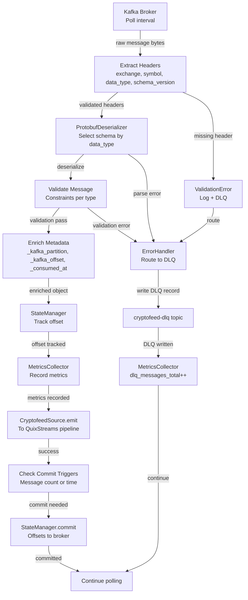
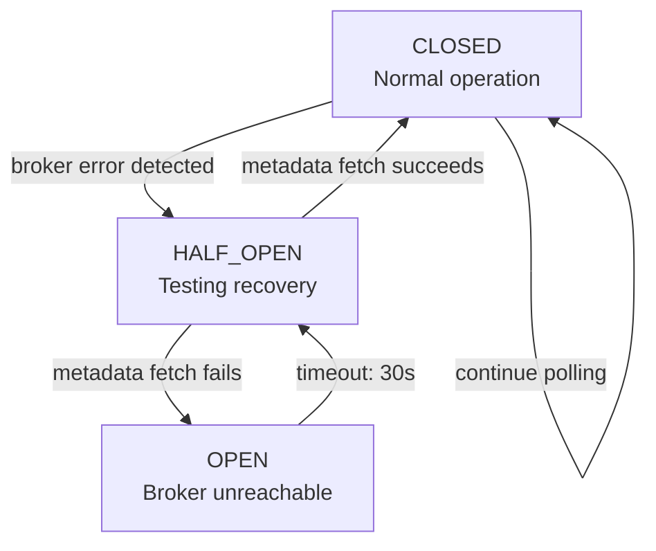
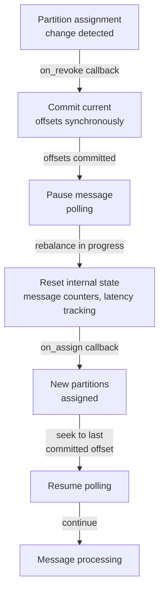

# CryptofeedSource for QuixStreams - Technical Design (Spec 11)

## Document Control

**Status**: Design Generated - Ready for Review
**Version**: 0.1.0
**Last Updated**: 2025-11-14
**Owner**: Engineering
**Related Specs**:
- Spec 0 (normalized-data-schema-crypto) - protobuf schema definitions
- Spec 1 (protobuf-callback-serialization) - serialization helpers
- Spec 3 (market-data-kafka-producer) - Kafka topic production

---

## 1. Overview & Context

### Purpose

Enable QuixStreams applications to consume protobuf-serialized market data from Kafka topics produced by Spec 3 (market-data-kafka-producer), implementing a QuixStreams-compatible Source that handles deserialization, validation, state management, error handling, and observability for real-time streaming analytics workloads.

### Target Users

- **Data Engineers**: Building real-time analytics pipelines with QuixStreams
- **Quantitative Researchers**: Consuming market data for live signal generation
- **Analytics Teams**: Aggregating, transforming, and persisting market data to storage systems (Iceberg, DuckDB, Parquet)

### Scope

**In Scope**:
- CryptofeedSource class extending QuixStreams Source interface
- Kafka consumer integration via confluent-kafka-python
- Protobuf deserialization for 14 data types with header extraction (exchange, symbol, data_type, schema_version)
- Error handling with Dead Letter Queue (DLQ) routing
- State management (offset tracking, checkpointing, consumer group coordination)
- Monitoring and observability (Prometheus metrics, structured JSON logging, health checks)
- Configuration management (YAML, environment variables, programmatic API)
- Schema version compatibility and migration guidance
- Circuit breaker pattern for broker failure resilience

**Out of Scope**:
- Storage implementation (Iceberg, DuckDB, Parquet - consumer responsibility)
- Analytics and aggregation logic (consumer responsibility)
- Stream processing transformations (consumer responsibility)
- Data retention policies (consumer responsibility)
- QuixStreams application orchestration (framework responsibility)

**Boundary**: This spec ends at message emission to QuixStreams pipeline. Consumers independently implement storage, analytics, and transformations.

### Key Design Principles

1. **Separation of Concerns**: CryptofeedSource handles ingestion only; consumers handle analytics/storage
2. **SOLID Principles**: Single responsibility, open/closed extension, interface segregation
3. **Reliability**: No message loss (exactly-once offset semantics), graceful error handling
4. **Observability**: Comprehensive metrics, structured logging, health endpoints
5. **Resilience**: Circuit breaker pattern, exponential backoff, DLQ recovery
6. **Flexibility**: YAML + env var configuration, multiple partition strategies, custom deserializers
7. **Type Safety**: Strong typing throughout (Python 3.10+)

---

## 2. Architecture Overview

### 2.1 High-Level Architecture

```
┌────────────────────────────────────────────────────────────────┐
│ Kafka Cluster (Produced by Spec 3: market-data-kafka-producer) │
│                                                                │
│ Topics: cryptofeed.trade, cryptofeed.orderbook, ...           │
│ (14 data types, protobuf-serialized messages with headers)    │
└─────────────────┬──────────────────────────────────────────────┘
                  │
                  │ Kafka Consumer Poll
                  ▼
┌────────────────────────────────────────────────────────────────┐
│ CryptofeedSource (extends QuixStreams.Source)                  │
│                                                                │
│ ┌──────────────────────────────────────┐                       │
│ │ KafkaConsumerAdapter                 │                       │
│ │ • Consumer lifecycle management      │                       │
│ │ • Poll messages from broker          │                       │
│ │ • Partition rebalancing callbacks    │                       │
│ └──────────────────────────────────────┘                       │
│           ↓ Raw KafkaMessage                                   │
│                                                                │
│ ┌──────────────────────────────────────┐                       │
│ │ ProtobufDeserializer                 │                       │
│ │ • Extract headers (exchange, symbol) │                       │
│ │ • Deserialize protobuf by data_type  │                       │
│ │ • Validate required fields           │                       │
│ │ • Enrich with metadata               │                       │
│ └──────────────────────────────────────┘                       │
│           ↓ Deserialized Object                                │
│                                                                │
│ ┌──────────────────────────────────────┐                       │
│ │ ErrorHandler                         │                       │
│ │ • Circuit breaker (CLOSED/HALF_OPEN/OPEN) │                 │
│ │ • Exponential backoff retry logic    │                       │
│ │ • Route errors to DLQ topic          │                       │
│ └──────────────────────────────────────┘                       │
│           ↓ Valid Message or DLQ Record                        │
│                                                                │
│ ┌──────────────────────────────────────┐                       │
│ │ StateManager                         │                       │
│ │ • Track consumed offsets             │                       │
│ │ • Commit offsets atomically          │                       │
│ │ • Resume from last committed offset  │                       │
│ │ • RocksDB state store (optional)     │                       │
│ └──────────────────────────────────────┘                       │
│           ↓ Offset Tracked                                     │
│                                                                │
│ ┌──────────────────────────────────────┐                       │
│ │ MetricsCollector                     │                       │
│ │ • Record Prometheus metrics          │                       │
│ │ • Track message latency, errors      │                       │
│ │ • Expose /metrics endpoint           │                       │
│ └──────────────────────────────────────┘                       │
│           ↓ Metrics Published                                  │
│                                                                │
└────────────────────────────────────────────────────────────────┘
                  ↓
         Emit to QuixStreams Pipeline
                  ↓
┌────────────────────────────────────────────────────────────────┐
│ QuixStreams Application                                        │
│ (User transforms: aggregations, windowing, storage, analytics) │
└────────────────────────────────────────────────────────────────┘
```

### 2.2 Component Architecture

```
┌────────────────────────────────────────────────────────────────┐
│ CryptofeedSource (Core Component)                              │
│                                                                │
│ __init__(name, kafka_config, topics, data_types, ...)         │
│ configure() - validation                                       │
│ run() - main message loop                                      │
│ shutdown() - cleanup                                           │
│                                                                │
├─→ _consumer: KafkaConsumerAdapter                              │
├─→ _deserializers: Dict[data_type, ProtobufDeserializer]       │
├─→ _error_handler: ErrorHandler                                │
├─→ _state_manager: StateManager                                │
├─→ _metrics_collector: MetricsCollector                         │
└─→ _config_manager: ConfigManager                              │
```

### 2.3 Data Flow Diagram

```
Kafka Broker
    ↓
[Consumer.poll(timeout_ms)] ← KafkaConsumerAdapter
    ↓ (raw message bytes + headers)
[Extract headers: exchange, symbol, data_type, schema_version]
    ↓
[ProtobufDeserializer.deserialize(bytes, data_type)]
    ↓
[Validate(Trade: price > 0, OrderBook: bids/asks ordered, ...)]
    ↓
[Enrich: add _kafka_partition, _kafka_offset, _consumed_at]
    ↓
[ErrorHandler: catch + route exceptions to DLQ]
    ↓
[StateManager: track offset, schedule commit]
    ↓
[MetricsCollector: record messages_consumed_total, latency]
    ↓
CryptofeedSource.emit(message) → QuixStreams Pipeline
    ↓
(User transforms: aggregations, persistence, analytics)
```

### 2.4 Error Path Diagram

```
Exception in Deserialization/Validation
    ↓
[ErrorHandler.handle_error(exception, message, stage)]
    ↓
Classify Error Type
    ├─ Transient (broker unavailable)
    │   └─→ Check circuit breaker state
    │       ├─ CLOSED: retry with exponential backoff
    │       ├─ HALF_OPEN: attempt single metadata fetch
    │       └─ OPEN: raise CircuitBreakerOpenException
    │
    ├─ Deserialization (protobuf parse error)
    │   └─→ Format DLQ record: {original_message, headers, error, timestamp}
    │       └─→ Write to cryptofeed-dlq topic
    │
    └─ Validation (data constraint violation)
        └─→ Log validation error with context (exchange, symbol, constraint)
            └─→ Write to cryptofeed-dlq topic
                └─→ MetricsCollector.increment(dlq_messages_total)
```

---

## 3. Detailed Component Design

### 3.1 CryptofeedSource (Main Component)

**Responsibility & Boundaries**:
- Extends QuixStreams Source interface for pipeline integration
- Orchestrates Kafka consumer lifecycle (start, run, shutdown)
- Coordinates message polling, deserialization, validation, enrichment
- Manages error handling and state tracking
- Emits deserialized messages to QuixStreams pipeline

**Dependencies**:
- **Inbound**: QuixStreams StreamingApp (registers as Source)
- **Outbound**: All internal components (Adapter, Deserializer, ErrorHandler, StateManager, MetricsCollector, ConfigManager)
- **External**: confluent-kafka-python, protobuf, prometheus-client, structlog

**Contract Definition**:

```python
class CryptofeedSource(Source):
    """QuixStreams-compatible Kafka source for cryptofeed market data.

    Contract:
    - Preconditions:
      * broker_addresses is non-empty list of valid Kafka brokers
      * topics list contains at least one valid cryptofeed.* topic
      * Kafka broker is accessible within metadata_fetch_timeout
      * data_types list matches topics (each topic has valid data_type)

    - Postconditions:
      * Consumer group is created/joined after start()
      * run() continuously polls and emits deserialized messages
      * shutdown() commits final offsets and closes consumer
      * No messages lost during graceful shutdown

    - Invariants:
      * Only one message polled per iteration (synchronous processing)
      * All emitted messages include metadata (_kafka_partition, _kafka_offset, _consumed_at)
      * Offsets committed atomically per commit_interval_messages or commit_interval_seconds
      * Circuit breaker state transitions follow defined state machine
    """

    def __init__(
        self,
        name: str,
        kafka_config: Dict[str, Any],
        topics: List[str],
        data_types: Optional[List[str]] = None,
        enable_metrics: bool = True,
        metrics_port: int = 8000,
        enable_dlq: bool = True,
        dlq_topic: str = "cryptofeed-dlq",
        poll_timeout_ms: int = 100,
        commit_interval_messages: int = 1000,
        commit_interval_seconds: int = 30,
        max_retries: int = 5,
        base_delay_ms: int = 100,
        circuit_breaker_timeout_ms: int = 30000,
        state_store_path: Optional[str] = None,
        config_file: Optional[str] = None,
        **kwargs
    ) -> None:
        """Initialize CryptofeedSource.

        Args:
            name: Source name for QuixStreams identification
            kafka_config: confluent-kafka consumer configuration dict
            topics: List of Kafka topics to subscribe to (cryptofeed.*)
            data_types: Optional list of data types matching topics
            enable_metrics: Enable Prometheus metrics collection (default: True)
            metrics_port: Port for /metrics endpoint (default: 8000)
            enable_dlq: Route errors to Dead Letter Queue (default: True)
            dlq_topic: DLQ topic name (default: "cryptofeed-dlq")
            poll_timeout_ms: Kafka poll timeout in milliseconds (default: 100)
            commit_interval_messages: Messages between commits (default: 1000)
            commit_interval_seconds: Seconds between commits (default: 30)
            max_retries: Max retries for transient errors (default: 5)
            base_delay_ms: Base exponential backoff delay (default: 100ms)
            circuit_breaker_timeout_ms: CB state transition timeout (default: 30s)
            state_store_path: RocksDB path for stateful operations (optional)
            config_file: YAML config file path (optional, overrides kwargs)
            **kwargs: Additional configuration parameters
        """
        # Implementation details in phase 1
        pass

    def configure(self) -> None:
        """Pre-execution validation.

        Validates:
        - Configuration schema (all required keys, valid values)
        - Kafka broker connectivity (metadata fetch)
        - Topic accessibility (can subscribe)
        - DLQ topic exists or can be created
        - Schema registry connectivity (if configured)

        Raises:
            ConfigurationError: If validation fails
        """
        pass

    def run(self) -> None:
        """Main event loop implementing Source.run contract.

        - Polls Kafka consumer at poll_timeout_ms intervals
        - Routes messages through deserialization pipeline
        - Catches all exceptions in pipeline without halting
        - Tracks offsets for periodic commits
        - Records metrics for observability
        - Yields control to QuixStreams between message processing

        Raises:
            CircuitBreakerOpenException: Broker unreachable, recovery failed
        """
        pass

    def shutdown(self) -> None:
        """Graceful shutdown.

        - Commits final pending offsets synchronously
        - Closes Kafka consumer connection
        - Flushes RocksDB state store (if enabled)
        - Closes metrics HTTP server
        - Logs final statistics
        """
        pass

    def default_topic(self) -> Optional[Topic]:
        """Return output Topic for QuixStreams pipeline.

        Returns the first subscribed topic as default output.
        """
        pass
```

**Key Methods**:
- `__init__()` - Initialize with config, create components
- `configure()` - Validate configuration, test Kafka connectivity
- `run()` - Main polling loop, emits deserialized messages
- `shutdown()` - Commit offsets, close consumer, cleanup resources
- `default_topic()` - Return output Topic for QuixStreams

**Internal State**:
- `_consumer`: KafkaConsumerAdapter managing Kafka consumer
- `_deserializers`: Dict mapping data_type → ProtobufDeserializer instances
- `_error_handler`: ErrorHandler managing circuit breaker, retries, DLQ
- `_state_manager`: StateManager tracking offsets, commits
- `_metrics_collector`: MetricsCollector recording Prometheus metrics
- `_config_manager`: ConfigManager managing YAML/env var configuration

---

### 3.2 KafkaConsumerAdapter

**Responsibility & Boundaries**:
- Wraps confluent-kafka-python KafkaConsumer
- Manages consumer lifecycle (create, subscribe, poll, commit, close)
- Handles partition rebalancing (on_assign, on_revoke callbacks)
- Validates broker connectivity

**Dependencies**:
- **External**: confluent-kafka (2.x), Python logging

**Contract Definition**:

```python
class KafkaConsumerAdapter:
    """Kafka consumer abstraction for CryptofeedSource.

    Manages lifecycle of confluent-kafka KafkaConsumer with
    rebalancing callbacks and offset management.

    Contract:
    - Preconditions:
      * broker_addresses non-empty, reachable within timeout
      * topics list non-empty, topics exist or can be auto-created
      * consumer_group non-empty string

    - Postconditions:
      * Consumer successfully joins group and subscribes to topics
      * poll() returns KafkaMessage or None within timeout
      * Offsets committed atomically to broker

    - Invariants:
      * Only one poll() in-flight at a time
      * Rebalance callbacks always preceded by on_revoke (if assigned)
      * on_assign called after rebalance with new partition set
    """

    def create_consumer(self) -> None:
        """Factory method to create confluent-kafka KafkaConsumer.

        Configuration:
        - bootstrap.servers: broker_addresses
        - group.id: consumer_group
        - auto.offset.reset: auto_offset_reset (earliest/latest)
        - enable.auto.commit: false (manual commits)
        - isolation.level: read_committed (exactly-once)
        - session.timeout.ms: 30000
        - heartbeat.interval.ms: 10000
        - on_assign: self._on_assign
        - on_revoke: self._on_revoke

        Raises:
            KafkaException: If consumer creation fails
        """
        pass

    def validate_broker_connectivity(self, timeout_ms: int = 5000) -> bool:
        """Test broker connectivity via metadata fetch.

        Args:
            timeout_ms: Metadata fetch timeout in milliseconds

        Returns:
            True if metadata fetch succeeds, False otherwise

        Raises:
            KafkaException: On persistent connectivity failure
        """
        pass

    def subscribe(self, topics: List[str]) -> None:
        """Subscribe to Kafka topics.

        Args:
            topics: List of topic names (cryptofeed.*)

        Raises:
            KafkaException: If subscription fails
        """
        pass

    def poll(self, timeout_ms: int = 100) -> Optional[KafkaMessage]:
        """Poll for next message with timeout.

        Args:
            timeout_ms: Poll timeout in milliseconds

        Returns:
            KafkaMessage if available, None if timeout expires

        Raises:
            KafkaException: On broker error, partition loss
        """
        pass

    def commit(self, offsets: Dict[Tuple[str, int], int]) -> None:
        """Commit offsets synchronously to broker.

        Args:
            offsets: Dict mapping (topic, partition) → offset

        Raises:
            KafkaException: If commit fails
        """
        pass

    def seek(self, topic: str, partition: int, offset: int) -> None:
        """Seek to specific offset on partition.

        Used to resume from last committed offset after restart.

        Args:
            topic: Topic name
            partition: Partition number
            offset: Offset to seek to

        Raises:
            KafkaException: If seek fails
        """
        pass

    def close(self) -> None:
        """Close consumer connection gracefully.

        Leaves consumer group, closes broker connections.
        """
        pass
```

**Error Handling**:
- KafkaException wrapping all broker-level errors
- Connectivity validation before poll (fail-fast)
- Rebalance exception handling (log + propagate)

---

### 3.3 ProtobufDeserializer

**Responsibility & Boundaries**:
- Deserialize protobuf message bytes using Spec 0 schemas
- Extract and validate Kafka message headers
- Convert protobuf objects to Python dicts
- Enrich with metadata (_kafka_partition, _kafka_offset, _consumed_at)
- Validate message constraints (Trade: price > 0, OrderBook: bid < ask, etc.)

**Dependencies**:
- **External**: protobuf (5.0+), cryptofeed.backends.protobuf_helpers (Spec 1)
- **Spec Integration**: Spec 0 proto_bindings for 14 data types

**Data Types Supported** (14 total):
1. Trade: exchange, symbol, timestamp, price, amount, side, id, type
2. Ticker: exchange, symbol, timestamp, bid, ask
3. OrderBook: exchange, symbol, timestamp, bids, asks
4. Candle: exchange, symbol, start, end, interval, open, high, low, close, volume, trades
5. Funding: exchange, symbol, timestamp, mark_price, rate, predicted_rate, next_funding_time
6. Liquidation: exchange, symbol, timestamp, price, amount, side, id
7. OpenInterest: exchange, symbol, timestamp, open_interest
8. Index: exchange, symbol, timestamp, price
9. Balance: exchange, currency, available, reserved, timestamp
10. Position: exchange, symbol, contracts, unrealized_pnl, timestamp
11. Fill: exchange, symbol, order_id, trade_id, price, amount, fee, timestamp
12. OrderInfo: exchange, symbol, order_id, status, timestamp, filled, average_price
13. Order: exchange, symbol, order_id, order_type, side, price, amount, timestamp
14. Transaction: exchange, transaction_id, currency, amount, timestamp, status

**Validation Rules**:
- Trade: price > 0, amount > 0, timestamp > 0
- OrderBook: bid < ask (within 1e-8 tolerance), all (price, amount) tuples valid
- Candle: open <= high, low <= close, close in [low, high], volume >= 0
- Ticker: ask >= bid (within 1e-8 tolerance), timestamp > 0
- Funding: rate, mark_price finite numbers
- All: required fields present, types match schema

**Contract Definition**:

```python
class ProtobufDeserializer:
    """Protobuf message deserialization for cryptofeed data types.

    Contract:
    - Preconditions:
      * message_bytes is valid protobuf-encoded data
      * data_type matches one of 14 supported types
      * headers contain required keys: exchange, symbol, data_type

    - Postconditions:
      * Deserialized object contains all protobuf fields
      * Enrichment fields added: _kafka_partition, _kafka_offset, _consumed_at
      * Validation errors raise DeserializationError or ValidationError

    - Invariants:
      * No field coercion (strict type checking)
      * Decimal precision preserved through string intermediate
      * Timestamps converted to float seconds consistently
    """

    def __init__(self, data_type: str) -> None:
        """Initialize deserializer for specific data type.

        Args:
            data_type: One of 14 supported data types

        Raises:
            ValueError: If data_type not supported
        """
        pass

    def deserialize(
        self,
        raw_bytes: bytes,
        headers: Dict[str, str],
    ) -> Dict[str, Any]:
        """Deserialize protobuf message bytes.

        Args:
            raw_bytes: Raw message bytes from Kafka
            headers: Message headers (exchange, symbol, data_type, schema_version)

        Returns:
            Dict with deserialized fields plus metadata
            {
                'exchange': 'coinbase',
                'symbol': 'BTC-USD',
                'price': '45000.50',
                'amount': '0.123',
                'timestamp': 1699999999.123,
                '_kafka_partition': 5,
                '_kafka_offset': 12345,
                '_consumed_at': 1699999999.456,
                'schema_version': 'v1'
            }

        Raises:
            DeserializationError: If protobuf parse fails
            ValidationError: If data validation fails
        """
        pass

    def validate_message(
        self,
        proto_msg: Message,
        data_type: str,
    ) -> bool:
        """Validate message constraints per data type.

        Args:
            proto_msg: Deserialized protobuf message
            data_type: Data type (Trade, OrderBook, etc.)

        Returns:
            True if validation passes

        Raises:
            ValidationError: If constraint violated
        """
        pass

    def _validate_trade(self, trade: Dict[str, Any]) -> None:
        """Validate Trade message constraints.

        Constraints:
        - price > 0
        - amount > 0
        - timestamp > 0
        - side in ['buy', 'sell', '']

        Raises:
            ValidationError: If constraint violated
        """
        pass

    def _validate_orderbook(self, orderbook: Dict[str, Any]) -> None:
        """Validate OrderBook message constraints.

        Constraints:
        - bids[].price < asks[].price (with 1e-8 tolerance)
        - bids ordered descending by price (or unordered, preserved as-is)
        - asks ordered ascending by price (or unordered, preserved as-is)
        - All (price, amount) tuples with price > 0, amount > 0

        Raises:
            ValidationError: If constraint violated
        """
        pass

    def _validate_candle(self, candle: Dict[str, Any]) -> None:
        """Validate Candle message constraints.

        Constraints:
        - open <= high
        - low <= close
        - close in [low, high]
        - volume >= 0
        - start < end

        Raises:
            ValidationError: If constraint violated
        """
        pass

    def _validate_ticker(self, ticker: Dict[str, Any]) -> None:
        """Validate Ticker message constraints.

        Constraints:
        - ask >= bid (within 1e-8 tolerance)
        - bid > 0, ask > 0
        - timestamp > 0

        Raises:
            ValidationError: If constraint violated
        """
        pass

    def enrich_metadata(
        self,
        msg_dict: Dict[str, Any],
        kafka_partition: int,
        kafka_offset: int,
        consumed_at: float,
    ) -> Dict[str, Any]:
        """Add operational metadata to message.

        Args:
            msg_dict: Deserialized message dict
            kafka_partition: Partition number
            kafka_offset: Message offset
            consumed_at: Timestamp when consumed (float seconds)

        Returns:
            Enriched dict with metadata fields
            - _kafka_partition: int
            - _kafka_offset: int
            - _consumed_at: float
        """
        pass
```

---

### 3.4 ErrorHandler

**Responsibility & Boundaries**:
- Classify errors (transient vs unrecoverable)
- Implement circuit breaker pattern (3 states: CLOSED, HALF_OPEN, OPEN)
- Execute exponential backoff retry logic
- Route errors to Dead Letter Queue
- Track error metrics

**Circuit Breaker State Machine**:
```
CLOSED (normal operation)
  ↓ [broker error]
HALF_OPEN (testing recovery)
  ├─ [metadata_fetch succeeds] → CLOSED
  └─ [metadata_fetch fails] → OPEN
OPEN (broker unavailable)
  └─ [timeout: 30s] → HALF_OPEN
```

**Error Categories**:
- **Transient**: BrokerNotAvailable, NetworkException, TimeoutException → Retry with exponential backoff
- **Parse Errors**: ProtobufDecodeError, InvalidMessage → Route to DLQ, continue processing
- **Validation Errors**: ConstraintViolation (bid >= ask) → Route to DLQ, continue processing
- **Unrecoverable**: UnknownDataType, MessageTooLarge → Log + skip, continue processing

**Contract Definition**:

```python
class ErrorHandler:
    """Error classification, circuit breaker, retry logic, DLQ routing.

    Contract:
    - Preconditions:
      * exception is a valid Python exception instance
      * message_bytes is original raw message (may be invalid)
      * stage is one of: 'deserialization', 'validation', 'enrichment'

    - Postconditions:
      * Errors classified and routed appropriately
      * Transient errors trigger retries (max 5)
      * Unrecoverable errors written to DLQ
      * Circuit breaker state transitions follow state machine

    - Invariants:
      * Circuit breaker timeout always respected
      * Exponential backoff strictly increases between retries
      * DLQ writes never cascade failures (error logged, continue)
    """

    def handle_error(
        self,
        exception: Exception,
        raw_message: bytes,
        headers: Dict[str, str],
        stage: str,
    ) -> Optional[Tuple[str, Dict[str, Any]]]:
        """Handle error and determine recovery action.

        Args:
            exception: Exception that occurred
            raw_message: Original message bytes (for DLQ)
            headers: Message headers
            stage: Processing stage (deserialization, validation, enrichment)

        Returns:
            Tuple (action, details) where action is:
            - 'retry': Retry with backoff
            - 'dlq': Route to Dead Letter Queue
            - 'skip': Log and skip message
            - 'fail': Raise exception to caller

        Raises:
            CircuitBreakerOpenException: If broker unreachable
        """
        pass

    def should_retry(
        self,
        error_type: str,
        retry_count: int,
    ) -> bool:
        """Determine if error should be retried.

        Args:
            error_type: Classification of error
            retry_count: Current retry count (0-based)

        Returns:
            True if should retry, False if max retries exceeded

        Algorithm:
        - Transient errors: retry if retry_count < max_retries (5)
        - Parse errors: never retry (route to DLQ)
        - Validation errors: never retry (route to DLQ)
        """
        pass

    def get_backoff_delay(self, retry_count: int) -> float:
        """Calculate exponential backoff delay in seconds.

        Args:
            retry_count: Current retry count (0-based)

        Returns:
            Delay in seconds for this retry

        Algorithm:
        - delay_ms = base_delay_ms * (2 ** retry_count)
        - jitter: optional random ±10%
        - delay_ms = min(delay_ms, max_delay_ms)

        Examples:
        - retry 0: 100ms
        - retry 1: 200ms
        - retry 2: 400ms
        - retry 3: 800ms
        - retry 4: 1600ms (capped at max_delay)
        """
        pass

    def check_circuit_breaker(self) -> CircuitBreakerState:
        """Check circuit breaker state, execute state transitions.

        Returns:
            Current state (CLOSED, HALF_OPEN, OPEN)

        State Transitions:
        - CLOSED + broker error → HALF_OPEN
        - HALF_OPEN + timeout expired → HALF_OPEN (no change)
        - HALF_OPEN + metadata fetch success → CLOSED
        - HALF_OPEN + metadata fetch fail → OPEN
        - OPEN + timeout expired → HALF_OPEN
        """
        pass

    def route_to_dlq(
        self,
        raw_message: bytes,
        headers: Dict[str, str],
        error_code: str,
        error_message: str,
        stage: str,
    ) -> None:
        """Write error record to Dead Letter Queue.

        DLQ Record Format:
        {
            'original_topic': 'cryptofeed.trade',
            'partition': 5,
            'offset': 12345,
            'error_code': 'parse_error',
            'error_message': 'Failed to deserialize protobuf: ...',
            'error_stage': 'deserialization',
            'timestamp': '2025-11-14T23:30:45.123Z',
            'original_headers': {...},
            'original_message_bytes': base64(message),
            'recovery_action': 'manual_reprocessing_required'
        }

        Args:
            raw_message: Original message bytes
            headers: Message headers
            error_code: Error classification (parse_error, validation_error, etc.)
            error_message: Human-readable error description
            stage: Processing stage where error occurred

        Raises:
            DLQWriteException: If DLQ write fails (logged, not raised)
        """
        pass
```

---

### 3.5 StateManager

**Responsibility & Boundaries**:
- Track consumed Kafka offsets per topic/partition
- Commit offsets atomically to broker (dual-trigger: message count OR time)
- Resume from last committed offset on restart
- Manage optional RocksDB state store for stateful operations
- Handle partition rebalancing (flush on revoke, reset on assign)

**Commit Strategy**:
- Default: every 1000 messages OR every 30 seconds (whichever first)
- Configurable: commit_interval_messages, commit_interval_seconds
- Atomic: all offsets committed together (all-or-nothing)

**Contract Definition**:

```python
class StateManager:
    """Offset tracking, checkpointing, state store management.

    Contract:
    - Preconditions:
      * offset tuple is (topic, partition, offset) with offset >= -1
      * offsets committed in monotonically increasing order per partition

    - Postconditions:
      * Offsets tracked in internal state before commit
      * Commit executed synchronously when triggers fire
      * Consumer resumes from last committed offset + 1

    - Invariants:
      * No offset commits during rebalance (pause polling)
      * State store flushes atomically before partition release
      * Last committed offset never decreases
    """

    def track_offset(
        self,
        topic: str,
        partition: int,
        offset: int,
    ) -> None:
        """Track offset for eventual commit.

        Called after message successfully processed.

        Args:
            topic: Topic name
            partition: Partition number
            offset: Message offset
        """
        pass

    def should_commit(self) -> bool:
        """Determine if commit triggers have fired.

        Returns:
            True if messages since last commit >= commit_interval_messages
            OR time since last commit >= commit_interval_seconds
        """
        pass

    def commit_offsets(
        self,
        offsets: Optional[Dict[Tuple[str, int], int]] = None,
    ) -> None:
        """Commit offsets synchronously to broker.

        Args:
            offsets: Optional dict override. If None, use tracked offsets.
                    Dict format: {(topic, partition): offset}

        Raises:
            StateStoreException: If commit fails
        """
        pass

    def get_last_committed_offset(
        self,
        topic: str,
        partition: int,
    ) -> int:
        """Get last committed offset for partition.

        Returns:
            Last committed offset, or -1 if no prior commit

        Used on startup to resume from last position.
        """
        pass

    def open_state_store(self) -> None:
        """Create/open RocksDB state store for stateful operations.

        Called during configure() if state_store_path specified.

        Raises:
            StateStoreException: If RocksDB open fails
        """
        pass

    def write_state(
        self,
        key: str,
        value: Dict[str, Any],
        partition: Optional[int] = None,
    ) -> None:
        """Write key-value pair to state store.

        Keys prefixed with partition ID for isolation.

        Args:
            key: State key
            value: JSON-serializable value dict
            partition: Partition number (for scoping)

        Raises:
            StateStoreException: If write fails
        """
        pass

    def read_state(
        self,
        key: str,
        partition: Optional[int] = None,
    ) -> Optional[Dict[str, Any]]:
        """Read value from state store.

        Args:
            key: State key
            partition: Partition number (for scoping)

        Returns:
            State dict if exists, None otherwise

        Raises:
            StateStoreException: If read fails
        """
        pass

    def flush_state_store(self) -> None:
        """Persist RocksDB to disk.

        Called during rebalance (on_revoke) and shutdown.
        Ensures state not lost on partition reassignment.

        Raises:
            StateStoreException: If flush fails
        """
        pass
```

---

### 3.6 MetricsCollector

**Responsibility & Boundaries**:
- Record Prometheus metrics (counters, gauges, histograms)
- Expose metrics endpoint at /metrics (text format)
- Track latency, throughput, errors, lag
- Structured JSON logging via structlog

**Prometheus Metrics**:

| Metric | Type | Labels | Description |
|--------|------|--------|-------------|
| `cryptofeed_quixstreams_messages_consumed_total` | Counter | topic, partition, data_type, exchange | Messages consumed from Kafka |
| `cryptofeed_quixstreams_messages_produced_total` | Counter | topic, partition, data_type, exchange | Messages emitted to QuixStreams |
| `cryptofeed_quixstreams_messages_latency_seconds` | Histogram | topic, data_type | End-to-end latency (Kafka consume to emit) |
| `cryptofeed_quixstreams_errors_total` | Counter | error_type, topic, severity | Error count by type |
| `cryptofeed_quixstreams_dlq_messages_total` | Counter | reason | Messages routed to DLQ |
| `cryptofeed_quixstreams_consumer_lag_offsets` | Gauge | topic, partition | Lag in offsets (high_watermark - current) |
| `cryptofeed_quixstreams_circuit_breaker_state` | Gauge | state_name | Circuit breaker state (0=CLOSED, 1=HALF_OPEN, 2=OPEN) |
| `cryptofeed_quixstreams_kafka_broker_connectivity_status` | Gauge | broker | Broker connectivity (0=down, 1=up) |
| `cryptofeed_quixstreams_last_committed_offset` | Gauge | topic, partition | Last committed offset |
| `cryptofeed_quixstreams_partition_assignment_count` | Counter | action | Partition assignment/revocation count |

**Histogram Buckets** (latency_seconds):
- 0.01, 0.05, 0.1, 0.5, 1.0, 5.0, 10.0 seconds

**Contract Definition**:

```python
class MetricsCollector:
    """Prometheus metrics collection and HTTP endpoint.

    Contract:
    - Preconditions:
      * enable_metrics=True to activate
      * metrics_port valid (1024-65535)

    - Postconditions:
      * Metrics server running on 0.0.0.0:metrics_port/metrics
      * All operations record metrics immediately (synchronous)
      * No metric recording overhead exceeds 100µs per operation
    """

    def __init__(
        self,
        enable_metrics: bool = True,
        metrics_port: int = 8000,
    ) -> None:
        """Initialize metrics collector.

        Args:
            enable_metrics: Enable metric collection
            metrics_port: Port for /metrics HTTP endpoint
        """
        pass

    def start_metrics_server(self) -> None:
        """Start HTTP server exposing /metrics endpoint.

        Runs on 0.0.0.0:metrics_port
        Endpoint: GET /metrics (Prometheus text format)

        Raises:
            MetricsException: If server startup fails
        """
        pass

    def record_message_consumed(
        self,
        topic: str,
        partition: int,
        data_type: str,
        exchange: str,
    ) -> None:
        """Record message consumed from Kafka.

        Increments:
        - messages_consumed_total counter
        """
        pass

    def record_message_produced(
        self,
        topic: str,
        partition: int,
        data_type: str,
        exchange: str,
    ) -> None:
        """Record message emitted to QuixStreams.

        Increments:
        - messages_produced_total counter
        """
        pass

    def record_latency(
        self,
        topic: str,
        data_type: str,
        latency_seconds: float,
    ) -> None:
        """Record end-to-end message latency.

        Observes:
        - messages_latency_seconds histogram

        Args:
            topic: Topic name
            data_type: Data type (Trade, OrderBook, etc.)
            latency_seconds: Latency in seconds (float)
        """
        pass

    def record_error(
        self,
        error_type: str,
        topic: str,
        severity: str = "error",
    ) -> None:
        """Record error occurrence.

        Increments:
        - errors_total counter

        Args:
            error_type: Error classification (parse_error, validation_error, etc.)
            topic: Topic where error occurred
            severity: Severity level (warning, error)
        """
        pass

    def record_dlq_message(self, reason: str) -> None:
        """Record DLQ message routed.

        Increments:
        - dlq_messages_total counter

        Args:
            reason: Reason for DLQ routing (parse_error, validation_error, etc.)
        """
        pass

    def update_consumer_lag(
        self,
        topic: str,
        partition: int,
        lag_offsets: int,
    ) -> None:
        """Update consumer lag gauge.

        Sets:
        - consumer_lag_offsets gauge

        Args:
            topic: Topic name
            partition: Partition number
            lag_offsets: Lag in offsets (high_watermark - current)
        """
        pass

    def update_circuit_breaker_state(
        self,
        state: str,
    ) -> None:
        """Update circuit breaker state gauge.

        Sets:
        - circuit_breaker_state gauge (0=CLOSED, 1=HALF_OPEN, 2=OPEN)

        Args:
            state: State name (CLOSED, HALF_OPEN, OPEN)
        """
        pass

    def update_broker_connectivity(
        self,
        connected: bool,
    ) -> None:
        """Update broker connectivity gauge.

        Sets:
        - kafka_broker_connectivity_status gauge (0=down, 1=up)

        Args:
            connected: True if broker reachable
        """
        pass

    def record_partition_assignment(
        self,
        action: str,
        partition_count: int,
    ) -> None:
        """Record partition assignment/revocation.

        Increments:
        - partition_assignment_count counter

        Args:
            action: Action (assigned, revoked)
            partition_count: Number of partitions affected
        """
        pass

    def shutdown(self) -> None:
        """Shutdown metrics server gracefully.

        Closes HTTP server, logs final metrics.
        """
        pass
```

---

### 3.7 ConfigManager

**Responsibility & Boundaries**:
- Load configuration from YAML files
- Apply environment variable overrides (CRYPTOFEED_QUIXSTREAMS_*)
- Validate against schema
- Provide default values
- Handle programmatic ConfigDict objects

**Input Formats**:
- **YAML**: `config_file` parameter (e.g., `~/.cryptofeed/config.yaml`)
- **Environment**: `CRYPTOFEED_QUIXSTREAMS_*` variables (override YAML)
- **Programmatic**: ConfigDict object passed to __init__

**Validation Schema**:

| Key | Type | Default | Validation |
|-----|------|---------|-----------|
| `broker_addresses` | List[str] | - | Required, non-empty, valid host:port |
| `topics` | List[str] | - | Required, non-empty, matches `cryptofeed.*` |
| `consumer_group` | str | - | Required, non-empty |
| `poll_timeout_ms` | int | 100 | Positive integer |
| `commit_interval_messages` | int | 1000 | Positive integer |
| `commit_interval_seconds` | int | 30 | Non-negative integer (0 = disabled) |
| `max_retries` | int | 5 | Positive integer |
| `base_delay_ms` | int | 100 | Positive integer |
| `circuit_breaker_timeout_ms` | int | 30000 | Positive integer |
| `dlq_topic` | str | "cryptofeed-dlq" | String, different from source topics |
| `enable_metrics` | bool | True | Boolean |
| `metrics_port` | int | 8000 | Integer (1024-65535) |
| `state_store_path` | str | - | Optional, valid filesystem path |
| `log_level` | str | "INFO" | One of DEBUG, INFO, WARNING, ERROR |

**Contract Definition**:

```python
class ConfigManager:
    """Configuration loading, validation, defaults.

    Contract:
    - Preconditions:
      * config_file path exists (if provided)
      * YAML is valid format
      * All required keys present (or defaults exist)

    - Postconditions:
      * Configuration validated against schema
      * Environment variables override YAML
      * All defaults applied
      * Ready for instantiation
    """

    def load_config(self, config_file: str) -> Dict[str, Any]:
        """Load and parse YAML configuration file.

        Args:
            config_file: Path to YAML config file

        Returns:
            Parsed configuration dict

        Raises:
            ConfigurationError: If file not found, invalid YAML, or validation fails
        """
        pass

    def apply_env_overrides(
        self,
        config: Dict[str, Any],
    ) -> Dict[str, Any]:
        """Apply CRYPTOFEED_QUIXSTREAMS_* environment variable overrides.

        Args:
            config: Base configuration dict

        Returns:
            Config dict with env vars applied (takes precedence)

        Algorithm:
        - Iterate env vars matching CRYPTOFEED_QUIXSTREAMS_*
        - Extract key from var name (strip prefix, lowercase)
        - Override corresponding config value
        - Handle type coercion (comma-separated strings → lists)
        """
        pass

    def validate_config(self, config: Dict[str, Any]) -> bool:
        """Validate configuration against schema.

        Args:
            config: Configuration dict

        Returns:
            True if valid

        Raises:
            ConfigurationError: If validation fails (includes all errors)
        """
        pass

    def get_defaults(self) -> Dict[str, Any]:
        """Return all default values.

        Returns:
            Dict of key → default_value for all optional keys
        """
        pass
```

---

## 4. System Flows

### 4.1 Message Processing Flow Diagram



### 4.2 Circuit Breaker State Machine



### 4.3 Rebalancing Flow



---

## 5. Technology Stack & Decisions

### 5.1 Core Framework Stack

| Layer | Technology | Version | Rationale |
|-------|-----------|---------|-----------|
| **Language** | Python | 3.10+ | Modern async/await, type hints, matches cryptofeed baseline |
| **Streaming Framework** | QuixStreams | 2.x | Native Python, Kafka-first, Source extension interface |
| **Kafka Client** | confluent-kafka-python | 2.x | C-based, high performance (10k+ msg/s), handles compression |
| **Serialization** | protobuf | 5.0+ | From Spec 0, binary efficient, schema evolution |
| **Metrics** | prometheus-client | 0.17+ | Standard observability, HTTP endpoint, text format |
| **Logging** | structlog | 23.x | Structured JSON logs, correlation IDs, performance optimized |

### 5.2 Optional Components

| Component | Library | Version | When to Use | Rationale |
|-----------|---------|---------|-------------|-----------|
| **State Store** | rocksdb | 0.21+ | StatefulSource mode enabled | Atomic k-v persistence per partition |
| **Configuration** | pydantic | 2.x+ | Type validation (matches cryptofeed) | Already used in Spec 3 |
| **HTTP Server** | aiohttp | 3.9+ | Metrics endpoint | Async-friendly, matches cryptofeed stack |

### 5.3 Key Design Decisions

**Decision 1: Circuit Breaker over Simple Retries**

- **Context**: Broker failures (network partitions, maintenance windows) can last 30+ seconds. Simple exponential backoff causes message accumulation, memory exhaustion, slow consumer group discovery.

- **Alternatives**:
  1. Exponential backoff only (no circuit breaker) - memory exhaustion under broker outage
  2. Always reconnect immediately - CPU thrashing on broker restart
  3. Manual circuit breaker (app code) - duplicate logic across consumers

- **Selected Approach**: 3-state circuit breaker (CLOSED → HALF_OPEN → OPEN) with metadata fetch test in HALF_OPEN state. Transitions:
  - CLOSED + broker error → HALF_OPEN (pause polling, test recovery every 30s)
  - HALF_OPEN + metadata_fetch success → CLOSED (resume polling)
  - HALF_OPEN + metadata_fetch fail → OPEN (wait, then HALF_OPEN again)

- **Rationale**: Prevents message queuing during extended outages, allows quick detection of broker recovery, minimizes CPU while avoiding thundering herd on reconnect.

- **Trade-offs**:
  - Gain: Resilience to extended outages, CPU efficiency
  - Lose: 30s potential message delay during broker restart (acceptable for analytics)

---

**Decision 2: Dual-Trigger Offset Commits (Message Count OR Time)**

- **Context**: High-throughput systems (10k+ msg/s) need efficient commits (not per-message). But time-only commits can delay offset persistence if throughput drops.

- **Alternatives**:
  1. Time-based only (30s interval) - high latency if throughput drops to zero
  2. Message count only (1000 msgs) - batches unpredictably (0-30s depending on rate)
  3. Dual-trigger: message count (1000) OR time (30s), whichever comes first

- **Selected Approach**: Commit when either trigger fires (message_count % 1000 == 0 OR time_since_last_commit >= 30s).

- **Rationale**: Balances throughput efficiency (batches at high volume) with latency guarantees (periodic commits at low volume). Default values tuned for typical cryptofeed load (1-5k msg/s).

- **Trade-offs**:
  - Gain: Efficient batch commits, predictable latency bounds
  - Lose: Complexity (maintain two timers), slight logic overhead

---

**Decision 3: RocksDB Optional (Not Default)**

- **Context**: Stateful operations (maintaining order book snapshots, computing rolling statistics) require durable state across partition rebalances. QuixStreams supports state stores but they're optional.

- **Alternatives**:
  1. No state store (default) - stateless, lowest latency, highest throughput
  2. Always enable RocksDB - higher memory, disk I/O, not needed for simple analytics
  3. Optional: enable only if state_store_path specified

- **Selected Approach**: RocksDB disabled by default. Enabled only if `state_store_path` config key provided.

- **Rationale**: Majority of analytics workloads (aggregations, windowing) don't need persistent state. Users who do enable it explicitly, avoid overhead for others.

- **Trade-offs**:
  - Gain: Lower default memory/disk footprint, simpler monitoring
  - Lose: Users must opt-in explicitly (requires documentation)

---

**Decision 4: Message-Level Error Handling (Don't Halt on Single Error)**

- **Context**: Kafka topics contain billions of messages. Single parse error or validation failure shouldn't halt the entire pipeline.

- **Alternatives**:
  1. Halt on any error - breaks pipeline on corruption
  2. Skip silently - loses visibility into data quality issues
  3. Route to DLQ, continue - preserves data quality visibility, unblocks pipeline

- **Selected Approach**: Route errors to Dead Letter Queue (cryptofeed-dlq topic), continue processing next message.

- **Rationale**: DLQ preserves raw message bytes + error context for manual inspection. Continues pipeline processing without blocking.

- **Trade-offs**:
  - Gain: Robustness (one bad message doesn't break pipeline), debuggability (DLQ has full context)
  - Lose: DLQ management overhead, need manual recovery procedure

---

## 6. Error Handling & Recovery

### 6.1 Exception Hierarchy

```python
CryptofeedSourceException (base)
├── ConfigurationError
│   └── ConfigFile not found, invalid YAML, validation failure
│
├── KafkaConsumerException
│   ├── BrokerUnavailable
│   ├── ConsumerGroupCoordinationFailure
│   └── PartitionAssignmentFailure
│
├── DeserializationError
│   ├── ProtobufDecodeError
│   └── HeaderExtractionError
│
├── ValidationError
│   ├── ConstraintViolation
│   └── RequiredFieldMissing
│
├── ErrorHandlerException
│   ├── CircuitBreakerOpenException
│   └── DLQWriteException
│
├── StateStoreException
│   ├── StateStoreOpenError
│   └── StateCommitError
│
└── MetricsException
    └── MetricsServerError
```

### 6.2 Error Recovery Strategies

| Error Type | Recovery Strategy | Max Retries | Timeout |
|------------|-------------------|------------|---------|
| **Broker Unavailable** | Exponential backoff, then circuit breaker | 5 | 30s CB timeout |
| **Metadata Fetch Timeout** | Retry with backoff | 5 | 5s timeout |
| **Protobuf Parse Error** | Route to DLQ, skip message | - | - |
| **Validation Failure** | Log + route to DLQ | - | - |
| **Offset Commit Failure** | Retry on next commit interval | - | - |
| **DLQ Write Failure** | Log error, don't cascade | - | - |
| **Partition Loss** | Rebalance callback, seek to last committed | - | - |

---

## 7. Monitoring & Observability

### 7.1 Prometheus Metrics Endpoint

**Endpoint**: `GET http://0.0.0.0:8000/metrics` (default port)

**Format**: Prometheus text exposition format (compatible with Prometheus, Grafana)

**Sample Output**:
```
# HELP cryptofeed_quixstreams_messages_consumed_total Messages consumed from Kafka
# TYPE cryptofeed_quixstreams_messages_consumed_total counter
cryptofeed_quixstreams_messages_consumed_total{data_type="trade",exchange="coinbase",partition="0",topic="cryptofeed.trade"} 125000

# HELP cryptofeed_quixstreams_messages_latency_seconds End-to-end message latency
# TYPE cryptofeed_quixstreams_messages_latency_seconds histogram
cryptofeed_quixstreams_messages_latency_seconds_bucket{data_type="trade",le="0.01",topic="cryptofeed.trade"} 98000
cryptofeed_quixstreams_messages_latency_seconds_bucket{data_type="trade",le="0.1",topic="cryptofeed.trade"} 124500
cryptofeed_quixstreams_messages_latency_seconds_sum{data_type="trade",topic="cryptofeed.trade"} 2150.5
cryptofeed_quixstreams_messages_latency_seconds_count{data_type="trade",topic="cryptofeed.trade"} 125000

# HELP cryptofeed_quixstreams_circuit_breaker_state Circuit breaker state
# TYPE cryptofeed_quixstreams_circuit_breaker_state gauge
cryptofeed_quixstreams_circuit_breaker_state{state_name="CLOSED"} 0
```

### 7.2 Structured JSON Logging

**Log Format** (structlog):
```json
{
  "timestamp": "2025-11-14T23:30:45.123456Z",
  "level": "INFO",
  "message": "Message consumed and deserialized",
  "logger": "cryptofeed.quixstreams",
  "event": "message_processed",
  "context": {
    "topic": "cryptofeed.trade",
    "partition": 5,
    "offset": 98765,
    "exchange": "coinbase",
    "symbol": "BTC-USD",
    "data_type": "trade",
    "latency_ms": 12.5,
    "message_size_bytes": 256
  },
  "trace_id": "abc-123-def-456"
}
```

**Log Levels**:
- **DEBUG**: Message size, deserialization time, offset commits
- **INFO**: Source lifecycle, topic subscriptions, configuration loaded
- **WARNING**: High error rate (>10% over 1-minute window), slow processing, retry attempts
- **ERROR**: Unrecoverable errors, DLQ writes, circuit breaker state changes

### 7.3 Health Check Endpoint

**Endpoint**: `GET http://0.0.0.0:8000/health`

**Response Format** (HTTP 200):
```json
{
  "status": "healthy",
  "kafka_connected": true,
  "circuit_breaker_state": "CLOSED",
  "messages_processed": 1250000,
  "uptime_seconds": 3600,
  "last_message_at": "2025-11-14T23:30:45.123456Z"
}
```

**Response Format** (HTTP 503 - Unhealthy):
```json
{
  "status": "unhealthy",
  "reason": "kafka_unavailable",
  "circuit_breaker_state": "OPEN",
  "broker_address": "kafka1:9092",
  "error": "Connection timeout"
}
```

---

## 8. Configuration Examples

### 8.1 YAML Configuration File

**Location**: `~/.cryptofeed/config.yaml` (or pass as `config_file` param)

```yaml
cryptofeed_quixstreams:
  # Kafka broker addresses (required)
  broker_addresses:
    - kafka1:9092
    - kafka2:9092
    - kafka3:9092

  # Topics to subscribe to (required)
  topics:
    - cryptofeed.trade
    - cryptofeed.orderbook
    - cryptofeed.ticker

  # Consumer group (required)
  consumer_group: quixstreams-analytics-1

  # Kafka consumer settings
  poll_timeout_ms: 100

  # Offset commit strategy
  commit_interval_messages: 1000
  commit_interval_seconds: 30

  # Retry and resilience
  max_retries: 5
  base_delay_ms: 100
  circuit_breaker_timeout_ms: 30000

  # Dead Letter Queue
  dlq_topic: cryptofeed-dlq
  enable_dlq: true

  # Monitoring
  enable_metrics: true
  metrics_port: 8000

  # State store (optional, for stateful operations)
  state_store_path: /var/lib/cryptofeed/state

  # Logging
  log_level: INFO
```

### 8.2 Environment Variable Overrides

```bash
export CRYPTOFEED_QUIXSTREAMS_BROKER_ADDRESSES=kafka1:9092,kafka2:9092
export CRYPTOFEED_QUIXSTREAMS_CONSUMER_GROUP=quixstreams-analytics-prod
export CRYPTOFEED_QUIXSTREAMS_LOG_LEVEL=DEBUG
export CRYPTOFEED_QUIXSTREAMS_METRICS_PORT=9090
```

### 8.3 Programmatic API

```python
from cryptofeed_source import CryptofeedSource
from quixstreams import StreamingApp

# Create source
source = CryptofeedSource(
    name="cryptofeed-trades",
    kafka_config={
        "bootstrap.servers": "kafka1:9092,kafka2:9092",
        "group.id": "quixstreams-consumer",
    },
    topics=["cryptofeed.trade", "cryptofeed.ticker"],
    data_types=["trade", "ticker"],
    enable_metrics=True,
    metrics_port=8000,
)

# Register with QuixStreams app
app = StreamingApp()
quixstreams_topic = app.topic("output-topic")

# Consume from source
sdf = app.dataframe(source)
sdf = sdf.apply(transform_fn)
sdf.to_topic(quixstreams_topic)

app.run()
```

---

## 9. Testing Strategy

### 9.1 Unit Tests

**Component**: ConfigManager
- YAML file loading and parsing
- Environment variable override precedence
- Validation schema enforcement
- Default value application
- Type coercion (comma-separated → lists)

**Component**: ProtobufDeserializer
- Each of 14 data types deserialization
- Header extraction and validation
- Metadata enrichment
- Constraint validation (Trade: price > 0, OrderBook: bid < ask, etc.)
- Error handling for missing required fields

**Component**: ErrorHandler
- Circuit breaker state transitions
- Exponential backoff calculation
- DLQ record formatting
- Error classification (transient vs unrecoverable)

**Component**: StateManager
- Offset tracking and commit logic
- Dual-trigger commit (message count + time)
- RocksDB operations (if enabled)

**Component**: MetricsCollector
- Metric recording (counters, gauges, histograms)
- Prometheus text format output
- Health endpoint response

### 9.2 Integration Tests

**End-to-End**: CryptofeedSource → QuixStreams
- Kafka consumer poll → deserialization → emit
- Multi-partition consumption with rebalancing
- Offset commit on rebalance (on_revoke callback)
- Circuit breaker activation and recovery
- DLQ routing for parse errors and validation errors
- State store operations (if enabled)

**Error Scenarios**:
- Broker unavailable → circuit breaker HALF_OPEN → test recovery
- Parse error (malformed protobuf) → route to DLQ
- Validation error (bid >= ask) → route to DLQ, continue
- Partition loss → rebalance, seek to last committed offset

### 9.3 Performance Tests

**Throughput**: Process 10,000+ msg/s
**Latency**: P50 < 5ms, P99 < 50ms (end-to-end poll to emit)
**Memory**: <500MB for 10k msg/s over 1 hour (steady state)

---

## 10. Deployment Considerations

### 10.1 Kubernetes Deployment

**StatefulSet** (preferred for per-partition state store):
```yaml
apiVersion: apps/v1
kind: StatefulSet
metadata:
  name: cryptofeed-quixstreams
spec:
  serviceName: cryptofeed-quixstreams
  replicas: 3
  selector:
    matchLabels:
      app: cryptofeed-quixstreams
  template:
    metadata:
      labels:
        app: cryptofeed-quixstreams
    spec:
      containers:
      - name: quixstreams
        image: cryptofeed-quixstreams:latest
        ports:
        - containerPort: 8000  # metrics
        env:
        - name: CRYPTOFEED_QUIXSTREAMS_BROKER_ADDRESSES
          value: kafka1:9092,kafka2:9092,kafka3:9092
        - name: CRYPTOFEED_QUIXSTREAMS_CONSUMER_GROUP
          value: quixstreams-analytics-prod
        - name: CRYPTOFEED_QUIXSTREAMS_LOG_LEVEL
          value: INFO
        resources:
          requests:
            memory: "512Mi"
            cpu: "250m"
          limits:
            memory: "1Gi"
            cpu: "500m"
        livenessProbe:
          httpGet:
            path: /health
            port: 8000
          initialDelaySeconds: 30
          periodSeconds: 10
        readinessProbe:
          httpGet:
            path: /health
            port: 8000
          initialDelaySeconds: 10
          periodSeconds: 5
        volumeMounts:
        - name: state-store
          mountPath: /var/lib/cryptofeed/state
  volumeClaimTemplates:
  - metadata:
      name: state-store
    spec:
      accessModes: [ "ReadWriteOnce" ]
      resources:
        requests:
          storage: 10Gi
```

### 10.2 Docker Deployment

**Dockerfile**:
```dockerfile
FROM python:3.11-slim

WORKDIR /app
COPY requirements.txt .
RUN pip install --no-cache-dir -r requirements.txt

COPY . .

ENV CRYPTOFEED_QUIXSTREAMS_BROKER_ADDRESSES=kafka:9092
ENV CRYPTOFEED_QUIXSTREAMS_CONSUMER_GROUP=quixstreams-consumer
ENV CRYPTOFEED_QUIXSTREAMS_METRICS_PORT=8000

EXPOSE 8000

HEALTHCHECK --interval=10s --timeout=5s --start-period=30s --retries=3 \
  CMD curl -f http://localhost:8000/health || exit 1

CMD ["python", "-m", "cryptofeed.quixstreams"]
```

**docker-compose.yml**:
```yaml
version: '3.8'
services:
  quixstreams:
    build: .
    environment:
      CRYPTOFEED_QUIXSTREAMS_BROKER_ADDRESSES: kafka:9092
      CRYPTOFEED_QUIXSTREAMS_CONSUMER_GROUP: quixstreams-dev
    ports:
      - "8000:8000"  # metrics
    depends_on:
      kafka:
        condition: service_healthy
    volumes:
      - ./config.yaml:/etc/cryptofeed/config.yaml

  kafka:
    image: confluentinc/cp-kafka:7.5.0
    environment:
      KAFKA_BROKER_ID: 1
      KAFKA_ZOOKEEPER_CONNECT: zookeeper:2181
      KAFKA_ADVERTISED_LISTENERS: PLAINTEXT://kafka:9092
      KAFKA_OFFSETS_TOPIC_REPLICATION_FACTOR: 1
    depends_on:
      - zookeeper

  zookeeper:
    image: confluentinc/cp-zookeeper:7.5.0
    environment:
      ZOOKEEPER_CLIENT_PORT: 2181
```

---

## 11. Dependencies on Other Specifications

### 11.1 Spec 0: normalized-data-schema-crypto

**Integration Points**:
- **Import**: Proto schema definitions from `cryptofeed/proto_bindings/`
- **Use Case**: ProtobufDeserializer instantiates schema classes for each data type
- **Data Types**: All 14 types (Trade, Ticker, OrderBook, Candle, Funding, Liquidation, OpenInterest, Index, Balance, Position, Fill, OrderInfo, Order, Transaction)
- **Contract**: Expect stable proto module names and message class names

**Expected Behavior**:
- Proto modules available: `trade_pb2`, `ticker_pb2`, `orderbook_pb2`, etc.
- Message classes: `trade_pb2.Trade`, `ticker_pb2.Ticker`, etc.
- Fields match Spec 1 serialization (e.g., price as string for Decimal preservation)

---

### 11.2 Spec 1: protobuf-callback-serialization

**Integration Points**:
- **Import**: Conversion helpers from `cryptofeed/backends/protobuf_helpers.py`
- **Use Case**: Understand field mappings for inverse deserialization
- **Helpers**: `trade_to_proto()`, `ticker_to_proto()`, etc. (for reference, not reused)

**Expected Behavior**:
- Protobuf message format matches Spec 1 serialization
- Timestamps stored as int64 microseconds (not float seconds)
- Decimals stored as strings (for price/amount precision)
- Enums (e.g., TRADE_SIDE_BUY/SELL) defined in proto files

---

### 11.3 Spec 3: market-data-kafka-producer

**Integration Points**:
- **Consume**: Kafka topics produced by Spec 3 KafkaCallback
- **Topic Naming**: `cryptofeed.{data_type}` (consolidated) or `cryptofeed.{data_type}.{exchange}.{symbol}` (per-symbol)
- **Message Headers**: exchange, symbol, data_type, schema_version (produced by Spec 3)
- **Partition Strategies**: Composite (default), Symbol, Exchange, RoundRobin (configured in Spec 3)

**Expected Behavior**:
- Topics exist and contain protobuf-serialized messages
- Headers set correctly by Spec 3 KafkaCallback
- Messages ordered by symbol (if using SymbolPartitioner)
- Exactly-once semantics enforced by Spec 3 producer

---

## 12. SOLID Principles Alignment

### 12.1 Single Responsibility

| Component | Responsibility |
|-----------|-----------------|
| CryptofeedSource | Kafka consumer lifecycle, message polling, pipeline orchestration |
| KafkaConsumerAdapter | Kafka consumer creation, polling, partition rebalancing |
| ProtobufDeserializer | Message deserialization, header extraction, validation |
| ErrorHandler | Error classification, circuit breaker, DLQ routing, retries |
| StateManager | Offset tracking, committing, state store operations |
| MetricsCollector | Prometheus metrics recording, HTTP endpoint, health checks |
| ConfigManager | Configuration loading, validation, defaults |

### 12.2 Open/Closed Principle

**Extension Points**:
- Custom deserializers (implement ProtobufDeserializer interface)
- Custom error handlers (override handle_error method)
- Custom metrics collectors (extend MetricsCollector)
- Custom config loaders (extend ConfigManager)

**Closed for Modification**:
- Core message polling loop (stable contract)
- Circuit breaker state machine (defined, no changes)
- Kafka consumer lifecycle (standard, no modifications)

### 12.3 Liskov Substitution

- CryptofeedSource fully substitutable for QuixStreams Source
- KafkaConsumerAdapter substitutable for any Kafka consumer interface
- All error types caught consistently (exception hierarchy)

### 12.4 Interface Segregation

- Minimal interfaces for each component (only essential methods)
- Clients depend only on needed methods (not monolithic APIs)
- Clear separation between public and internal methods

### 12.5 Dependency Inversion

- Depend on abstractions (ConfigManager protocol, ErrorHandler interface)
- High-level modules (CryptofeedSource) don't depend on low-level details
- Configuration injected, not hardcoded

---

## 13. KISS Principle

**Simple Message Flow**:
1. Poll Kafka → Get message
2. Extract headers → Validate
3. Deserialize protobuf → Check constraints
4. Enrich metadata → Emit
5. Track offset → Commit periodically

**Error Handling**:
- Transient error → Retry with backoff
- Parse error → Route to DLQ, continue
- Circuit breaker → Pause polling until recovery

**Configuration**:
- YAML files (standard)
- Environment variables (12-factor app)
- No complex DSL or dynamic configuration

**Monitoring**:
- Prometheus metrics (standard)
- JSON structured logs (searchable)
- Health endpoint (HTTP 200/503)

---

## 14. Document Control

**Review Checklist**:
- [ ] All 83 requirements mapped to components
- [ ] Architecture diagrams included
- [ ] Component contracts defined (pre/post conditions)
- [ ] Error handling strategy clear
- [ ] Configuration examples provided
- [ ] Testing approach defined
- [ ] Deployment examples (K8s, Docker)
- [ ] Dependencies on Specs 0, 1, 3 documented
- [ ] SOLID principles verified
- [ ] No implementation details (design-only)

**Approval Status**: Pending review

**Next Steps**:
1. Review design for completeness and clarity
2. Approve design (set `approvals.design.approved: true`)
3. Generate implementation tasks based on components
4. Begin Phase 1 (QuixStreams Source implementation)
