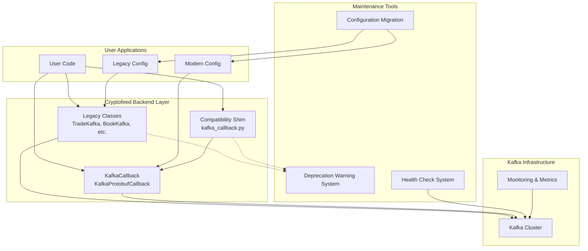
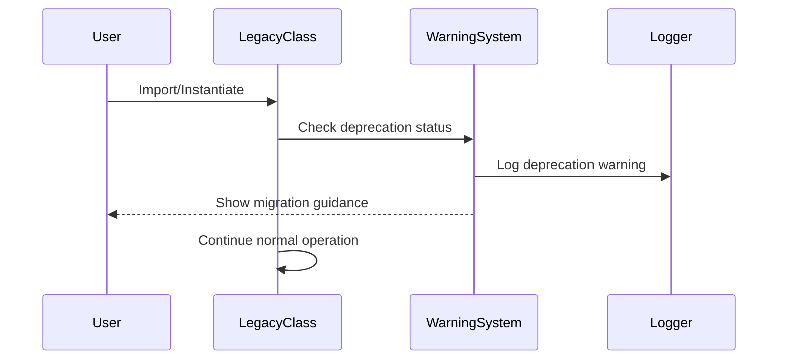
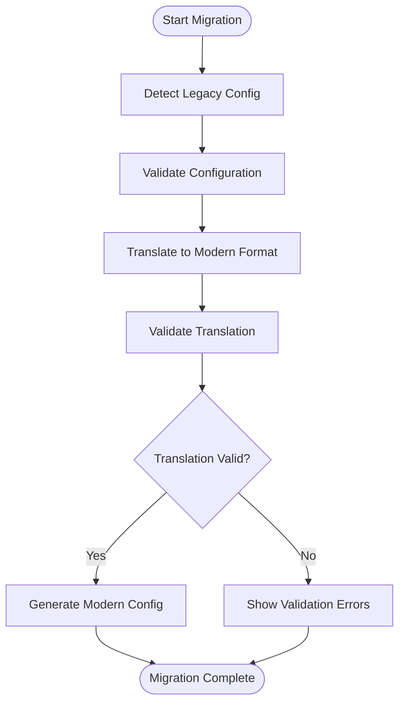
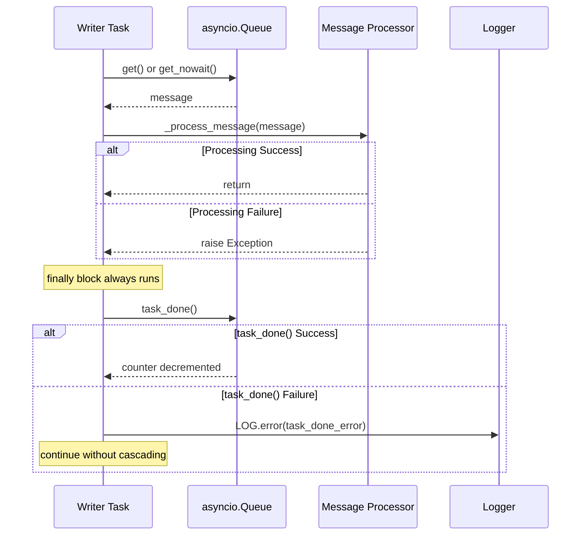
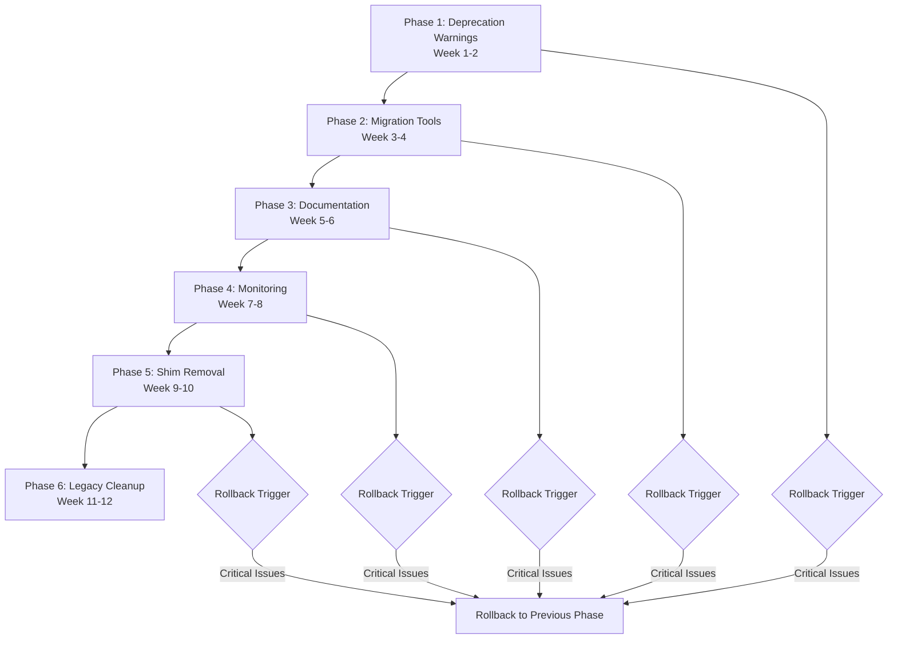

# Design Document

---
**Purpose**: Provide sufficient detail to ensure implementation consistency across different implementers, preventing interpretation drift.

**Approach**:
- Include essential sections that directly inform implementation decisions
- Omit optional sections unless critical to preventing implementation errors
- Match detail level to feature complexity
- Use diagrams and tables over lengthy prose

**Warning**: Approaching 1000 lines indicates excessive feature complexity that may require design simplification.
---

## Overview 
This feature delivers systematic maintenance and evolution of Cryptofeed's Kafka backend infrastructure following the completion of the market-data-kafka-producer specification. The system manages the deprecation lifecycle of legacy Kafka backend classes while maintaining operational excellence for existing deployments.

**Purpose**: This feature delivers structured deprecation management and migration tooling for Kafka backend transitions.
**Users**: System maintainers, deployment engineers, and platform operators will utilize this for managing Kafka backend lifecycle and migration procedures.
**Impact**: Changes the current dual-backend state by providing clear migration paths and eventual removal of legacy implementations.

### Goals
- Manage legacy backend deprecation with clear user guidance and migration timelines
- Remove compatibility shims while maintaining system stability
- Provide comprehensive documentation and automated migration tools
- Ensure operational excellence through monitoring and health checks
- Maintain test coverage and regression prevention throughout the transition

### Non-Goals
- New feature development for legacy Kafka backend
- Performance optimizations beyond critical bug fixes
- Breaking changes to existing legacy APIs during transition period
- Migration of user data or Kafka topic structures

## Architecture

### Existing Architecture Analysis
The current Kafka backend ecosystem consists of:
- **Legacy Backend** (`cryptofeed.backends.kafka`): Original BackendQueue-based implementation with JSON serialization
- **Modern Backend** (`cryptofeed.backends.kafka.*`): New modular implementation with protobuf support and advanced features
- **Compatibility Shim** (`cryptofeed.kafka_callback`): Redirects imports to new implementation
- **Dual Class Hierarchy**: Legacy classes (TradeKafka, BookKafka, etc.) coexist with modern KafkaCallback

Current constraints:
- Legacy classes must maintain API compatibility during transition
- Both implementations share the same Kafka cluster resources
- Existing user configurations must continue to work
- No breaking changes to existing message formats

### Architecture Pattern & Boundary Map



**Architecture Integration**:
- Selected pattern: **Strangler Fig Pattern** - Gradually replace legacy components while maintaining functionality
- Domain/feature boundaries: Clear separation between legacy maintenance and modern backend development
- Existing patterns preserved: BackendQueue interface, callback patterns, configuration handling
- New components rationale: Deprecation system, migration tools, and monitoring for operational excellence
- Steering compliance: Maintains SOLID principles, follows KISS approach, preserves existing contracts

### Technology Stack

| Layer | Choice / Version | Role in Feature | Notes |
|-------|------------------|-----------------|-------|
| Backend / Services | Python warnings module | Deprecation warning emission | Standard library, built-in |
| Backend / Services | logging module | Structured logging and monitoring | Existing cryptofeed patterns |
| Data / Storage | Existing Kafka cluster | Message transport | No changes to infrastructure |
| Infrastructure / Runtime | pytest | Test framework for both implementations | Existing test infrastructure |
| Infrastructure / Runtime | Pydantic | Configuration validation and migration | Existing in modern backend |

## System Flows

### Deprecation Warning Flow


### Configuration Migration Flow


### Queue Synchronization Flow


**Queue Contract Pattern** (from solution doc `kafka-batch-drain-missing-task-done.md`):
```python
# CORRECT pattern - both _drain_once() and _drain_batch() must follow this
async def _drain_once(self) -> None:
    message = await self._queue.get()
    try:
        if message is _STOP_SENTINEL:
            return
        await self._process_message(message)
    finally:
        try:
            self._queue.task_done()
        except Exception as e:
            LOG.error("%s: Failed to mark task as done: %s", self._log_name, e)
```

## Requirements Traceability

| Requirement | Summary | Components | Interfaces | Flows |
|-------------|---------|------------|------------|-------|
| 1.1 | Legacy class deprecation warnings | LegacyClasses, DeprecationWarnings | Warning API | Deprecation Warning Flow |
| 1.2 | Migration guidance on instantiation | LegacyClasses, MigrationTools | Migration API | Deprecation Warning Flow |
| 1.3 | Backward compatibility maintenance | LegacyClasses | BackendQueue Interface | None |
| 1.4 | Security vulnerability patches | LegacyClasses | Security Patch Process | None |
| 1.5 | No new features in legacy | LegacyClasses | Feature Freeze Policy | None |
| 2.1 | Shim deprecation warnings | CompatibilityShim, DeprecationWarnings | Warning API | Deprecation Warning Flow |
| 2.2 | Import path guidance | CompatibilityShim | Import Redirection | None |
| 2.3 | Successful import redirection | CompatibilityShim | Import Redirection | None |
| 2.4 | Shim file removal | CompatibilityShim | File Removal Process | None |
| 2.5 | Internal dependency cleanup | CompatibilityShim | Dependency Analysis | None |
| 3.1 | Comprehensive migration guides | MigrationTools | Documentation API | Configuration Migration Flow |
| 3.2 | Prioritized new backend examples | MigrationTools | Documentation API | None |
| 3.3 | Deprecated pattern marking | MigrationTools | Documentation API | None |
| 3.4 | Troubleshooting guides | MigrationTools | Documentation API | None |
| 3.5 | API documentation maintenance | MigrationTools | Documentation API | None |
| 4.1 | Separate test execution | TestFramework | Test Runner Interface | None |
| 4.2 | Deprecation warning verification | TestFramework, LegacyClasses | Test Assertion API | None |
| 4.3 | Functional equivalence validation | TestFramework | Test Comparison API | None |
| 4.4 | Legacy test stability | TestFramework | Test Regression API | None |
| 4.5 | Performance benchmarking | TestFramework | Performance Test API | None |
| 5.1 | Separate implementation metrics | Monitoring | Metrics Collection API | None |
| 5.2 | Usage pattern tracking | Monitoring, DeprecationWarnings | Usage Analytics API | None |
| 5.3 | Operational dashboard distinction | Monitoring | Dashboard API | None |
| 5.4 | Distinct alerting procedures | Monitoring | Alerting API | None |
| 5.5 | Health check validation | HealthChecks | Health Check API | None |
| 6.1 | Automated configuration translation | MigrationTools | Config Translation API | Configuration Migration Flow |
| 6.2 | Configuration validation | MigrationTools | Config Validation API | Configuration Migration Flow |
| 6.3 | Complete option mapping | MigrationTools | Config Mapping API | None |
| 6.4 | Alternative approach guidance | MigrationTools | Documentation API | None |
| 6.5 | Dual format validation | MigrationTools | Config Validation API | None |
| 7.1 | Multi-channel timeline communication | MigrationTools | Communication API | None |
| 7.2 | Documentation updates | MigrationTools | Documentation API | None |
| 7.3 | Regular progress updates | Monitoring | Progress Reporting API | None |
| 7.4 | Transparent timeline adjustments | MigrationTools | Communication API | None |
| 7.5 | Decision log maintenance | MigrationTools | Documentation API | None |
| 8.1 | Queue get/task_done pairing | KafkaBackendBase | Queue Contract | Queue Synchronization Flow |
| 8.2 | try/finally for task_done | KafkaBackendBase | Queue Contract | Queue Synchronization Flow |
| 8.3 | Batch drain queue contract | KafkaBackendBase | Queue Contract | Queue Synchronization Flow |
| 8.4 | task_done error handling | KafkaBackendBase, Logger | Queue Contract | Queue Synchronization Flow |
| 8.5 | queue.join() correctness | KafkaBackendBase | Queue Contract | Queue Synchronization Flow |

## Components and Interfaces

### Maintenance Domain

#### DeprecationWarningSystem

| Field | Detail |
|-------|--------|
| Intent | Centralized deprecation warning management for all Kafka backend components |
| Requirements | 1.1, 1.2, 2.1, 2.2, 5.2 |
| Owner / Reviewers | Platform Engineering Team |

**Responsibilities & Constraints**
- Emit consistent deprecation warnings across all legacy components
- Track warning frequency and patterns for usage analytics
- Provide actionable migration guidance in warning messages
- Maintain warning message consistency and accuracy

**Dependencies**
- Inbound: LegacyClasses — warning emission requests (Criticality: P0)
- Inbound: CompatibilityShim — import warning requests (Criticality: P0)
- Outbound: Logger — structured warning logs (Criticality: P1)
- Outbound: Monitoring — usage metrics (Criticality: P2)

**Contracts**: Service [X] / API [ ] / Event [ ] / Batch [ ] / State [ ]

##### Service Interface
```python
class DeprecationWarningSystem:
    def emit_class_warning(self, class_name: str, replacement: str) -> None:
        """Emit deprecation warning for legacy class usage."""
        
    def emit_import_warning(self, old_path: str, new_path: str) -> None:
        """Emit deprecation warning for legacy import path."""
        
    def track_usage(self, component: str, context: dict) -> None:
        """Track usage patterns for migration planning."""
```
- Preconditions: Component must be registered for deprecation tracking
- Postconditions: Warning emitted and usage tracked
- Invariants: Warning messages remain consistent across calls

**Implementation Notes**
- Integration: Uses Python's warnings module with custom warning categories
- Validation: Ensures all warnings include actionable migration guidance
- Risks: Warning fatigue if too frequent; need to balance visibility with usability

#### ConfigurationMigrationTool

| Field | Detail |
|-------|--------|
| Intent | Automated translation and validation of legacy Kafka configurations to modern format |
| Requirements | 6.1, 6.2, 6.3, 6.4, 6.5 |
| Owner / Reviewers | Deployment Engineering Team |

**Responsibilities & Constraints**
- Parse and validate legacy configuration formats
- Translate configuration options to modern equivalents
- Validate translated configurations for functional equivalence
- Provide clear guidance for unmappable options

**Dependencies**
- Inbound: User — legacy configuration files (Criticality: P0)
- Outbound: ModernConfig — translated configuration (Criticality: P0)
- Outbound: Logger — migration logs (Criticality: P1)
- External: Pydantic — configuration validation (Criticality: P0)

**Contracts**: Service [X] / API [ ] / Event [ ] / Batch [ ] / State [ ]

##### Service Interface
```python
class ConfigurationMigrationTool:
    def migrate_config(self, legacy_config: dict) -> MigrationResult:
        """Migrate legacy configuration to modern format."""
        
    def validate_migration(self, legacy: dict, modern: dict) -> ValidationResult:
        """Validate functional equivalence of configurations."""
        
    def get_unmappable_options(self, legacy_config: dict) -> list[str]:
        """Identify options without direct modern equivalents."""
```
- Preconditions: Legacy configuration must be valid YAML/JSON
- Postconditions: Modern configuration is functionally equivalent
- Invariants: All critical options must have valid mappings

**Implementation Notes**
- Integration: Uses Pydantic models for validation and type safety
- Validation: Comprehensive testing with real-world configuration samples
- Risks: Complex configuration edge cases may require manual intervention

#### HealthCheckSystem

| Field | Detail |
|-------|--------|
| Intent | Comprehensive health monitoring for both legacy and modern Kafka implementations |
| Requirements | 5.5, 5.1, 5.3, 5.4 |
| Owner / Reviewers | Platform Operations Team |

**Responsibilities & Constraints**
- Validate Kafka connectivity for both implementations
- Monitor message delivery and latency metrics
- Provide distinct health status for legacy vs modern usage
- Trigger appropriate alerting for implementation-specific issues

**Dependencies**
- Inbound: LegacyClasses — health check requests (Criticality: P0)
- Inbound: ModernCallback — health check requests (Criticality: P0)
- Outbound: KafkaCluster — connectivity validation (Criticality: P0)
- Outbound: Monitoring — health metrics (Criticality: P0)
- Outbound: Alerting — failure notifications (Criticality: P1)

**Contracts**: Service [X] / API [ ] / Event [ ] / Batch [ ] / State [ ]

##### Service Interface
```python
class HealthCheckSystem:
    def check_legacy_health(self, config: dict) -> HealthStatus:
        """Check health of legacy Kafka backend."""
        
    def check_modern_health(self, config: dict) -> HealthStatus:
        """Check health of modern Kafka backend."""
        
    def validate_connectivity(self, bootstrap_servers: str) -> ConnectivityStatus:
        """Validate Kafka cluster connectivity."""
```
- Preconditions: Valid configuration provided
- Postconditions: Health status accurately reflects system state
- Invariants: Health checks must not impact production message flow

**Implementation Notes**
- Integration: Uses existing Kafka client connectivity validation
- Validation: Non-intrusive health checks that don't disrupt message flow
- Risks: Health check failures may be mistaken for production issues

### Documentation Domain

#### MigrationDocumentationManager

| Field | Detail |
|-------|--------|
| Intent | Centralized management of migration documentation and user guidance |
| Requirements | 3.1, 3.2, 3.3, 3.4, 3.5, 7.1, 7.2, 7.5 |
| Owner / Reviewers | Technical Writing Team |

**Responsibilities & Constraints**
- Maintain comprehensive migration guides with code examples
- Track documentation updates and versioning
- Ensure all deprecated patterns are clearly marked
- Provide troubleshooting guides for common migration issues

**Dependencies**
- Inbound: MigrationTools — migration procedure documentation (Criticality: P1)
- Inbound: DeprecationWarningSystem — warning message content (Criticality: P1)
- Outbound: User — documentation and guides (Criticality: P0)
- External: Documentation System — markdown/HTML generation (Criticality: P0)

**Contracts**: Service [X] / API [ ] / Event [ ] / Batch [ ] / State [ ]

##### Service Interface
```python
class MigrationDocumentationManager:
    def generate_migration_guide(self) -> Documentation:
        """Generate comprehensive migration guide."""
        
    def update_deprecation_markers(self, component: str, timeline: str) -> None:
        """Update deprecation timeline markers in documentation."""
        
    def create_troubleshooting_guide(self, common_issues: list[str]) -> Documentation:
        """Create troubleshooting guide for identified issues."""
```
- Preconditions: Component information must be current
- Postconditions: Documentation accurately reflects migration procedures
- Invariants: All examples must be tested and functional

**Implementation Notes**
- Integration: Uses existing documentation generation tools
- Validation: All code examples must be tested against real implementations
- Risks: Documentation drift if not synchronized with implementation changes

## Data Models

### Domain Model

#### DeprecationStatus
- **Aggregate Root**: DeprecationWarningSystem
- **Entities**: Component, WarningMessage, UsageMetrics
- **Value Objects**: MigrationGuidance, Timeline, WarningCategory
- **Domain Events**: DeprecationTriggered, UsagePatternDetected, MigrationCompleted

#### ConfigurationMigration
- **Aggregate Root**: ConfigurationMigrationTool
- **Entities**: LegacyConfig, ModernConfig, MigrationResult
- **Value Objects**: ConfigOption, ValidationRule, MappingRule
- **Domain Events**: MigrationStarted, ValidationCompleted, MigrationFailed

#### HealthMonitoring
- **Aggregate Root**: HealthCheckSystem
- **Entities**: HealthCheck, Metric, Alert
- **Value Objects**: HealthStatus, ConnectivityResult, PerformanceMetric
- **Domain Events**: HealthCheckCompleted, AlertTriggered, MetricCollected

### Logical Data Model

**Structure Definition**:
- Deprecation tracking uses time-series data for usage patterns
- Configuration mappings maintain many-to-many relationships between legacy and modern options
- Health metrics stored as aggregated time-series data with implementation-specific tags
- Documentation versioning tracks changes and provides rollback capability

**Consistency & Integrity**:
- All deprecation warnings must have corresponding migration guidance
- Configuration migrations must preserve functional equivalence
- Health check data must be isolated by implementation type
- Documentation must be synchronized with code changes

### Physical Data Model

**For Time-Series Metrics**:
- Collection: `health_metrics`
- Key design: `implementation_type:component:metric_name:timestamp`
- Indexes: Time-based indexes for trend analysis, component indexes for filtering
- TTL: 90 days for detailed metrics, 1 year for aggregated health status

**For Configuration Mappings**:
- Collection: `config_mappings`
- Structure: Embedded documents for legacy->modern option mappings
- Indexes: Legacy option name, modern option name, component type
- Validation: Schema validation ensures all required fields present

**For Documentation**:
- Storage: File system with version control integration
- Structure: Markdown files with front matter metadata
- Indexing: Full-text search for user guidance lookup
- Versioning: Git-based versioning with release tagging

### Data Contracts & Integration

**API Data Transfer**
- Migration requests: JSON schema with legacy configuration
- Migration responses: Structured results with validation status and warnings
- Health check requests: Configuration subset for connectivity testing
- Health check responses: Status objects with metrics and recommendations

**Event Schemas**
- Deprecation events: Component identifier, usage context, timestamp
- Migration events: Configuration hash, success status, error details
- Health events: Implementation type, status code, metric values

## Error Handling

### Error Strategy
The system uses a multi-layered error handling approach with graceful degradation for non-critical failures and immediate escalation for production-impacting issues.

### Error Categories and Responses
**User Errors** (4xx): Invalid configuration → field-level validation with specific guidance; Missing migration options → alternative approach suggestions; Incompatible legacy config → clear error messages with migration requirements
**System Errors** (5xx): Kafka connectivity failures → circuit breaker pattern with retry; Configuration parsing errors → fallback to manual migration; Health check failures → degraded monitoring mode with alerts
**Business Logic Errors** (422): Configuration mapping conflicts → manual intervention required; Timeline violations → automatic timeline adjustment with notification; Documentation inconsistencies → automated documentation generation pause

### Monitoring
Comprehensive error tracking with structured logging, metrics collection for error rates by component, and alerting for critical failures that impact production systems.

## Testing Strategy

### Unit Tests
- DeprecationWarningSystem: Warning emission accuracy, usage tracking, message formatting
- ConfigurationMigrationTool: Config parsing accuracy, mapping correctness, validation logic
- HealthCheckSystem: Connectivity validation, metric collection, status reporting
- MigrationDocumentationManager: Guide generation, example validation, version tracking

### Integration Tests
- End-to-end migration workflows with real configuration files
- Health check validation against test Kafka clusters
- Documentation generation with actual component information
- Warning emission in import and instantiation scenarios

### E2E Tests
- Complete migration scenarios from legacy to modern implementations
- Production-like configuration validation and migration
- Health monitoring in dual-implementation environments
- User workflow testing with documentation and tools

### Performance/Load
- Warning system performance under high instantiation rates
- Configuration migration tool performance with large config files
- Health check system impact on production message flow
- Documentation generation performance for large codebases

## Migration Strategy

The migration follows a phased approach with clear timelines and rollback procedures:



- Phase breakdown: 2-week phases with specific deliverables and validation checkpoints
- Rollback triggers: Critical production issues, significant user feedback, security vulnerabilities
- Validation checkpoints: Automated testing, user feedback collection, metric analysis

## Supporting References

- Legacy Kafka backend implementation: `cryptofeed/backends/kafka.py`
- Modern Kafka backend package: `cryptofeed/backends/kafka/`
- Compatibility shim implementation: `cryptofeed/kafka_callback.py`
- Existing test suites: `tests/unit/backends/test_legacy_kafka_backend.py`, `tests/unit/kafka/`
- Market-data-kafka-producer specification: `.kiro/specs/market-data-kafka-producer/`
- **Queue contract compliance solution doc**: `docs/solutions/runtime-errors/kafka-batch-drain-missing-task-done.md`
- **Queue contract fix commit**: `9730d29e` (fix: mark batch drain tasks done and require pydantic by default)