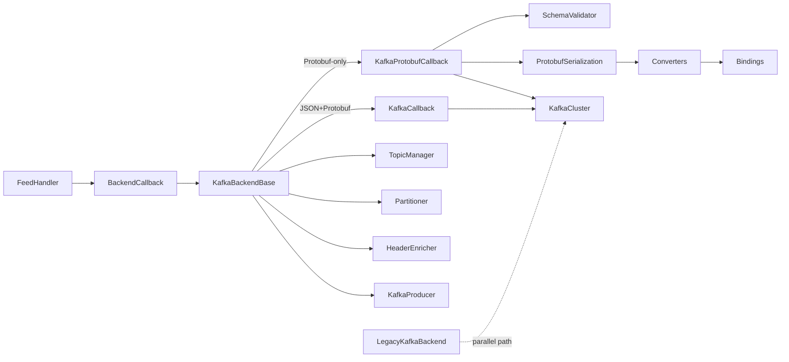
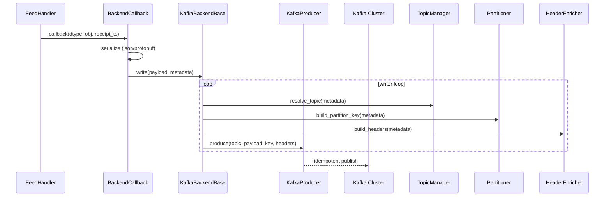
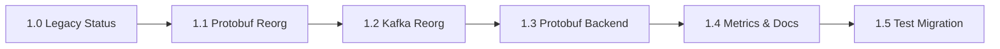

# Design: Kafka & Protobuf Code Improvement

**Spec Name**: `kafka-proto-code-improvement`  
**Version**: 0.1.0  
**Status**: Design Draft  
**Created**: January 15, 2025  
**Updated**: January 15, 2025

---

## Overview

**Purpose**: Deliver a maintainable, colocated Kafka and Protobuf backend architecture that keeps the legacy JSON backend functional, introduces a protobuf-only backend, and shares infrastructure via a dedicated base class.  
**Users**: Cryptofeed integrators and backend maintainers who need a predictable module layout, explicit contracts, and backward compatible import surfaces.  
**Impact**: Converts the current monolithic `kafka_callback.py` + scattered helpers into two cohesive modules (`backends/kafka/`, `backends/protobuf/`) with compatibility shims so downstream deployments continue to function while benefiting from clearer contracts and isolation.

### Goals
- Colocate Kafka and Protobuf code under `cryptofeed/backends/`
- Introduce `KafkaBackendBase` for shared infrastructure (queues, producer orchestration)
- Provide `KafkaProtobufCallback` focused exclusively on protobuf serialization
- Preserve `cryptofeed/backends/kafka.py` as a maintained legacy JSON backend
- Maintain 100% backward compatibility via shim modules and re-exports
- Document schema/version headers and metrics to unlock observability

### Non-Goals
- Changing Kafka topic strategies, schema definitions, or consumer responsibilities
- Introducing new storage or analytics features beyond ingestion
- Modifying normalized data schemas or protobuf message definitions
- Replacing aiokafka in the legacy backend
- Implementing new performance optimizations beyond reorganizing responsibilities

---

## Architecture

### Existing Architecture Analysis
- `KafkaCallback` monolith (1,754 LOC) bundles queueing, topic management, partitioning, header enrichment, serialization, metrics, and producer orchestration.
- `kafka_producer.py`, `kafka_config.py`, and `proto_bindings` live at repo root, forcing long imports and implicit coupling.
- `cryptofeed/backends/kafka.py` still logs a deprecation warning, confusing operators who rely on JSON output via aiokafka.
- Protobuf serialization helpers and bindings exist in `cryptofeed/backends/protobuf_helpers.py` and `cryptofeed/proto_bindings/__init__.py`, mixing converters, serialization helpers, and bindings lookups in a single module.

### Architecture Pattern & Boundary Map



- **Selected pattern**: Layered ingestion pipeline with shared service base and pluggable emitters. Maintains asynchronous queue boundary to protect the feed loop.
- **Domain boundaries**:
  - `cryptofeed/backends/kafka/` handles queueing, partitioning, headers, metrics, and producer I/O.
  - `cryptofeed/backends/protobuf/` handles converter registry, serialization, schema validation, and bindings.
  - Compatibility shims at repository root ensure external API stability.
- **Existing patterns preserved**: BackendCallback contract, asyncio queue writer, Kafka producer wrapper, normalized data schema types.
- **New components rationale**: Base class removes duplication between unified and protobuf-only callbacks; explicit modules clarify responsibilities.
- **Steering compliance**: Adheres to SOLID (single responsibility modules), KISS (shallow inheritance), DRY (shared base), and NO LEGACY (isolate but preserve).

### Technology Stack

| Layer | Choice / Version | Role in Feature | Notes |
|-------|------------------|-----------------|-------|
| Backend / Services | Python 3.12 asyncio | Async queue + writer loops | Aligns with feed handler runtime |
| Messaging / Events | `confluent-kafka` Producer (v2.x) | Unified and protobuf callbacks | Idempotent producer retained per Kafka best practices [AutoMQ](https://www.automq.com/blog/kafka-producer-examples-best-practices) |
| Messaging / Events | `aiokafka` (legacy) | Maintained JSON backend | No functional changes beyond docstring/warning |
| Data / Serialization | `google.protobuf` (buf-generated schemas) | Serialization, validation | Enforced through helpers + bindings modules |
| Configuration | `pydantic` v2 | KafkaConfig / TopicConfig / PartitionConfig models | Re-exported from `backends/kafka/config.py` |
| Monitoring | Prometheus-compatible metrics hooks | Export queue depth, delivery success/failure, serialization counts | Implemented via new `metrics.py` |

---

## System Flows

### Kafka Backend Flow (JSON + Protobuf)



### Protobuf Serialization Flow


Key decisions:
- Converter registry uses explicit type mapping to Protobuf builders and enforces precise typing.
- SchemaValidator guards required fields before bytes hit Kafka, reducing invalid messages.
- HeaderEnricher stamps schema version and serialization format in every record, aligning with schema governance.

---

## Requirements Traceability

| Requirement | Summary | Components | Interfaces | Flows |
|-------------|---------|------------|------------|-------|
| FR1 | Legacy backend marked as maintained and warning removed | LegacyKafkaBackend (`backends/kafka/legacy.py`), compatibility shims | BackendCallback API, aiokafka configuration | Legacy writer loop |
| FR2 | Protobuf code colocated with helpers, serialization, bindings | `backends/protobuf/{helpers,converters,serialization,bindings,validation}` | Converter registry, SchemaValidator service | Protobuf serialization flow |
| FR3 | Kafka code colocated with extracted components | `backends/kafka/{callback,protobuf,legacy,topic_manager,partitioner,headers,producer,config,metrics,__init__}` | KafkaBackendBase service interface | Kafka backend flow |
| FR4 | Dedicated protobuf backend | `KafkaProtobufCallback`, `SchemaValidator`, `ProtobufSerialization` | BackendCallback API, KafkaBackendBase extension | Kafka backend flow (protobuf branch) |
| FR5 | Shared infrastructure base class | `KafkaBackendBase`, `KafkaCallback` (unified), `KafkaProtobufCallback` | Queue writer service, TopicManager/Partitioner/Header interfaces | Kafka backend flow |
| FR6 | Backward compatibility via shims and re-exports | `cryptofeed/kafka_callback.py` shim, `kafka_producer.py` shim, `kafka_config.py` shim, `proto_bindings` shim, `protobuf_helpers` shim | Import-level adapters, DeprecationWarning emission | All flows referencing legacy import paths |

---

## Components and Interfaces

### Component Summary

| Component | Domain | Intent | Req Coverage | Key Dependencies (P0/P1) | Contracts |
|-----------|--------|--------|--------------|--------------------------|-----------|
| KafkaBackendBase | Kafka | Shared queue + producer orchestration | FR3, FR5 | BackendCallback (P0), TopicManager (P0), KafkaProducer (P0) | Service |
| KafkaCallback | Kafka | Unified JSON/Protobuf backend using base class | FR3, FR5 | KafkaBackendBase (P0), HeaderEnricher (P0) | Service/Event |
| KafkaProtobufCallback | Kafka | Protobuf-only backend with validation | FR3, FR4, FR5 | KafkaBackendBase (P0), SchemaValidator (P0), ProtobufSerialization (P0) | Service |
| TopicManager | Kafka | Resolve topic names + ensure creation metadata | FR3, FR5 | KafkaConfig (P0) | Service |
| Partitioner | Kafka | Generate partition keys/ids per strategy | FR3 | KafkaConfig (P1) | Service |
| HeaderEnricher | Kafka | Build headers (schema version, exchange, data type) | FR3 | Protobuf bindings metadata (P1) | Service |
| KafkaProducer | Kafka | Confluent producer wrapper | FR3, FR5 | confluent-kafka (P0) | Service |
| Metrics | Kafka | Export queue, delivery, serialization metrics | FR3 | Prometheus client (P1) | Service |
| LegacyKafkaBackend | Kafka | Maintained aiokafka backend | FR1, FR6 | aiokafka (P0) | Service |
| KafkaConfig models | Kafka | Pydantic configuration surface | FR3, FR6 | pydantic (P0) | State |
| Protobuf Helpers | Protobuf | Aggregates serialization entry points | FR2, FR4 | Converters (P0), Serialization (P0) | Service |
| Converters | Protobuf | Type-specific converter functions | FR2 | Bindings (P0) | State |
| Serialization | Protobuf | Shared serialization helpers + pooling | FR2, FR4 | google.protobuf (P0) | Service |
| SchemaValidator | Protobuf | Ensures converter outputs satisfy schema | FR2, FR4 | google.protobuf (P0) | Service |
| Bindings | Protobuf | Central import/export for generated pb2 modules | FR2, FR6 | Buf-generated schemas (P0) | State |
| Compatibility Shims | Compatibility | Re-export old paths with warnings | FR6 | New modules (P0) | API |

---

### Kafka Domain

#### KafkaBackendBase

| Field | Detail |
|-------|--------|
| Intent | Provide queue lifecycle, writer loop, batching, producer lifecycle, and dependency injection for Kafka callbacks |
| Requirements | FR3, FR5 |

**Responsibilities & Constraints**
- Owns asyncio queue, batching thresholds, and flow control.
- Instantiates TopicManager, Partitioner, HeaderEnricher, and KafkaProducer from config.
- Exposes abstract `_serialize_payload` and `_build_headers` hooks for subclasses.
- Must remain serialization-format agnostic.

**Dependencies**
- Inbound: `BackendCallback` (P0) — pushes serialized payloads.
- Outbound: `KafkaProducer` (P0), `TopicManager` (P0), `Partitioner` (P1), `HeaderEnricher` (P1), `Metrics` (P1).

**Contracts**
- Service contract (Python type hints):
```python
class KafkaBackendBase(BackendQueue, ABC):
    def __init__(self, config: KafkaConfig, *, metrics: Metrics | None = None) -> None: ...
    async def write(self, payload: SerializedMessage) -> None: ...
    @abstractmethod
    def _serialize_payload(self, item: QueuedItem) -> tuple[bytes, HeaderFields]: ...
```

**Implementation Notes**
- Integration: ensures idempotent producer settings remain enabled (`enable.idempotence=true`, `acks=all`) per Kafka best practices [AutoMQ](https://www.automq.com/blog/kafka-producer-examples-best-practices).
- Validation: rejects configs without bootstrap servers; enforces positive partition/replication counts via Pydantic models.
- Risks: misconfigured topic strategies; mitigated via config schema + warnings.

#### KafkaCallback (Unified)
- Extends KafkaBackendBase, retains ability to emit JSON or Protobuf based on `serialization_format`.
- Responsibilities: call `serialize_to_protobuf` via helpers when format=protobuf, else `_build_dict_payload`.
- Dependencies: `ProtobufSerialization` indirectly when protobuf enabled.
- Contracts: ensures JSON output still enriches headers with `format=json`.
- Risks: format toggling at runtime—lock serialization format during initialization via BackendCallback APIs.

#### KafkaProtobufCallback
- Extends KafkaBackendBase but locks serialization to protobuf during `__init__`.
- Injects `SchemaValidator` and `ProtobufSerialization` to enforce schema-level guarantees before produce.
- Adds `schema_version` override for header stamping to keep compatibility with consumers.
- Risks: schema mismatches; mitigated via validator + logging.

#### TopicManager / Partitioner / HeaderEnricher
- Each extracted into dedicated modules with focused contracts:
  - `TopicManager` ensures consistent naming (consolidated, per_symbol) and can expose future hybrid strategies.
  - `Partitioner` returns `PartitionKey` (bytes) or `partition` index depending on strategy.
  - `HeaderEnricher` returns `list[tuple[str, bytes]]` containing canonical metadata, including `schema_version`, `serialization_format`, `data_type`, `exchange`, `symbol`.
- Implementation notes: Provide memoization/caching per config to minimize per-message allocations.

#### KafkaProducer
- Moved to `backends/kafka/producer.py`, unchanged API.
- Maintains idempotent settings (per AutoMQ + DEV article guidance on pairing `enable.idempotence` with low `max.in.flight` to preserve ordering [DEV Community](https://dev.to/konstantinas_mamonas/kafka-producers-explained-partitioning-batching-and-reliability-4bm8)).
- Provide optional adapter for pluggable metrics and delivery callbacks.

#### Metrics
- New module emits: queue depth, drain latency, produce successes/failures, serializer timings.
- Exposes `MetricsRecorder` protocol so production deployments can integrate Prometheus without forcing dependency.

#### LegacyKafkaBackend (`backends/kafka/legacy.py`)
- Module docstring updated to “MAINTAINED for backward compatibility”.
- Removes `warnings.warn` on import; publishes info log directing users to new callbacks.
- No functional change to aiokafka usage; remains JSON only with per-symbol topics.

#### Compatibility Shims
- Root-level modules become thin wrappers with explicit warnings:
  - `cryptofeed/kafka_callback.py` → imports from `backends/kafka/callback.py`.
  - `cryptofeed/kafka_producer.py` → imports from `backends/kafka/producer.py`.
  - `cryptofeed/kafka_config.py` → imports from `backends/kafka/config.py`.
- Each shim logs `DeprecationWarning` pointing to new path while preserving `__all__`.

### Protobuf Domain

#### Helpers (`backends/protobuf/helpers.py`)
- Public entry points: `serialize_to_protobuf(obj)`, `register_converter(name, fn)`, `get_converter(name)`.
- Delegates to `converters` and `serialization` modules internally.
- Maintains compatibility by re-exporting identical API as legacy module.

#### Converters
- Hosts 14 converter functions, each fully typed and referencing pb2 modules via `bindings`.
- Registry stored as `Mapping[str, ConverterFn]` with enforced keys.
- Adds caching utilities for enum lookups and Decimal→str conversion to keep serialization at ~2µs.

#### Serialization
- Handles message instantiation, pooling, zero-copy serialization where possible.
- Provides `SerializationContext` dataclass (exchange, symbol, schema_version) passed from callbacks.

#### SchemaValidator
- Ensures required fields set, enums valid, and schema version compatibility before bytes produced.
- Exposes interface:
```python
class SchemaValidator:
    def validate(self, proto: Message, *, schema_version: str) -> None: ...
```
- Adds structured errors to aid debugging.

#### Bindings
- `backends/protobuf/bindings.py` centralizes imports from `gen.python.cryptofeed.normalized.v1`.
- Provides `SCHEMA_VERSION`, `REQUIRED_MODULES`, `validate_bindings`.
- `cryptofeed/proto_bindings/__init__.py` becomes shim (`warnings.warn` + `from ...bindings import *`).

#### Compatibility Shim Files
- `cryptofeed/backends/protobuf_helpers.py` now only re-exports from `backends/protobuf/helpers`.
- Shims include DeprecationWarning text instructing new paths but function identically.

---

## Data Models

### Configuration Models

| Model | Source | Purpose | Notes |
|-------|--------|---------|-------|
| `KafkaTopicConfig` | `backends/kafka/config.py` | Topic strategy, prefix, partitions, replication | Enforces valid prefixes and positive counts |
| `KafkaPartitionConfig` | `backends/kafka/config.py` | Partition key strategy | Allowed values: composite, symbol, exchange, round_robin |
| `KafkaProducerConfig` | `backends/kafka/config.py` | Producer tuning (acks, retries, linger, compression) | Defaults align with idempotent best practices (acks=all, retries=3, idempotence=true) |
| `KafkaConfig` | `backends/kafka/config.py` | Composite config referencing topic/partition/producer | Provides `.from_yaml` helper for config files |

### Header Schema

| Header | Type | Description |
|--------|------|-------------|
| `cf.serialization_format` | bytes | `b"json"` or `b"protobuf"` |
| `cf.schema_version` | bytes | e.g., `b"v0.1.0"` from bindings |
| `cf.data_type` | bytes | Normalized data type name (trade, ticker, etc.) |
| `cf.exchange` | bytes | Exchange identifier |
| `cf.symbol` | bytes | Normalized symbol |
| `cf.receipt_ts` | bytes | Microsecond timestamp for ingestion latency tracking |

### Protobuf Payloads
- No schema changes introduced; design enforces conversion accuracy and validation.
- Serialization module ensures Decimal→string conversions preserve precision and timestamps convert to µs.

---

## Error Handling

### Error Strategy
- KafkaBackendBase catches producer exceptions and routes them through Metrics + structured logs.
- SchemaValidator raises `ProtobufEncodeError` with actionable context when required fields missing.
- Partition/Topic config errors raised during initialization (fail fast).

### Error Categories
- **Configuration Errors**: invalid topic/partition settings → raised during instantiation.
- **Serialization Errors**: converter failures, schema validation issues → raise `SerializationError` and surface metrics counter `cf_protobuf_validation_failures_total`.
- **Producer Errors**: connection failures, delivery timeouts → log + metrics, rely on idempotent producer to avoid duplicates.

### Monitoring
- Metrics module exposes counters/gauges:
  - `cf_kafka_queue_depth`
  - `cf_kafka_drain_latency_seconds`
  - `cf_kafka_delivery_failures_total`
  - `cf_protobuf_validation_failures_total`
- Hooks allow Prometheus/StatsD adapters.

---

## Testing Strategy

### Unit Tests
- KafkaBackendBase queue and batching behavior (json + protobuf payloads).
- TopicManager topic naming across strategies.
- Partitioner key generation per strategy (composite, symbol, exchange, round_robin).
- HeaderEnricher header contents for JSON vs Protobuf.
- SchemaValidator coverage for missing fields, enum mismatches, schema version mismatches.
- Protobuf helpers registry operations and converter outputs.

### Integration Tests
- Unified KafkaCallback end-to-end run with confluent-kafka mocked broker (pytest fixture).
- KafkaProtobufCallback producing to embedded Kafka or confluent mock verifying headers + payload bytes.
- LegacyKafkaBackend still functioning without warnings via aiokafka stub.
- Compatibility shims import tests ensuring `from cryptofeed.kafka_callback import KafkaCallback` still works.

### Performance & Load
- Benchmark serialization throughput for converters to ensure no regression from 2.1µs baseline.
- KafkaBackendBase batch drain load test to confirm >100k msg/s throughput with `batch_drain_size` default 50.

### Regression / Migration
- Import matrix tests verifying both new and legacy import paths operate (FR6).
- Test suite grouping matches Phase 1.5 plan: first run old path tests, then gradually switch to new imports.

---

## Security Considerations
- No new network surfaces; Kafka authentication unchanged.
- Ensure header enrichment never leaks sensitive data (only exchange/symbol/data_type/timestamps).
- Legacy backend still relies on aiokafka configuration for TLS/SASL (outside scope but documented).

---

## Performance & Scalability
- Maintain idempotent producer semantics and low `max.in.flight` (<5) to preserve ordering as recommended by Kafka best practices [DEV Community](https://dev.to/konstantinas_mamonas/kafka-producers-explained-partitioning-batching-and-reliability-4bm8).
- Keep partition strategies pluggable so teams can balance ordering vs throughput.
- Optional metrics allow capacity planning by exposing queue depth and drain latency.

---

## Migration Strategy



1. **Phase 1.0**: Update legacy module docstrings, remove warnings, add README note.
2. **Phase 1.1**: Move protobuf code into new module, create shims, run tests.
3. **Phase 1.2**: Move Kafka files, extract TopicManager/Partitioner/HeaderEnricher/metrics, add shims.
4. **Phase 1.3**: Implement `KafkaBackendBase`, refactor unified callback, add protobuf-only callback + validator.
5. **Phase 1.4**: Add metrics instrumentation and documentation updates (schema versioning guide, migration doc).
6. **Phase 1.5**: Update tests and client imports progressively, ensuring backward compatibility before removing shims in future release.

Rollback plan: revert to previous release by retaining legacy backend and old import paths (shims guarantee safety).

---

## Supporting References
- AutoMQ, *Kafka Producer: Learn & Examples & Best Practices* (idempotent producer guidelines, ordering guarantees).  
- DEV Community, *Kafka Producers Explained: Partitioning, Batching, and Reliability* (partition strategy trade-offs, `max.in.flight` guidance).  
- kafka-python docs (idempotent producer semantics, error handling expectations).

---

**Status**: Design drafted and ready for review.  
**Next Step**: Approve design, then run `kiro:spec-tasks kafka-proto-code-improvement` to generate implementation tasks.
