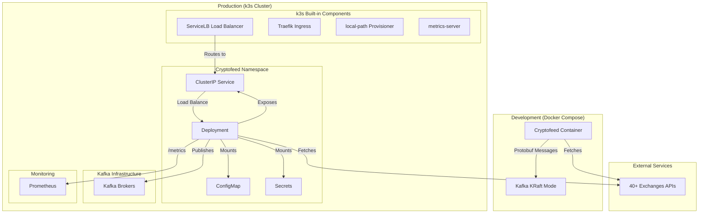
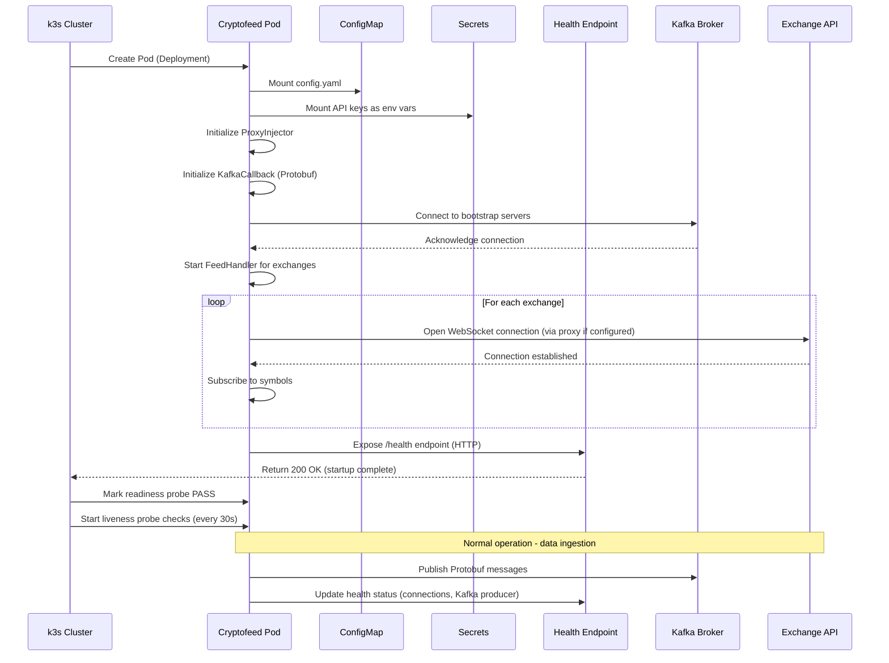
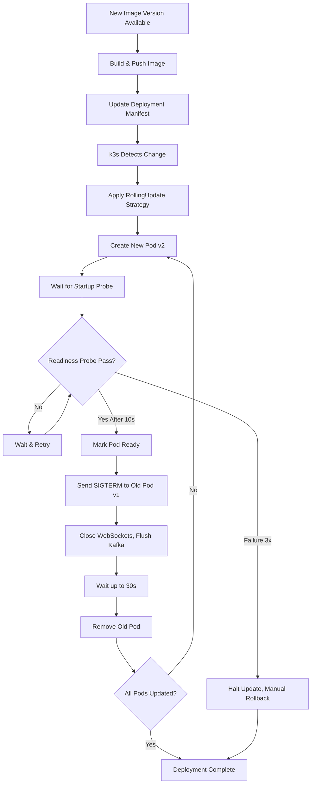
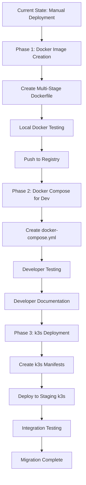

# Technical Design Document: Multi-Exchange Docker Deployment

## Overview

This design delivers production-ready containerization for cryptofeed, enabling scalable deployment of market data ingestion from 40+ cryptocurrency exchanges into Kafka Protobuf backend. The architecture prioritizes Docker Compose for local development and k3s (lightweight Kubernetes) for staging/production environments, following FR-first principles with basic deployment capabilities and deferring advanced NFRs to future phases.

**Purpose**: Transform cryptofeed from a locally-run Python application into a containerized service deployable across development (Docker Compose) and production (k3s) environments with health checks, metrics exposure, and multi-exchange isolation.

**Users**: Developers will use Docker Compose for local testing; platform engineers will deploy to k3s clusters for staging/production; DevOps teams will manage configuration and secrets.

**Impact**: Changes cryptofeed deployment model from manual Python process management to declarative container orchestration with basic health monitoring and rolling updates.

### Goals

- Enable Docker Compose development environment with < 5 minute setup time
- Provide k3s production deployment with basic pod management (Deployments, rolling updates)
- Support flexible isolation strategies (single-container multi-exchange, per-exchange containers)
- Integrate seamlessly with existing Kafka backend, proxy system, and Protobuf serialization
- Deliver basic observability (metrics exposure at /metrics endpoint, structured logs)
- Implement secure container runtime (non-root user, Kubernetes Secrets for credentials)

### Non-Goals

- Horizontal Pod Autoscaler (HPA) - deferred to Phase 2
- Advanced observability (Grafana dashboards, alerting) - metrics exposure only, no dashboards
- CI/CD automation (GitHub Actions, ArgoCD) - manual deployment workflow
- Zero-downtime rolling updates (canary/blue-green) - basic RollingUpdate strategy only
- External Secrets Operator integration - native Kubernetes Secrets only
- Disaster recovery and multi-region deployment - single cluster scope
- Multi-environment configuration overlays (Kustomize/Helm) - single environment focus

## Architecture

### Existing Architecture Analysis

Cryptofeed currently operates as a Python asyncio application with the following established patterns:

**Current Runtime Model**:
- Python 3.11+ asyncio event loop managing multiple exchange connections
- WebSocket-first architecture with REST fallbacks for snapshots
- Proxy system (`cryptofeed/proxy.py`) providing global and per-exchange proxy injection
- Kafka backend (`cryptofeed/backends/kafka/`) with Protobuf serialization and health checks
- Prometheus metrics exporters for monitoring
- Health check infrastructure supporting connectivity validation
- Proxy configuration precedence: defaults → proxy.yaml (literal YAML, no `${}` templating) → explicit/CLI overrides → environment (`CRYPTOFEED_PROXY_*`) via pydantic-settings. Environment remains highest to align with ops expectations.

**Integration Points to Preserve**:
- Kafka producer configuration (bootstrap servers, acks, compression)
- Proxy injector patterns (HTTP/SOCKS5, pool-aware selection)
- Health check endpoints (KafkaHealthCheck, KafkaHealthStatus dataclasses)
- Metrics exporter (PrometheusMetricsExporter with producer/Kafka/serialization metrics)
- Configuration management (config.yaml, environment variable interpolation)

**Technical Debt Addressed**:
- No existing container images → Design multi-stage Dockerfile from scratch
- No orchestration manifests → Create Docker Compose and k3s manifests
- Manual deployment process → Enable declarative deployment via kubectl
- Limited operational tooling → Integrate health checks with k3s probes

### High-Level Architecture



**Architecture Integration**:
- **Existing patterns preserved**: Asyncio event loop, proxy injection, Kafka producer patterns, health checks
- **New components rationale**:
  - Multi-stage Dockerfile → Separate build/runtime dependencies, reduce image size by 60-80%
  - k3s Deployment → Enable horizontal scaling and self-healing
  - ConfigMap/Secrets → Decouple configuration from container images
  - k3s built-in components → Leverage ServiceLB, Traefik, local-path provisioner without external installations
- **Technology alignment**: Python 3.11+ asyncio (unchanged), aiohttp/websockets (unchanged), confluent-kafka (unchanged), prometheus_client (already integrated)
- **Steering compliance**: Ingestion-layer-only (no storage), START SMALL (MVP Dockerfile first, then orchestration), FR over NFR (basic deployment, defer advanced features)

### Technology Stack and Design Decisions

#### Core Technology Alignment

**Container Runtime**:
- **Base Image**: `python:3.11-slim-bookworm` (official Python image, Debian-based)
  - Rationale: Asyncio support, smaller than full Python image (~140MB vs ~900MB), apt package manager
  - Alternative: `python:3.11-alpine` (Alpine Linux, ~50MB) - rejected due to asyncio library compatibility issues
- **Multi-stage Build**: Builder stage + runtime stage
  - Rationale: Separate build dependencies (gcc, build-essential) from runtime, reduce final image by 60-80%
  - Research finding: Multi-stage builds reduce Python images by 250MB+ by excluding build-essential

**Orchestration Platforms**:
- **Local/Staging**: Docker Compose with Kafka KRaft mode (no Zookeeper)
  - Rationale: Simple developer onboarding, sub-60-second startup, familiar workflow
  - Research finding: Kafka 3.3+ KRaft mode eliminates Zookeeper dependency, faster startup for dev environments
- **Production**: k3s (lightweight Kubernetes)
  - Rationale: Certified Kubernetes distribution with built-in components, 512MB RAM minimum vs 2GB+ for full Kubernetes
  - Built-in components: local-path provisioner (storage), ServiceLB (load balancer), Traefik (ingress), metrics-server (metrics)
  - Use case: Edge computing, IoT, CI/CD, resource-constrained production environments
  - Research finding: k3s single binary installation, all Kubernetes control plane components in one process

**k3s Built-in Components** (no external installation required):
- **Storage**: local-path provisioner (automatic PV provisioning for PersistentVolumeClaims)
- **Load Balancer**: ServiceLB/Klipper (assigns IPs to LoadBalancer services on bare metal)
- **Ingress**: Traefik 2.x (pre-installed, automatic HTTP routing)
- **Metrics**: metrics-server (CPU/memory metrics for basic monitoring)
- **CNI**: Flannel (default network plugin)
- **Container Runtime**: containerd (default, not Docker)

#### Key Design Decisions

**Decision 1: Multi-Stage Dockerfile with Slim Base Image**

- **Context**: Python dependencies include compiled extensions (ccxt, aiohttp, cryptography for ED25519 auth); final image must be small, secure, and performant
- **Alternatives**:
  1. Single-stage `python:3.11` (900MB image) - simple but wasteful
  2. Alpine-based `python:3.11-alpine` (50MB base) - smallest but asyncio library compatibility issues
  3. Multi-stage `python:3.11-slim-bookworm` (builder + runtime) - balanced size and compatibility
- **Selected Approach**: Multi-stage build with `python:3.11-slim-bookworm`
  - Builder stage: Install build dependencies (gcc, build-essential), compile wheels, install all Python packages
  - Runtime stage: Copy only compiled packages, install runtime dependencies, set non-root user
- **Rationale**:
  - Image size: ~300MB (vs 900MB single-stage, 60-70% reduction)
  - Security: No build tools in runtime image, non-root user execution
  - Compatibility: Debian base ensures asyncio, aiohttp, websockets work without patching
  - Performance: Pre-compiled wheels reduce container startup time
- **Trade-offs**:
  - Gain: Smaller image size, faster pull times, reduced attack surface
  - Sacrifice: Slightly more complex Dockerfile, longer initial build time (mitigated by layer caching)

**Decision 2: Deployment for All Exchanges (Simplified from StatefulSet Hybrid)**

- **Context**: Cryptofeed supports 40+ exchanges; original design proposed hybrid Deployment/StatefulSet approach
- **Alternatives**:
  1. Pure Deployment for all exchanges - simplest but no persistent identity
  2. Pure StatefulSet for all exchanges - stable identities but unnecessary complexity
  3. Hybrid approach - Deployment for stateless, StatefulSet for stateful (original design)
- **Selected Approach**: Use Deployment for all exchanges (simplified)
  - Rationale: FR-first prioritization, avoid StatefulSet complexity for MVP
  - Exchange state (sequence numbers, order book snapshots) can be rebuilt from Kafka topics
  - Persistent volumes not required for ingestion-layer-only architecture
- **Rationale**:
  - Simplicity: Single deployment pattern, easier operations
  - FR focus: Deliver basic deployment first, add StatefulSet if persistent state needed later
  - Resource efficiency: No PersistentVolume overhead
- **Trade-offs**:
  - Gain: Simpler operations, faster scaling, no volume management
  - Sacrifice: No stable network identities (acceptable for stateless ingestion)

**Decision 3: ConfigMap/Secrets Split with Native Kubernetes Secrets**

- **Context**: Cryptofeed requires exchange API keys (sensitive), proxy URLs (non-sensitive), and Kafka endpoints (non-sensitive)
- **Alternatives**:
  1. ConfigMap only with base64-encoded secrets - simple but insecure
  2. Native Kubernetes Secrets - encrypted at rest, suitable for basic deployments
  3. External Secrets Operator with HashiCorp Vault - secure but adds complexity (Phase 2)
- **Selected Approach**: ConfigMap for non-sensitive config + Kubernetes native Secrets
  - ConfigMap: Stores config.yaml (exchanges, symbols, Kafka endpoints, proxy URLs)
  - Secrets: Stores API keys, secrets, passphrases (base64 encoded)
  - Manual secret rotation requires new Secret + Deployment rolling update
- **Rationale**:
  - FR focus: Deliver basic secrets management without external dependencies
  - Security: Secrets not in version control, encrypted at rest in etcd (when enabled), RBAC-restricted access
  - Simplicity: No External Secrets Operator installation, lower operational complexity
- **Trade-offs**:
  - Gain: Simpler deployment, no external vault dependency, faster time-to-value
  - Sacrifice: Manual secret rotation, no automatic TTL expiration (acceptable for MVP)

## System Flows

### Container Startup and Initialization Flow



### Rolling Update Deployment Flow



## Requirements Traceability

| Requirement | Summary | Components | Interfaces | Flows |
|-------------|---------|------------|------------|-------|
| 1. Container Image Build | Multi-stage Dockerfile | Dockerfile, .dockerignore | Docker build API | - |
| 2. Docker Compose Dev | Docker Compose orchestration | docker-compose.yml, services (cryptofeed, kafka) | Docker Compose CLI | Container Startup Flow |
| 3. k3s Deployment | k3s manifests | Deployment, Service | kubectl, k3s API | Rolling Update Flow |
| 4. Configuration Mgmt | ConfigMaps, Secrets | cryptofeed-config (ConfigMap), cryptofeed-api-keys (Secret) | Kubernetes API | Container Startup Flow |
| 5. Health Checks | Health checks, DNS | /health HTTP endpoint, Kubernetes Service, readiness/liveness probes | HTTP, k3s probe spec | Container Startup Flow |
| 6. Metrics Exposure | Prometheus metrics | PrometheusMetricsExporter | /metrics HTTP endpoint | - |
| 7. Multi-Exchange Integration | Kafka/Proxy integration | KafkaCallback, ProxyInjector, config.yaml | Kafka Producer API, HTTP/SOCKS5 proxy | Container Startup Flow |
| 8. Container Security | Non-root user, secrets | Dockerfile USER directive, Kubernetes Secrets, security context | Kubernetes Security Context API | - |
| 9. Documentation | Runbooks, guides | docs/docker/, docs/kubernetes/ | - | - |

## Components and Interfaces

### Container Runtime Layer

#### Cryptofeed Container Image

**Responsibility & Boundaries**
- **Primary Responsibility**: Package cryptofeed application and runtime dependencies into secure, minimal container image
- **Domain Boundary**: Build-time concerns only; runtime orchestration handled by k3s/Docker Compose
- **Data Ownership**: Application code, Python packages, configuration templates
- **Transaction Boundary**: N/A (stateless image build)

**Dependencies**
- **Inbound**: CI/CD pipeline (triggers builds), Dockerfile instructions
- **Outbound**: Docker Hub / ECR / GCR (image registry), Python package index (PyPI)
- **External**:
  - `python:3.11-slim-bookworm` base image (official Docker image)
  - Python packages: aiohttp, websockets, ccxt, pydantic, protobuf, confluent-kafka, prometheus_client
  - Build dependencies: gcc, build-essential (builder stage only)

**Contract Definition**

**Build Interface** (Dockerfile):
```dockerfile
# Multi-stage build contract
FROM python:3.11-slim-bookworm AS builder
# Builder stage: Install build deps, compile wheels
WORKDIR /build
RUN apt-get update && apt-get install -y --no-install-recommends \
    gcc build-essential librdkafka-dev && rm -rf /var/lib/apt/lists/*
COPY requirements.txt .
RUN pip wheel --no-cache-dir --wheel-dir /wheels -r requirements.txt

FROM python:3.11-slim-bookworm AS runtime
# Runtime stage: Copy wheels, install runtime deps only
RUN apt-get update && apt-get install -y --no-install-recommends \
    librdkafka1 && rm -rf /var/lib/apt/lists/*
COPY --from=builder /wheels /wheels
RUN pip install --no-cache-dir --find-links /wheels /wheels/*.whl \
    && rm -rf /wheels
# Security: Non-root user
RUN useradd -m -u 1001 -s /bin/bash cryptofeed
WORKDIR /app
COPY --chown=cryptofeed:cryptofeed . .
USER cryptofeed
# Entry point supporting env var configuration
ENV PYTHONUNBUFFERED=1 \
    PYTHONDONTWRITEBYTECODE=1 \
    PROMETHEUS_MULTIPROC_DIR=/tmp/prometheus
ENTRYPOINT ["python", "-m", "cryptofeed"]
CMD ["--config", "/config/config.yaml"]
```

**Image Tagging Contract**:
- `latest`: Latest main branch build
- `v{major}.{minor}.{patch}`: Semantic version (e.g., `v1.2.3`)
- `{git-sha}`: Git commit SHA for traceability

**Health Check Contract** (embedded in image):
- HTTP endpoint: `GET /health`
- Response: `{"status": "healthy", "kafka": "connected", "exchanges": ["binance", "coinbase"]}`
- Port: 8080 (default, configurable via `HEALTH_PORT` env var)

**Preconditions**:
- Dockerfile and requirements.txt present in build context
- Base image `python:3.11-slim-bookworm` pullable from Docker Hub

**Postconditions**:
- Image size < 500MB
- Zero critical CVE vulnerabilities (verified via Trivy scan)
- Non-root user execution (UID 1001)
- All runtime dependencies included, no build tools

**Invariants**:
- Image immutable after build (digest-based addressing)
- Reproducible builds (same Dockerfile + context → same image digest)

#### Health Check HTTP Server

**Responsibility & Boundaries**
- **Primary Responsibility**: Expose HTTP health check endpoint for k3s probes and monitoring
- **Domain Boundary**: Container runtime health only; application-level health delegated to KafkaHealthCheck
- **Data Ownership**: Health status aggregation (Kafka connectivity, exchange connections, metrics)
- **Transaction Boundary**: Read-only health queries

**Dependencies**
- **Inbound**: k3s liveness/readiness probes, monitoring systems
- **Outbound**: `cryptofeed/backends/kafka/health.py` (KafkaHealthCheck), FeedHandler connection status
- **External**: None (embedded HTTP server using aiohttp)

**Contract Definition**

**HTTP API Contract**:

| Method | Endpoint | Request | Response | Errors |
|--------|----------|---------|----------|--------|
| GET | /health | None | `{"status": "healthy", "components": {...}}` | 503 (unhealthy) |
| GET | /ready | None | `{"status": "ready"}` | 503 (not ready) |
| GET | /metrics | None | Prometheus text format | 500 (metrics error) |

**Health Response Schema**:
```json
{
  "status": "healthy",
  "timestamp": "2025-12-12T10:30:00Z",
  "components": {
    "kafka": {
      "status": "healthy",
      "latency_ms": 12.5,
      "bootstrap_servers": ["kafka-broker:9092"]
    },
    "exchanges": {
      "binance": {"status": "connected", "symbols": 50},
      "coinbase": {"status": "connected", "symbols": 30}
    }
  },
  "uptime_seconds": 3600
}
```

**Readiness Criteria**:
- Kafka producer initialized and connected (validated via `KafkaHealthCheck.check_modern()`)
- At least 1 exchange connection established
- Configuration loaded successfully

**Liveness Criteria**:
- HTTP server responsive (< 1s response time)
- No fatal exceptions in main event loop
- Kafka producer not in failed state

### Orchestration Layer

#### Docker Compose Development Stack

**Responsibility & Boundaries**
- **Primary Responsibility**: Provide local development environment with cryptofeed and Kafka
- **Domain Boundary**: Local development only; production uses k3s
- **Data Ownership**: Service definitions, network configuration, volume mounts
- **Transaction Boundary**: N/A (declarative configuration)

**Dependencies**
- **Inbound**: Developers running `docker-compose up`
- **Outbound**: Docker Engine API, cryptofeed container image, Kafka images
- **External**:
  - `apache/kafka-native:latest` (KRaft mode, no Zookeeper)
  - `bitnami/kafka:latest` (alternative, Bitnami-maintained)

**Contract Definition**

**Docker Compose Service Definition**:
```yaml
version: '3.8'

services:
  cryptofeed:
    image: cryptofeed:latest
    build:
      context: .
      dockerfile: Dockerfile
    environment:
      - KAFKA_BOOTSTRAP_SERVERS=kafka:9092
      - BINANCE_API_KEY=${BINANCE_API_KEY}
      - BINANCE_API_SECRET=${BINANCE_API_SECRET}
      - PROMETHEUS_MULTIPROC_DIR=/tmp/prometheus
    volumes:
      - ./config/config.yaml:/config/config.yaml:ro
      - ./config/proxy.yaml:/config/proxy.yaml:ro
    ports:
      - "8080:8080"  # Health check endpoint
      - "9090:9090"  # Metrics endpoint
    depends_on:
      kafka:
        condition: service_healthy
    healthcheck:
      test: ["CMD", "curl", "-f", "http://localhost:8080/health"]
      interval: 30s
      timeout: 10s
      retries: 3
      start_period: 40s
    restart: unless-stopped
    deploy:
      resources:
        limits:
          cpus: '1.0'
          memory: 2G
        reservations:
          cpus: '0.5'
          memory: 1G

  kafka:
    image: apache/kafka-native:latest
    environment:
      KAFKA_NODE_ID: 1
      KAFKA_PROCESS_ROLES: broker,controller
      KAFKA_LISTENERS: PLAINTEXT://0.0.0.0:9092,CONTROLLER://0.0.0.0:9093
      KAFKA_ADVERTISED_LISTENERS: PLAINTEXT://kafka:9092
      KAFKA_CONTROLLER_LISTENER_NAMES: CONTROLLER
      KAFKA_LISTENER_SECURITY_PROTOCOL_MAP: CONTROLLER:PLAINTEXT,PLAINTEXT:PLAINTEXT
      KAFKA_CONTROLLER_QUORUM_VOTERS: 1@kafka:9093
      KAFKA_OFFSETS_TOPIC_REPLICATION_FACTOR: 1
      KAFKA_TRANSACTION_STATE_LOG_REPLICATION_FACTOR: 1
      KAFKA_TRANSACTION_STATE_LOG_MIN_ISR: 1
      KAFKA_LOG_DIRS: /tmp/kraft-combined-logs
    ports:
      - "9092:9092"
    healthcheck:
      test: ["CMD", "kafka-broker-api-versions.sh", "--bootstrap-server", "localhost:9092"]
      interval: 10s
      timeout: 5s
      retries: 5
      start_period: 30s
    volumes:
      - kafka-data:/tmp/kraft-combined-logs

volumes:
  kafka-data:
```

**Startup Sequence**:
1. Start Kafka (wait for healthcheck: `service_healthy`)
2. Start cryptofeed (depends_on Kafka)
3. Expose ports: 8080 (health), 9090 (metrics), 9092 (Kafka)
4. Mount config files as read-only volumes

**Environment Variables**:
- `KAFKA_BOOTSTRAP_SERVERS`: Kafka broker endpoints (default: `kafka:9092`)
- `{EXCHANGE}_API_KEY`, `{EXCHANGE}_API_SECRET`: Per-exchange credentials (loaded from `.env` file)
- `PROMETHEUS_MULTIPROC_DIR`: Prometheus metrics directory

**Preconditions**:
- Docker Engine 20.10+ installed
- Docker Compose 2.0+ installed
- `.env` file with API keys (excluded from version control)
- `config/config.yaml` and `config/proxy.yaml` present

**Postconditions**:
- Cryptofeed container running and healthy (HTTP 200 on `/health`)
- Kafka broker accessible at `localhost:9092`
- Metrics visible at `localhost:9090/metrics`
- Startup time < 60 seconds

#### k3s Deployment

**Responsibility & Boundaries**
- **Primary Responsibility**: Manage cryptofeed replicas with rolling updates
- **Domain Boundary**: All exchanges use Deployment (no StatefulSet for MVP)
- **Data Ownership**: Pod replicas, update strategy, resource limits
- **Transaction Boundary**: N/A (declarative desired state)

**Dependencies**
- **Inbound**: kubectl applying manifests
- **Outbound**: Container image registry, ConfigMap, Secrets, k3s API
- **External**: None (all dependencies within k3s cluster)

**Contract Definition**

**Deployment Manifest**:
```yaml
apiVersion: apps/v1
kind: Deployment
metadata:
  name: cryptofeed-binance
  namespace: cryptofeed-prod
  labels:
    app: cryptofeed
    exchange: binance
spec:
  replicas: 3
  strategy:
    type: RollingUpdate
    rollingUpdate:
      maxUnavailable: 1
      maxSurge: 1
  selector:
    matchLabels:
      app: cryptofeed
      exchange: binance
  template:
    metadata:
      labels:
        app: cryptofeed
        exchange: binance
      annotations:
        prometheus.io/scrape: "true"
        prometheus.io/port: "9090"
        prometheus.io/path: "/metrics"
    spec:
      serviceAccountName: cryptofeed
      securityContext:
        runAsNonRoot: true
        runAsUser: 1001
        fsGroup: 1001
      containers:
      - name: cryptofeed
        image: cryptofeed:v1.2.3
        imagePullPolicy: IfNotPresent
        ports:
        - name: http
          containerPort: 8080
          protocol: TCP
        - name: metrics
          containerPort: 9090
          protocol: TCP
        env:
        - name: KAFKA_BOOTSTRAP_SERVERS
          valueFrom:
            configMapKeyRef:
              name: cryptofeed-config
              key: kafka.bootstrap_servers
        - name: BINANCE_API_KEY
          valueFrom:
            secretKeyRef:
              name: cryptofeed-api-keys
              key: BINANCE_API_KEY
        - name: BINANCE_API_SECRET
          valueFrom:
            secretKeyRef:
              name: cryptofeed-api-keys
              key: BINANCE_API_SECRET
        - name: PROMETHEUS_MULTIPROC_DIR
          value: /tmp/prometheus
        resources:
          requests:
            cpu: 500m
            memory: 1Gi
          limits:
            cpu: 2000m
            memory: 4Gi
        volumeMounts:
        - name: config
          mountPath: /config
          readOnly: true
        - name: tmp
          mountPath: /tmp
        livenessProbe:
          httpGet:
            path: /health
            port: 8080
          initialDelaySeconds: 30
          periodSeconds: 30
          timeoutSeconds: 5
          failureThreshold: 3
        readinessProbe:
          httpGet:
            path: /ready
            port: 8080
          initialDelaySeconds: 10
          periodSeconds: 10
          timeoutSeconds: 3
          failureThreshold: 3
        startupProbe:
          httpGet:
            path: /health
            port: 8080
          initialDelaySeconds: 0
          periodSeconds: 5
          timeoutSeconds: 3
          failureThreshold: 12  # 60 seconds total
        lifecycle:
          preStop:
            exec:
              command: ["/bin/sh", "-c", "sleep 10"]
      volumes:
      - name: config
        configMap:
          name: cryptofeed-config
      - name: tmp
        emptyDir: {}
      terminationGracePeriodSeconds: 30
```

**Deployment Strategy**:
- **Type**: RollingUpdate
- **Max Unavailable**: 1 (one pod can be down during update)
- **Max Surge**: 1 (one extra pod allowed during update)
- **Update Flow**:
  1. Create new pod with updated image
  2. Wait for startup probe (up to 60s)
  3. Wait for readiness probe (10s)
  4. Mark new pod ready
  5. Send SIGTERM to old pod
  6. Wait for preStop hook (10s delay for connection draining)
  7. Force kill after 30s terminationGracePeriod
  8. Repeat for remaining pods

**Probe Configuration**:
- **Startup Probe**: 12 attempts × 5s = 60s max startup time
- **Readiness Probe**: 10s interval, 3 failures = remove from service load balancing
- **Liveness Probe**: 30s interval, 3 failures = container restart

**Resource Limits**:
- **Requests**: 500m CPU, 1Gi memory (guaranteed resources for scheduling)
- **Limits**: 2 CPU, 4Gi memory (maximum allowed before throttling/OOMKill)

### Configuration Management Layer

#### ConfigMap for Non-Sensitive Configuration

**Responsibility & Boundaries**
- **Primary Responsibility**: Store non-sensitive application configuration (exchange list, Kafka endpoints, proxy URLs)
- **Domain Boundary**: Configuration data only; secret management delegated to Secrets
- **Data Ownership**: config.yaml, proxy.yaml, exchange classifications
- **Transaction Boundary**: Read-only (immutable ConfigMaps for production)

**Dependencies**
- **Inbound**: Deployment (mounts as volume or env vars)
- **Outbound**: k3s API (etcd storage)
- **External**: None

**Contract Definition**

**ConfigMap Manifest**:
```yaml
apiVersion: v1
kind: ConfigMap
metadata:
  name: cryptofeed-config
  namespace: cryptofeed-prod
  labels:
    app: cryptofeed
    version: v1.2.3
immutable: true  # Production: Prevent accidental changes
data:
  config.yaml: |
    exchanges:
      - binance
      - coinbase
      - kraken
      - okx
    symbols:
      binance: ["BTC-USDT", "ETH-USDT"]
      coinbase: ["BTC-USD", "ETH-USD"]
    kafka:
      bootstrap_servers: "kafka-broker-1:9092,kafka-broker-2:9092,kafka-broker-3:9092"
      acks: all
      compression_type: snappy
      topic_prefix: "cryptofeed"
    proxy:
      http: "http://proxy-pool:8080"
      socks5: null
    log_level: INFO

  kafka.bootstrap_servers: "kafka-broker-1:9092,kafka-broker-2:9092,kafka-broker-3:9092"
  log_level: "INFO"
```

**Hot-Reload Strategy**:
- **Production (immutable: true)**: ConfigMap changes require new ConfigMap + Deployment update (triggers rolling update)
- ConfigMap changes propagate to pods within 1min (kubelet sync period), application must watch file changes

**Validation**:
- JSON schema validation in CI pipeline before deployment
- Reject invalid exchange names, malformed Kafka endpoints, missing required fields

#### Secrets for Sensitive Credentials

**Responsibility & Boundaries**
- **Primary Responsibility**: Store sensitive API keys, secrets, and passphrases
- **Domain Boundary**: Secret storage only; manual rotation (no External Secrets Operator for MVP)
- **Data Ownership**: Exchange API keys, Kafka SASL credentials
- **Transaction Boundary**: Write-once (manual creation)

**Dependencies**
- **Inbound**: Deployment (mounts as env vars)
- **Outbound**: k3s API (etcd storage, optionally encrypted at rest)
- **External**: None (Phase 1 uses native k8s Secrets only)

**Contract Definition**

**Secrets Manifest**:
```yaml
apiVersion: v1
kind: Secret
metadata:
  name: cryptofeed-api-keys
  namespace: cryptofeed-prod
  labels:
    app: cryptofeed
type: Opaque
data:
  BINANCE_API_KEY: YmFzZTY0X2VuY29kZWRfa2V5  # base64 encoded
  BINANCE_API_SECRET: YmFzZTY0X2VuY29kZWRfc2VjcmV0
  COINBASE_API_KEY: ...
  COINBASE_API_SECRET: ...
  KAFKA_SASL_USERNAME: ...
  KAFKA_SASL_PASSWORD: ...
```

**Secret Rotation**:
- Manual rotation requires new Secret + Deployment rolling update
- No automatic rotation for MVP (External Secrets Operator deferred to Phase 2)

**Security Constraints**:
- Never log secret values
- RBAC: Only ServiceAccount `cryptofeed` can read secrets in namespace `cryptofeed-prod`
- Encryption at rest: Enable k3s etcd encryption for production clusters

### Monitoring and Observability Layer

#### Prometheus Metrics Exporter (Existing)

**Responsibility & Boundaries**
- **Primary Responsibility**: Expose cryptofeed metrics in Prometheus format for scraping
- **Domain Boundary**: Metrics collection and exposure only; NO Grafana dashboards (deferred to Phase 2)
- **Data Ownership**: Counter, histogram, and gauge metrics for producer/Kafka/serialization
- **Transaction Boundary**: N/A (stateless metrics exporter)

**Integration Strategy**:
- **Existing Implementation**: `cryptofeed/backends/kafka/metrics.py` (PrometheusMetricsExporter)
- **Modification Approach**: Extend existing metrics with container-specific labels
  - Add `pod_name`, `namespace`, `node_name` labels to all metrics
- **Backward Compatibility**: Maintain existing metric names and labels

**Contract Definition**

**Metrics Endpoint**:
- **URL**: `http://{pod-ip}:9090/metrics`
- **Format**: Prometheus text exposition format
- **Labels**:
  - Existing: `exchange`, `symbol`, `data_type`, `partition_strategy`
  - New: `pod_name`, `namespace`, `node_name`

**Key Metrics** (from existing implementation):
```prometheus
# Producer metrics
messages_produced_total{exchange="binance", symbol="BTC-USDT", data_type="trade", partition_strategy="composite"} 123456
produce_latency_seconds_bucket{exchange="binance", data_type="trade", le="0.01"} 5000
produce_errors_total{exchange="binance", data_type="trade", error_type="timeout"} 12

# Kafka metrics
kafka_broker_latency_seconds{broker_id="0", operation="produce"} 0.005
kafka_partition_lag_records{partition="0"} 1500

# Serialization metrics
message_size_bytes_bucket{data_type="trade", compression_enabled="true", le="500"} 8000
serialization_latency_seconds{data_type="trade"} 0.00002
```

**Prometheus Scrape Configuration**:
```yaml
scrape_configs:
- job_name: 'cryptofeed'
  kubernetes_sd_configs:
  - role: pod
    namespaces:
      names:
      - cryptofeed-prod
  relabel_configs:
  - source_labels: [__meta_kubernetes_pod_annotation_prometheus_io_scrape]
    action: keep
    regex: true
  - source_labels: [__meta_kubernetes_pod_annotation_prometheus_io_path]
    action: replace
    target_label: __metrics_path__
    regex: (.+)
  - source_labels: [__address__, __meta_kubernetes_pod_annotation_prometheus_io_port]
    action: replace
    regex: ([^:]+)(?::\d+)?;(\d+)
    replacement: $1:$2
    target_label: __address__
  - source_labels: [__meta_kubernetes_pod_name]
    target_label: pod_name
  - source_labels: [__meta_kubernetes_namespace]
    target_label: namespace
  - source_labels: [__meta_kubernetes_pod_node_name]
    target_label: node_name
```

## Data Models

### Container Configuration Data Model

```yaml
# Kubernetes ConfigMap data model
apiVersion: v1
kind: ConfigMap
metadata:
  name: cryptofeed-config
data:
  config.yaml: |
    # Application configuration
    exchanges: List[str]           # Exchange identifiers
    symbols:                       # Symbol subscriptions per exchange
      {exchange}: List[str]        # e.g., ["BTC-USDT", "ETH-USDT"]
    kafka:
      bootstrap_servers: str       # Comma-separated Kafka broker endpoints
      acks: int | str              # 0, 1, "all"
      compression_type: str        # "none", "gzip", "snappy", "lz4", "zstd"
      topic_prefix: str            # Topic namespace prefix
    proxy:
      http: Optional[str]          # HTTP proxy URL
      socks5: Optional[str]        # SOCKS5 proxy URL
      per_exchange:                # Per-exchange proxy overrides
        {exchange}:
          http: Optional[str]
          socks5: Optional[str]
    log_level: str                 # "DEBUG", "INFO", "WARNING", "ERROR"
```

### Deployment Resource Model

```yaml
# k3s Deployment resource model
apiVersion: apps/v1
kind: Deployment
spec:
  replicas: int                    # Desired replica count (1-50)
  strategy:
    type: RollingUpdate
    rollingUpdate:
      maxUnavailable: int | str    # Number or percentage
      maxSurge: int | str          # Number or percentage
  template:
    spec:
      containers:
      - name: str
        image: str                 # cryptofeed:{version}
        resources:
          requests:
            cpu: str               # "500m", "1000m"
            memory: str            # "1Gi", "2Gi"
          limits:
            cpu: str               # "2000m"
            memory: str            # "4Gi"
        env:                       # Environment variables
        - name: str
          value: str               # Literal value
          valueFrom:               # ConfigMap/Secret reference
            configMapKeyRef:
              name: str
              key: str
            secretKeyRef:
              name: str
              key: str
```

### Health Status Data Model

```python
# Health check response schema (from cryptofeed/backends/kafka/health.py)
@dataclass
class KafkaHealthStatus:
    implementation: str             # "modern" or "legacy"
    ok: bool                        # True if healthy
    latency_ms: float               # Connection latency
    error: Optional[str] = None     # Error message if unhealthy
    details: Dict[str, Any] = None  # Additional context

    def as_dict(self) -> Dict[str, Any]:
        return {
            "implementation": self.implementation,
            "ok": self.ok,
            "latency_ms": self.latency_ms,
            "error": self.error,
            "details": self.details or {}
        }

# Extended health response for HTTP endpoint
{
    "status": "healthy" | "degraded" | "unhealthy",
    "timestamp": "2025-12-12T10:30:00Z",
    "components": {
        "kafka": KafkaHealthStatus.as_dict(),
        "exchanges": {
            "{exchange}": {
                "status": "connected" | "disconnected" | "error",
                "symbols": int,
                "last_message_at": "2025-12-12T10:29:55Z"
            }
        }
    },
    "uptime_seconds": int
}
```

## Error Handling

### Error Strategy

**Container-Level Errors**:
- **Build Failures**: CI pipeline fails early, prevents image push, alerts team
- **Runtime Crashes**: k3s liveness probe detects unhealthy container, restarts pod
- **Startup Failures**: Startup probe allows 60s initialization, fails if health endpoint unreachable
- **Configuration Errors**: Validation in entrypoint script, fail fast with descriptive error message

**Application-Level Errors** (inherited from existing cryptofeed):
- **Exchange Connection Failures**: Exponential backoff retry, health endpoint reports degraded status
- **Kafka Producer Errors**: Circuit breaker pattern (existing in `cryptofeed/backends/kafka/`), DLQ for undeliverable messages
- **Proxy Failures**: Automatic proxy rotation (existing in `cryptofeed/proxy.py`), fallback to direct connection

### Error Categories and Responses

**Infrastructure Errors (Container/k3s)**:
- **ImagePullBackOff**: Alert on-call engineer, check image registry authentication, verify image tag exists
- **CrashLoopBackOff**: Check logs (`kubectl logs`), verify ConfigMap/Secret mounts, health check misconfiguration
- **OOMKilled**: Increase memory limits, investigate memory leaks via profiling
- **Evicted** (resource pressure): Scale down other workloads, add more cluster capacity, tune resource requests

**Application Errors** (inherited):
- **Kafka Connection Timeout**: Check Kafka broker availability, network policies, DNS resolution
- **Exchange API Rate Limit**: Reduce subscription frequency, add backoff delays, rotate API keys
- **Protobuf Serialization Error**: Log malformed message, emit metric, skip message (no crash)

**Configuration Errors**:
- **Invalid Exchange Name**: Fail fast on startup, log error with list of valid exchanges
- **Missing API Key**: Fail fast on startup, log error indicating which exchange requires credentials
- **Malformed Kafka Endpoint**: Fail fast on startup, validate bootstrap_servers format

### Monitoring

**Error Tracking**:
- **Prometheus Metrics**: `produce_errors_total` counter with labels `exchange`, `data_type`, `error_type`
- **Logging**: Structured JSON logs with `level=ERROR`, `exchange`, `error_message`, `stack_trace`

**Health Monitoring**:
- **Liveness Probe Failures**: k3s event log, Prometheus alert (`kube_pod_container_status_restarts_total`)
- **Readiness Probe Failures**: Pod removed from service load balancing, logged in k3s events
- **Startup Probe Timeout**: Pod killed and restarted, logged as FailedScheduling event

## Testing Strategy

### Unit Tests

**Container Build Tests**:
- Verify Dockerfile builds without errors
- Check final image size < 500MB
- Validate non-root user (UID 1001) in runtime stage
- Ensure build dependencies excluded from runtime stage (test for absence of gcc, build-essential)

**Configuration Validation Tests**:
- Test ConfigMap YAML parsing with valid/invalid configurations
- Verify environment variable interpolation (e.g., `${BINANCE_API_KEY}`)
- Test Secret mounting as env vars

**Health Check Tests**:
- Mock HTTP server responses (200 OK, 503 Service Unavailable)
- Test health status aggregation (Kafka healthy + exchanges connected = overall healthy)
- Verify readiness vs liveness logic (readiness: Kafka connected; liveness: HTTP responsive)

### Integration Tests

**Docker Compose Stack Tests**:
- Start docker-compose.yml, verify cryptofeed container healthy within 60s
- Test Kafka connectivity (produce/consume test message)
- Verify metrics endpoint accessible at `localhost:9090/metrics`
- Test graceful shutdown (SIGTERM → close connections → exit within 30s)

**k3s Deployment Tests** (Kind cluster):
- Apply Deployment manifest, verify pod reaches Running state
- Test rolling update (change image tag, verify basic rolling update)
- Test ConfigMap/Secret updates (change config, verify pod restart)

**Health Check Integration Tests**:
- Deploy to k3s, verify liveness/readiness probes pass
- Simulate Kafka broker failure, verify readiness probe fails (pod removed from service)
- Restore Kafka, verify readiness probe passes (pod re-added to service)

### E2E Tests

**Full Deployment Tests**:
- Deploy to k3s → verify end-to-end data flow: Exchange API → Cryptofeed → Kafka
- Test multi-exchange deployment (3+ exchanges, isolated containers)
- Test basic rolling update (update image tag, verify zero pod failures)

## Security Considerations

**Container Security**:
- **Non-root User**: Dockerfile uses `USER 1001`, SecurityContext enforces `runAsNonRoot: true`
- **Read-Only Root Filesystem**: SecurityContext `readOnlyRootFilesystem: true`, writable `/tmp` via emptyDir
- **Minimal Base Image**: Slim Debian base (vs full Python), no unnecessary packages
- **CVE Scanning**: Trivy scans in CI pipeline, fail build if critical CVEs detected

**Secrets Management**:
- **Kubernetes Secrets**: Base64 encoded (not encrypted by default), enable etcd encryption at rest
- **RBAC**: ServiceAccount `cryptofeed` has read-only access to ConfigMaps/Secrets in `cryptofeed-prod` namespace only
- **No Secret Logging**: Never log API keys, secrets, or passphrases in plain text

**k3s Security**:
- **Namespace Isolation**: Deploy cryptofeed to dedicated namespace (`cryptofeed-prod`)
- **Service Account**: Use dedicated ServiceAccount with minimal RBAC permissions
- **Security Context**: Enforce `runAsNonRoot`, `allowPrivilegeEscalation: false`

## Performance & Scalability

**Target Metrics**:
- **Throughput**: 100,000+ messages/second per pod (from Kafka producer benchmarks)
- **Latency**: p99 < 5ms produce latency (from market-data-kafka-producer spec)
- **Startup Time**: < 30s cold start, < 10s warm start (image cached)
- **Resource Efficiency**: < 500m CPU and < 1Gi memory per pod for 50 symbols/exchange

**Scaling Approaches**:
- **Horizontal Scaling**: Manual replica scaling via `kubectl scale` (HPA deferred to Phase 2)
- **Vertical Scaling**: Resource limits tunable per exchange tier (tier-1: 2 CPU/4GB, tier-2: 1 CPU/2GB)
- **Exchange Isolation**: Per-exchange pods prevent single high-volume exchange (Binance) from starving low-volume exchanges

**Caching Strategies**:
- **Docker Layer Caching**: Optimize Dockerfile instruction order (least-changed → most-changed)
- **Image Pull Caching**: k3s imagePullPolicy `IfNotPresent`, nodes cache images locally
- **Metadata Caching**: Reuse ccxt exchange metadata across pod restarts (no persistent storage required)

**Optimization Techniques**:
- **Python Asyncio**: Single-threaded event loop (no GIL contention)
- **Protobuf Serialization**: Binary format (2.1µs latency, 63% smaller than JSON)
- **Kafka Compression**: Snappy compression (balanced CPU vs size)

## Migration Strategy



**Migration Phases**:

**Phase 1: Docker Image Creation (Week 1)**
- Create multi-stage Dockerfile
- Test local image builds
- Publish images to registry with semantic versioning
- **Rollback Trigger**: Build failures, CVE scan failures
- **Validation**: Image size < 500MB, zero critical CVEs, local run successful

**Phase 2: Docker Compose Development Environment (Week 2)**
- Create docker-compose.yml with cryptofeed + Kafka KRaft services
- Document developer workflow (setup, run, debug)
- Test with 3+ exchanges, verify Kafka integration
- **Rollback Trigger**: Startup time > 60s, Kafka connection failures
- **Validation**: Developer onboarding time < 30 minutes

**Phase 3: k3s Deployment (Week 3-4)**
- Create k3s manifests (Deployment, Service, ConfigMap, Secrets)
- Deploy to staging k3s cluster, test rolling updates
- Configure basic Prometheus scraping
- **Rollback Trigger**: Pod crash loops, health check failures
- **Validation**: 10+ successful rolling updates, metrics visible in Prometheus

---

## Sources

**k3s Lightweight Kubernetes**:
- [K3s - Lightweight Kubernetes | K3s](https://docs.k3s.io/)
- [GitHub - k3s-io/k3s: Lightweight Kubernetes](https://github.com/k3s-io/k3s)
- [Lightweight and powerful: K3s at a glance - NETWAYS Web Services](https://nws.netways.de/en/blog/2025/01/16/lightweight-and-powerful-k3s-at-a-glance/)
- [What is K3s? A Quick Installation Guide for K3s](https://devtron.ai/blog/what-is-k3s-a-quick-installation-guide-for-k3s/)

**k3s Architecture and Built-in Components**:
- [Networking Services | K3s](https://docs.k3s.io/networking/networking-services)
- [What is K3s and How is it Different from K8s? | Traefik Labs](https://traefik.io/glossary/k3s-explained)
- [K3s Vs. K8s: Which Kubernetes Is Right For You?](https://www.cloudzero.com/blog/k3s-vs-k8s/)

**Docker Compose and Kafka Development**:
- [Event-driven apps with Kafka | Docker Docs](https://docs.docker.com/guides/kafka/)
- [Kafka Docker Explained: Setup, Best Practices & Tips | DataCamp](https://www.datacamp.com/tutorial/kafka-docker-explained)
- [Running Apache Kafka® KRaft on Docker: Tutorial and best practices](https://www.instaclustr.com/education/apache-spark/running-apache-kafka-kraft-on-docker-tutorial-and-best-practices/)
- [Kafka Docker: Setup Guide & Best Practices](https://www.automq.com/blog/kafka-docker-setup-guide-best-practices)

**Docker Multi-Stage Builds**:
- [Multi-stage builds | Docker Docs](https://docs.docker.com/get-started/docker-concepts/building-images/multi-stage-builds/)
- [Docker Multi-Stage Builds for Python Developers](https://collabnix.com/docker-multi-stage-builds-for-python-developers/)
