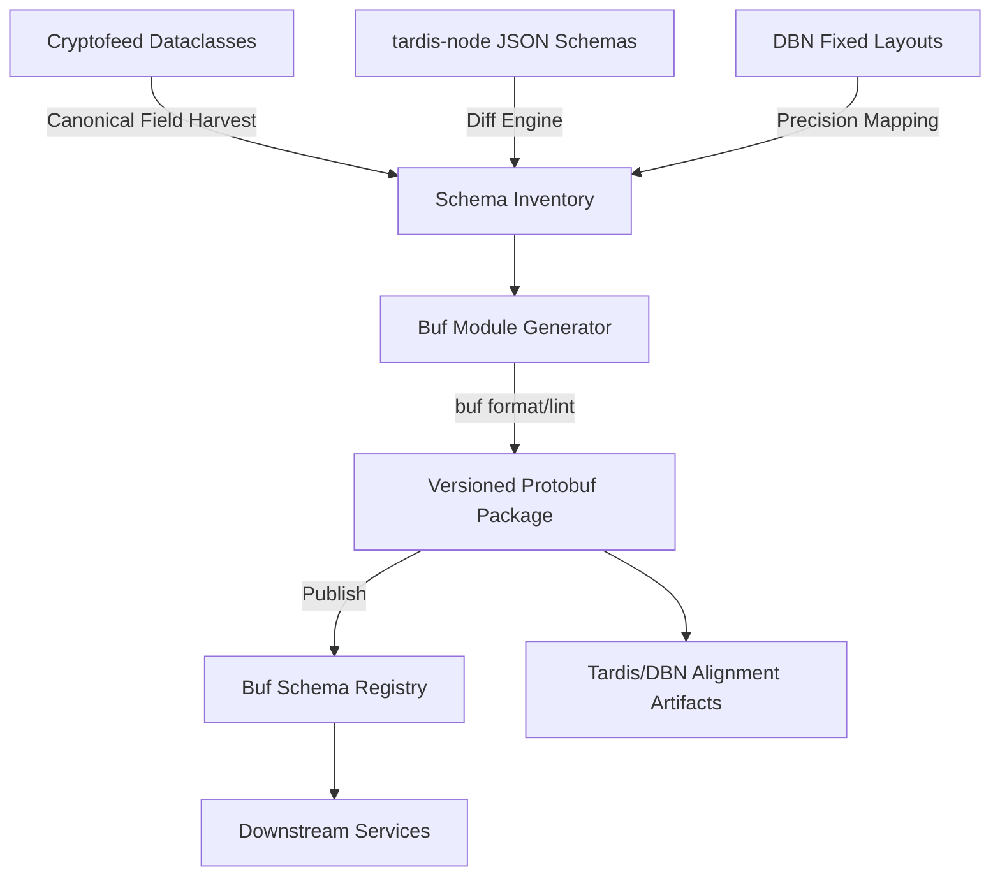

# Design Document – Buf-Centric Schema Alignment

## Overview
The normalized-data-schema-crypto initiative now delivers canonical cryptocurrency
market data schemas as Buf-managed Protobuf modules. Cryptofeed dataclasses are
the primary source of truth for field semantics; tardis-node JSON exports and
DBN fixed layouts serve as complementary references that supply transport-specific
constraints and metadata. Instead of
maintaining a separate schema package inside Cryptofeed, the program reconciles
conflicts via governance and publishes versioned modules to the Buf Schema
Registry (BSR). Downstream teams consume the BSR artifact to guarantee
consistent semantics across streaming adapters, historical replay, and
analytics tooling.

## Goals & Non-Goals
- **Goals**
  - Provide a single, Buf-based Protobuf contract for normalized crypto events.
  - Align tardis-node JSON schemas and DBN fixed layouts with the canonical
    Protobuf definitions.
  - Automate schema validation, linting, and breaking-change detection via Buf
    CLI workflows integrated in CI.
  - Publish versioned modules to the BSR with governance artifacts (changelog,
    migration guidance, dashboards).
- **Non-Goals**
  - Implement new runtime transports or storage engines; transports remain
    consumers of the published Protobuf module as needed.
  - Maintain a local schema registry or custom encoder library inside
    Cryptofeed.
  - Replace tardis-node or DBN pipelines; instead we synchronize their schemas
    with the canonical Protobuf definitions.

## Requirements Traceability
| Requirement | Design Coverage |
| --- | --- |
| R1 Cross-Source Schema Inventory | §Schema Inventory Workflow |
| R2 Protobuf Canonicalization | §Buf Module Structure, §Generation Pipeline |
| R3 BSR Publication & Versioning | §Release Process, §CI/CD Integration |
| R4 Tardis/DBN Alignment | §Source Alignment, §Regression Validation |
| R5 Governance & Documentation | §Governance Model, §Artifacts |

## Architecture Overview

## Schema Inventory Workflow (R1)
1. **Source Harvesters** convert each field from Cryptofeed dataclasses (canonical source) across priority market data events—trades, order books (L2/L3), funding, NBBO, ticker—alongside complementary tardis-node JSON exports and DBN layouts into normalized records including name, type, units, precision, and lineage. Secondary datasets (balances, liquidations, options Greeks, portfolios) are catalogued in Phase 2.
2. **Inventory Store**: YAML/CSV tables kept in `docs/schemas/inventory/` capture the merged view with conflict markers and coverage status (complete/partial/missing) for every normalized event. Each tardis-node/DBN row references the canonical Cryptofeed field it maps to, highlighting complementary metadata or gaps.
3. **Adjudication Process**: Conflicts trigger workshops; decisions recorded in
   `inventory/DECISIONS.md` with action items. Deviations from the Cryptofeed
   canonical definition must document rationale and compensating steps.
4. **Automation**: A simple Python CLI (`tools/schema_inventory.py`) validates
   that new fields are documented before Buf generation runs.

## Buf Module Structure (R2)
- **Workspace Layout**
  - `proto/cryptofeed/normalized/v1/*.proto`
  - `buf.yaml` (module definition, including BSR namespace and lint config)
  - `buf.gen.yaml` (code generation targets for language bindings)
- **Schema Conventions**
  - Use snake_case field names aligned with existing dataclasses.
  - Decimal fields represented as strings with comments describing scale; future
    extension can adopt `google.type.DecimalValue` once standardized.
  - Enumerations mirror existing defines (e.g., `BUY`/`SELL`) with reserved
    numbers for future extension.
  - Timestamp fields use `int64` microseconds since epoch for deterministic
    alignment with tardis-node and DBN.
- **Buf Workflows**
  - `buf format` enforced via pre-commit.
  - `buf lint` ensures style and package consistency.
  - `buf breaking --against` checks the last published module in CI.

## Generation Pipeline (R2)
1. **Inventory to Protobuf Mapping**: A generator script reads the inventory and
   outputs `.proto` templates with field numbers derived from a deterministic
   sequence (optionally storing metadata in `proto/MAPPINGS.md`).
2. **Manual Review**: Engineers validate annotations, comments, and message
   naming.
3. **Rendering**: `buf format` normalizes output before commit.
4. **Code Generation**: Optional language targets (Python, Go) produced via
   `buf generate` if downstream teams require libraries.

## Source Alignment (R4)
- **tardis-node**: Update JSON Schema references to include Buf field numbers and ensure JSON serialization matches the canonical Protobuf structure defined by Cryptofeed dataclasses for the market data set (trades, order books, funding, ticker, NBBO). Account-level schemas follow once market data parity is complete.
- **DBN**: Document byte offsets and scaling relative to Protobuf fields; maintain YAML sheets cross-referencing DBN identifiers to Protobuf paths that originate from the Cryptofeed contract, focusing on market data first and documenting gaps for account data as follow-up.
- **Cryptofeed Dataclasses**: Provide mapping tables so consumers know which dataclass properties map to each Protobuf field and confirm they remain the authoritative definition for every event class.

## Regression Validation (R4)
- **Parity Tests**: Replay representative tardis-node JSON and DBN binary
  samples, encode them into the Protobuf messages, and assert field equality.
- **Throughput Benchmarks**: Measure `buf`-generated code performance to ensure
  Protobuf serialization meets latency expectations.
- **Diff Reports**: For each release candidate, generate `reports/parity/*.json`
  summarizing mismatches and regression outcomes.

## Release Process (R3 & R5)
1. **Version Bump**: Update module version in `buf.yaml` and changelog entry.
2. **CI Pipeline**: Run `buf lint`, `buf breaking`, parity tests, and code
   generation checks; failing stages block release.
3. **Publication**: `buf registry push` uploads the module to the BSR with
   release notes referencing field changes and migration guidance.
4. **Documentation**: Update `docs/schemas/README.md`, migration guides, FAQs,
   and share Buf module metrics (downloads, dependents) via dashboards.

## Governance Model (R5)
- **Change Proposals**: Use lightweight RFCs stored in
  `docs/schemas/proposals/` detailing rationale, impact, and rollout plan.
- **Review Cadence**: Bi-weekly schema steering meeting reviews open proposals
  and monitors BSR feedback.
- **Consumer Feedback Loop**: BSR module issues tracked in the central schema
  backlog with SLA (2 business days) for acknowledgement.

## Risks & Mitigations
- **Schema Drift**: Mitigated by mandatory Buf breaking checks and parity
  replays against tardis-node/DBN samples.
- **Adoption Lag**: Provide version negotiation guidance and optional shims for
  teams migrating from legacy JSON schemas.
- **Decimal Precision**: Document recommended fixed-point scaling and highlight
  potential overflow scenarios in DBN alignment notes.

## Implementation Roadmap
1. **Phase 0 – Inventory Bootstrap**: Harvest fields, populate comparison
   matrix, resolve conflicts for critical events (trades, L2 book).
2. **Phase 1 – Buf Module MVP**: Generate initial `.proto` files, run linting,
   produce sample code bindings, and stage release candidate.
3. **Phase 2 – Source Alignment**: Update tardis-node JSON Schema references and
   DBN layout docs; execute parity tests; iterate on gaps.
4. **Phase 3 – BSR Publication**: Complete CI pipeline, publish module, and
   distribute migration guides.
5. **Phase 4 – Ongoing Governance**: Monitor metrics, respond to consumer
   requests, and plan subsequent schema extensions.
