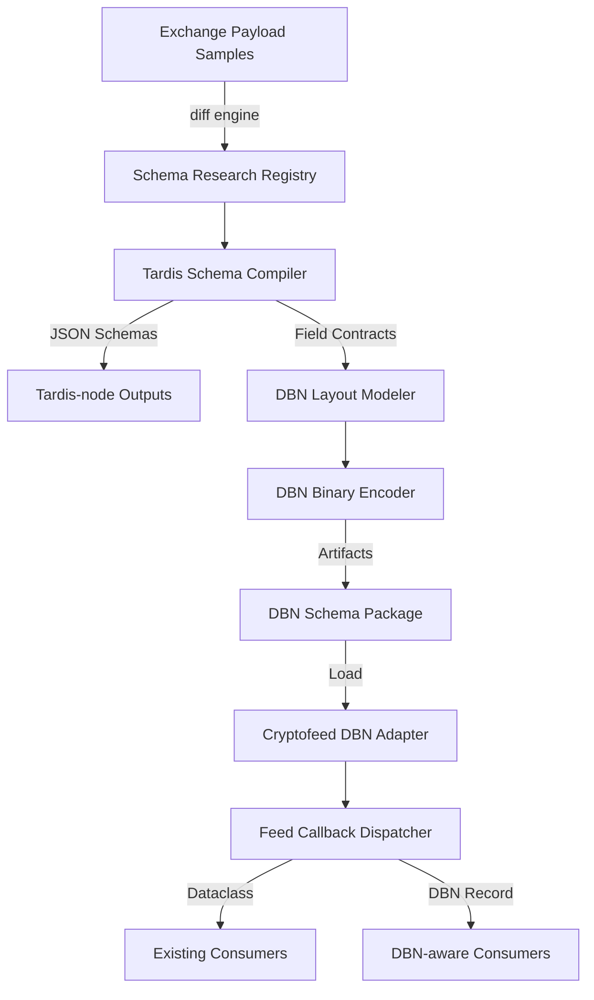
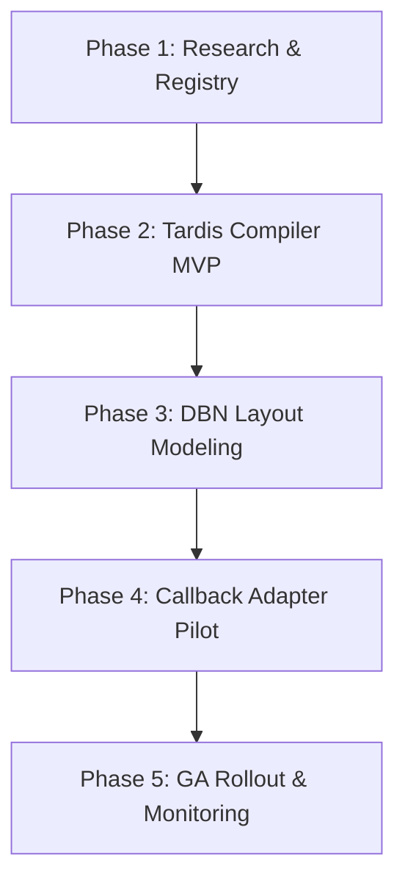

# Design Document

## Overview
The normalized-data-schema-crypto initiative extends Cryptofeed’s normalization
pipeline to publish DBN-compatible payloads enriched with crypto-specific
attributes. The solution standardizes schema research artifacts, introduces a
versioned schema compiler for tardis-node and DBN fixed records, and adds a
DBN emission path to feed callbacks without disturbing existing dataclass
consumers. The design emphasizes parallel work streams (schema research,
tardis-node alignment, DBN layout modeling, callback enablement) coordinated via
bounded interfaces and shared specification hubs.

## Goals & Non-Goals
- **Goals**
  - Provide authoritative schema research outputs covering exchange payloads,
    tardis-node exports, and DBN layouts.
  - Generate versioned tardis-node schema extensions and DBN fixed-width
    definitions with crypto fields (e.g., sequencing, funding, options Greeks).
  - Enable Cryptofeed callbacks to emit DBN-compliant payloads alongside
    existing dataclasses with configuration gating.
  - Supply governance assets (migrations, changelog, regression plan) for
    adoption across streaming and historical pipelines.
- **Non-Goals**
  - Implement runtime ingestion or storage layers beyond schema emission.
  - Replace tardis-node or DBN storage tooling.
  - Redesign existing proxy, transport, or adapter infrastructure.

## Requirements Traceability
| Requirement | Design Coverage |
| --- | --- |
| R1 Schema Landscape Assessment | §Schema Research Workstream, §Context Registry |
| R2 Tardis-Node Extensions | §Schema Compiler, §Tardis Alignment Workflow |
| R3 DBN Fixed Extensions | §DBN Layout Model, §Binary Encoder |
| R4 Governance & Tooling | §Governance & Documentation, §Regression Plan |
| R5 DBN Callback Enablement | §Callback Adapter, §Runtime Configuration |

## Architecture Overview


## Data Flow
```mermaid
graph LR
  src1[(Exchange)] --> p1[Transport/Adapter]
  p1 --> norm[Normalized Event (dataclass)]
  norm --> cfg{DBN Mode Enabled?}
  cfg -- No --> fwd1[Dispatch Dataclass]
  cfg -- Yes --> map[DBN Field Mapper]
  map --> pack[Fixed Record Encoder]
  pack --> fwd2[Dispatch DBN Payload]
  fwd2 --> log[Proxy/Metrics Hooks]
```

## Component Design

### Schema Research Registry
- **Purpose:** Centralize field inventories, transport notes, and licensing for
  exchange formats, tardis-node outputs, and DBN layouts.
- **Key Features:** Version-controlled markdown/CSV tables, diff tooling,
  metadata enrichment (precision, timestamps, feed source).
- **Interfaces:** CLI/automation script producing `schema_registry.json` with
  enumerated fields and lineage references.

### Tardis Schema Compiler
- **Purpose:** Convert research artifacts into versioned tardis-node JSON Schema
  definitions with crypto extensions.
- **Key Features:** Canonical field naming, type validation, Decimal scale
  policies, sequence semantics, migration annotations.
- **Interfaces:** Python module `cryptofeed.schemas.tardis.compile()` producing
  JSON Schema files plus sample payloads.

### DBN Layout Modeler
- **Purpose:** Define fixed-width record layouts consistent with DBN conventions
  while incorporating crypto fields.
- **Key Features:** Byte offset calculator, endianness rules, scaling factor
  ledger, field-level compatibility notes vs. `cryptofeed.types`.
- **Interfaces:** YAML definition consumed by encoder; export `dbn_layout.json`
  and Markdown spec with diagrams.

### DBN Binary Encoder
- **Purpose:** Produce test fixtures (binary + JSON) and parity tests ensuring
  DBN records faithfully represent normalized dataclasses.
- **Key Features:** Deterministic serialization, checksum validation, CI hooks
  for regression replay.
- **Interfaces:** `cryptofeed.dbn.encoder.encode(event)` returning `bytes` plus
  metadata for assertions.

### DBN Callback Adapter
- **Purpose:** Extend feed callbacks with optional DBN emission while preserving
  existing behavior.
- **Key Features:** Config flag (`feedhandler.dbn_mode`), dual dispatch,
  parity assertions, proxy/metrics integration.
- **Interfaces:** Wrapper around `Feed.callback()` returning both dataclass and
  DBN payload when enabled.

## Data Models
- **NormalizedEvent (existing):** Exchange, symbol, timestamp, price, size,
  side, sequence, raw payload reference.
- **TardisNormalizedRecord (JSON):** Extends NormalizedEvent with canonical
  IDs, maker/taker flag, tick size, funding rate, options Greeks.
- **DBNFixedRecord (binary):** Byte layout mapping to the above fields with
  scaled integers and reserved bits for crypto extensions.
- **SchemaRegistryEntry (JSON):** `{ "source": "exchange", "field": "price",
  "type": "decimal", "precision": 8, "flow": "transport->adapter" }`.

## Integration Strategy
- **Bounded Interfaces:** Schema registry feeds compiler via JSON; compiler
  outputs consumed by both tardis-node workflows and DBN modeler.
- **Parallel Streams:** Each work stream (research, tardis, DBN, callbacks)
  commits to artifacts compatible via the registry contract, supporting compound
  engineering with minimal cross-blocking.
- **Adoption Plan:** Provide configuration toggles and sample notebooks
  demonstrating dataclass vs. DBN consumption.

## Error Handling & Monitoring
- **Validation Errors:** Compiler raises structured exceptions (with field path)
  when schema conflicts detected; captured in CI.
- **Encoding Failures:** DBN encoder logs record metadata and raw payload for
  forensic analysis; retries disabled to ensure deterministic failure.
- **Monitoring:** Metrics on DBN emission counts, parity check outcomes, and
  schema registry freshness (age of latest research entry).

## Testing Strategy
- **Unit Tests:**
  - Schema registry diffing and metadata enrichment.
  - Tardis compiler generating expected JSON Schema fragments.
  - DBN encoder scaling and checksum logic.
  - Callback adapter toggling DBN mode.
- **Integration Tests:**
  - Replay recorded exchange payloads through adapters → DBN encoder.
  - Tardis-node export compatibility using sample JSON Schemas.
  - Proxy + DBN callback path verifying metrics.
- **Regression Suites:**
  - Golden binary fixtures vs. newly encoded payloads.
  - Parity checks between dataclass and DBN representations for trades, order
    books, funding, and options.

## Governance & Documentation
- Maintain `docs/schemas/normalized-data.md` summarizing schema versions,
  migration guides, and FAQ.
- Publish changelog entries per schema release with backward compatibility
  matrix.
- Define review cadence (bi-weekly) to reconcile parallel work streams and
  adjust roadmap.

## Migration Strategy

- **Rollback:** Toggle DBN mode off; fallback to existing dataclass-only path.
- **Validation:** Run regression suite before advancing each phase; require
  research registry freshness <= 7 days.

