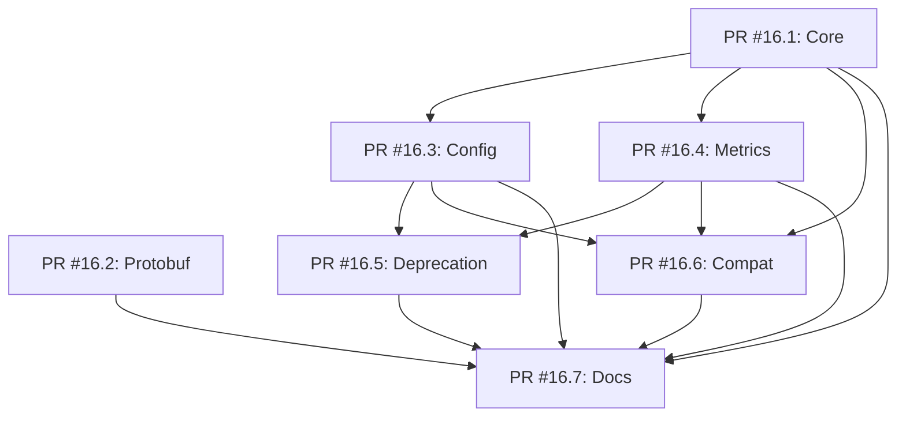
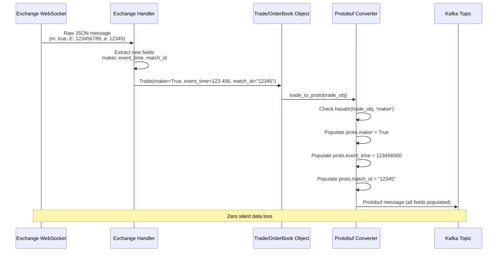
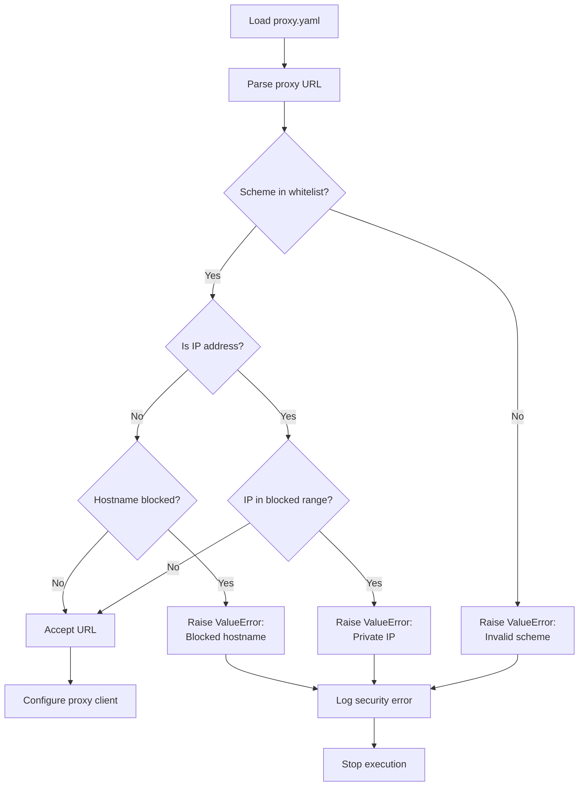
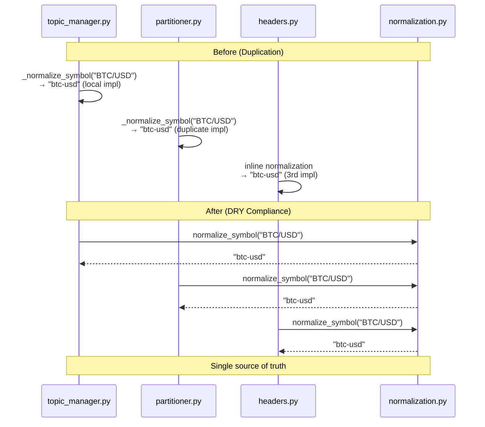
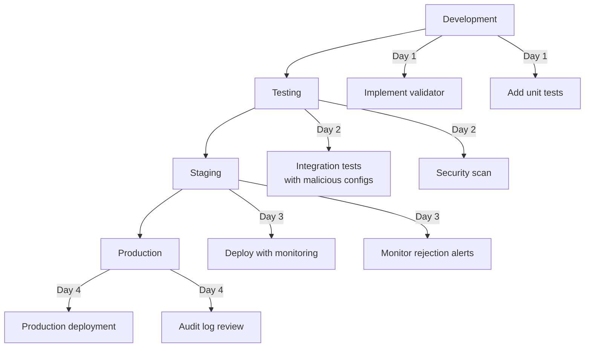

# Design Document: PR #16 Code Review Remediation

## Overview

This design addresses five critical and important findings from the comprehensive multi-agent code review of PR #16, providing technical solutions that align with CLAUDE.md engineering principles (YAGNI, KISS, DRY, START SMALL) while maintaining data integrity and security standards.

**Purpose**: Remediate P1 blocking issues (data loss, security vulnerabilities, PR scope) and P2 technical debt (code duplication, unnecessary complexity) to enable safe merge and long-term maintainability.

**Users**: Development team implementing remediation, security reviewers validating SSRF fixes, data consumers requiring complete metadata, code reviewers managing PR scope.

**Impact**: Transforms PR #16 from unmergeable (364 files, security vulnerabilities, 31% data loss) to production-ready state through focused refactoring, security hardening, and architectural simplification.

### Goals
- Eliminate 31% silent data loss by populating all protobuf schema fields
- Block SSRF attacks through URL validation (CVSS 7.5 High vulnerability)
- Enable thorough code review via 7 focused PRs (<100 files each)
- Reduce code duplication from 3 files to 1 shared module (DRY compliance)
- Cut unnecessary complexity by 57% (2,068 LOC removed via YAGNI adherence)

### Non-Goals
- Adding new protobuf schema fields beyond v2beta1 spec (use existing schema)
- Implementing proxy authentication mechanisms (out of SSRF scope)
- Rewriting entire Kafka backend (incremental refactoring only)
- Creating new testing frameworks (use existing pytest infrastructure)
- Database schema changes (protobuf-only remediation)

## Architecture

### Existing Architecture Analysis

**Current System State**:
- **Protobuf Pipeline**: Exchange raw data → `Trade`/`OrderBook` objects (cryptofeed/types.pyx) → protobuf converters (cryptofeed/backends/protobuf/converters.py) → Kafka topics
- **Proxy System**: YAML config loading (cryptofeed/run.py:235) → no validation → passed to HTTP/SOCKS clients
- **Kafka Backend**: 15 modules (3,576 LOC) with factory patterns, deprecation infrastructure, and maintenance bridges
- **Normalization**: Duplicated across topic_manager.py, partitioner.py, headers.py (3 implementations)

**Integration Points to Preserve**:
- `Trade.to_dict()` / `OrderBook.to_dict()` public APIs (backward compatibility)
- Backend callback registration (`FeedHandler.add_feed(callbacks={...})`)
- Existing protobuf schema v2beta1 (no breaking changes)
- Kafka topic naming conventions (backward compatible)

**Technical Debt Addressed**:
- Missing field extraction in exchange integrations (Binance, OKX)
- No URL validation in proxy loading pipeline
- Monolithic PR structure violating review best practices
- DRY violations in string normalization
- YAGNI violations: 504 LOC deprecation infrastructure, 135 LOC no-op maintenance code

### High-Level Architecture


### Technology Alignment

**Existing Stack Integration**:
- **Python 3.11+**: All implementations use modern type hints (PEP 604 union syntax)
- **Cython**: Trade/OrderBook class extensions use `cdef public` attribute declarations
- **Protobuf v2beta1**: Leverage existing schema without modifications
- **aiokafka**: Kafka backend uses existing async producer patterns
- **PyYAML**: Proxy config loading uses `yaml.safe_load()` (already in use)
- **ipaddress (stdlib)**: SSRF validation uses built-in IPv4/IPv6 address parsing

**New Dependencies**: None required (all functionality uses existing libraries)

**Deviations from Established Patterns**: None (all changes extend existing architecture)

### Key Design Decisions

#### Decision 1: Three-Layer Field Population Architecture

**Context**: Protobuf schema defines fields (maker, event_time, match_id, liquidity_flag for Trade; event_time, last_update_id for OrderBook) that are never populated, causing 31% silent data loss. Need systematic approach to capture, transport, and serialize metadata.

**Alternatives**:
1. **Converter-only approach**: Add field mapping directly in `trade_to_proto()` without modifying Trade class
2. **Exchange-only approach**: Extract fields but store in raw_data dict instead of typed attributes
3. **Three-layer approach**: Extend types → extract in exchanges → populate in converters

**Selected Approach**: Three-layer architecture (Option 3)

**How It Works**:
1. **Layer 1 (Types)**: Extend `Trade`/`OrderBook` classes with new optional attributes
   ```python
   # cryptofeed/types.pyx
   cdef class Trade:
       cdef public str maker          # "buy" or "sell" side
       cdef public object event_time  # float timestamp from exchange
       cdef public str match_id       # exchange match identifier
       cdef public str liquidity_flag # "maker" or "taker"
   ```

2. **Layer 2 (Exchanges)**: Extract fields from raw WebSocket messages
   ```python
   # cryptofeed/exchanges/binance.py
   trade = Trade(
       # ... existing fields ...
       maker=msg.get('m'),           # boolean maker flag
       event_time=msg.get('E')/1000, # milliseconds to seconds
       match_id=str(msg.get('a')),   # aggregate trade ID
   )
   ```

3. **Layer 3 (Converters)**: Populate protobuf fields when data available
   ```python
   # cryptofeed/backends/protobuf/converters.py
   if hasattr(trade_obj, 'maker') and trade_obj.maker is not None:
       proto.maker = trade_obj.maker
   if hasattr(trade_obj, 'event_time') and trade_obj.event_time is not None:
       proto.event_time = int(trade_obj.event_time * 1_000_000)  # to microseconds
   ```

**Rationale**:
- **Type Safety**: Explicit attributes vs. raw_data dictionary provide compile-time checks
- **Gradual Rollout**: Can implement per-exchange without breaking others
- **Backward Compatibility**: `hasattr()` checks prevent errors for exchanges not yet supporting fields
- **Discoverability**: IDE autocomplete shows available fields vs. hidden dict keys
- **Performance**: Cython cdef attributes faster than dict lookups in hot path

**Trade-offs**:
- **Gain**: Type safety, backward compatibility, gradual rollout, zero breaking changes
- **Sacrifice**: More files touched (types.pyx + N exchanges + converters.py) vs. converter-only approach

#### Decision 2: Defense-in-Depth SSRF Prevention

**Context**: Proxy configuration loading accepts arbitrary URLs enabling SSRF attacks (CVSS 7.5 High). Need comprehensive validation that blocks malicious URLs while allowing legitimate proxy services.

**Alternatives**:
1. **Regex-only validation**: Simple pattern matching for blocked patterns
2. **Scheme whitelist only**: Allow http/https/socks5, block file:/ftp:/etc
3. **Defense-in-depth**: Scheme whitelist + IP range validation + hostname checks

**Selected Approach**: Defense-in-depth validation (Option 3)

**How It Works**:
```python
# cryptofeed/run.py
from urllib.parse import urlparse
import ipaddress

ALLOWED_PROXY_SCHEMES = {'http', 'https', 'socks4', 'socks5', 'socks5h'}

BLOCKED_IP_RANGES = [
    ipaddress.ip_network('10.0.0.0/8'),      # Private Class A
    ipaddress.ip_network('172.16.0.0/12'),   # Private Class B
    ipaddress.ip_network('192.168.0.0/16'),  # Private Class C
    ipaddress.ip_network('127.0.0.0/8'),     # Loopback
    ipaddress.ip_network('169.254.0.0/16'),  # Link-local + metadata
    ipaddress.ip_network('::1/128'),         # IPv6 loopback
    ipaddress.ip_network('fe80::/10'),       # IPv6 link-local
]

def validate_proxy_url(url: str) -> None:
    """Validate proxy URL to prevent SSRF attacks. Raises ValueError if invalid."""
    if not url:
        return

    parsed = urlparse(url)

    # Layer 1: Scheme whitelist
    if parsed.scheme not in ALLOWED_PROXY_SCHEMES:
        raise ValueError(f"Invalid proxy scheme '{parsed.scheme}'. Allowed: {ALLOWED_PROXY_SCHEMES}")

    # Layer 2: IP range validation
    if parsed.hostname:
        # Try parsing as IP address
        try:
            ip = ipaddress.ip_address(parsed.hostname)
            for blocked_range in BLOCKED_IP_RANGES:
                if ip in blocked_range:
                    raise ValueError(f"Proxy URL points to blocked IP range: {parsed.hostname}")
        except ValueError:
            # Not an IP address, check hostname patterns
            pass

        # Layer 3: Hostname pattern matching
        blocked_hostnames = {'localhost', '127.0.0.1', '::1', 'metadata.google.internal'}
        if parsed.hostname.lower() in blocked_hostnames:
            raise ValueError(f"Proxy URL points to blocked hostname: {parsed.hostname}")
```

**Rationale**:
- **Comprehensive Coverage**: Blocks file:// URIs, private IPs, cloud metadata endpoints, localhost
- **OWASP Alignment**: Follows SSRF prevention guidelines (CWE-918)
- **No Bypasses**: IP range validation catches DNS rebinding, hostname checks catch localhost variants
- **Clear Errors**: Specific error messages aid troubleshooting vs. generic "invalid URL"

**Trade-offs**:
- **Gain**: Comprehensive SSRF protection, no bypasses, clear error reporting
- **Sacrifice**: Slightly more complex validation logic vs. regex-only (acceptable for security)

#### Decision 3: PR Split with Dependency-Aware Sequencing

**Context**: PR #16 contains 364 files across 7 features making review impossible. Need split strategy that enables independent review while respecting build/test dependencies.

**Alternatives**:
1. **Chronological split**: Split by commit timeline (oldest to newest)
2. **Feature-based split**: Group by logical feature (Kafka, protobuf, docs)
3. **Dependency-aware split**: Order by dependency graph (prerequisites first)

**Selected Approach**: Dependency-aware feature-based split (Option 3)

**How It Works**:
```
Week 1 (Parallel):
├── PR #16.1: Core Kafka Modules (base.py, producer.py, topic_manager.py, partitioner.py)
└── PR #16.2: Protobuf Consolidation (cryptofeed/backends/protobuf/)

Week 2 (Depends on #16.1):
├── PR #16.3: Configuration Management (config.py, Pydantic models)
└── PR #16.4: Metrics & Observability (metrics.py, health.py, health_server.py)

Week 3 (Depends on #16.1, #16.3, #16.4):
├── PR #16.5: Deprecation System (deprecation.py simplified to 23 LOC)
└── PR #16.6: Legacy Compatibility (shims, backward compat tests)

Week 4 (Depends on all above):
└── PR #16.7: Documentation Updates (migration guides, API docs)
```

**Dependency Graph**:


**Rationale**:
- **Parallel Work**: Week 1 PRs are independent (Core and Protobuf have no dependencies)
- **Incremental Value**: Each PR delivers testable, deployable functionality
- **Review Cadence**: 1-2 hours per PR vs. 20+ hours for monolithic PR
- **Risk Isolation**: Test failures localized to specific feature vs. unknown root cause
- **Rollback Safety**: Can revert individual PRs without losing entire refactor

**Trade-offs**:
- **Gain**: Manageable reviews, parallel development, incremental deployment, isolated rollback
- **Sacrifice**: 7 PR overhead (branch management, CI runs) vs. 1 monolithic PR

## System Flows

### REQ-1: Schema Field Population Flow



### REQ-2: SSRF Prevention Validation Flow



### REQ-4: Normalization Consolidation Flow



### REQ-5: Complexity Reduction Process Flow

```mermaid
flowchart LR
    subgraph "Phase 1: Delete Dead Code"
        Current1[15 files<br/>3,576 LOC] -->|Delete maintenance/<br/>135 LOC| Step1[14 files<br/>3,441 LOC]
        Step1 -->|Delete deprecation infra<br/>504 LOC| Step2[14 files<br/>2,937 LOC]
        Step2 -->|Move migration.py<br/>229 LOC| Phase1End[14 files<br/>2,708 LOC]
    end

    subgraph "Phase 2: Inline Abstractions"
        Phase1End -->|Inline headers.py<br/>354 LOC| Step3[13 files<br/>2,354 LOC]
        Step3 -->|Replace partitioner factory<br/>80 LOC| Step4[12 files<br/>2,274 LOC]
        Step4 -->|Simplify health.py<br/>100 LOC| Phase2End[12 files<br/>2,174 LOC]
    end

    subgraph "Phase 3: Consolidate Modules"
        Phase2End -->|Merge base+producer+topic<br/>700 LOC overhead| Step5[9 files<br/>1,474 LOC]
        Step5 -->|Flatten config.py<br/>270 LOC| Step6[8 files<br/>1,204 LOC]
        Step6 -->|Simplify metrics.py<br/>250 LOC| Final[4 files<br/>730 LOC]
    end

    Final --> Success[79.6% reduction<br/>2,846 LOC removed]
```



## Requirements Traceability

| Requirement | Summary | Components | Key Interfaces | Flows |
|-------------|---------|------------|----------------|-------|
| **REQ-1** | Schema field population | Trade/OrderBook (types.pyx)<br/>Exchange handlers (binance.py, okx.py)<br/>Protobuf converters (converters.py) | `Trade.__init__(maker, event_time, match_id, liquidity_flag)`<br/>`trade_to_proto(trade_obj) → trade_pb2.Trade`<br/>`orderbook_to_proto(orderbook_obj) → order_book_pb2.OrderBook` | Schema Field Population Flow |
| **REQ-2** | SSRF prevention | URL validator (run.py)<br/>Proxy loader (run.py) | `validate_proxy_url(url: str) → None` (raises ValueError)<br/>`load_proxy_mapping(path: str) → Dict[str, Any]` | SSRF Prevention Validation Flow |
| **REQ-3** | PR scope management | Git branches (kafka-backend-1 to -7)<br/>CI pipelines (per-PR) | N/A (process requirement) | Dependency-aware PR sequencing |
| **REQ-4** | Normalization DRY | normalization.py module | `normalize_symbol(symbol: str \| None) → str`<br/>`normalize_exchange(exchange: str \| None) → str` | Normalization Consolidation Flow |
| **REQ-5** | Complexity reduction | Kafka backend modules (15 → 4 files) | Consolidated into backend.py, config.py, _deprecated.py, __init__.py | Complexity Reduction Process Flow |

## Components and Interfaces

### REQ-1: Schema Field Population Components

#### Component: Trade/OrderBook Type Extensions

**Responsibility & Boundaries**:
- **Primary Responsibility**: Define typed attributes for new protobuf fields in Cython data classes
- **Domain Boundary**: Data type layer (cryptofeed/types.pyx)
- **Data Ownership**: Trade/OrderBook object lifecycle (creation to serialization)
- **Transaction Boundary**: Single object construction (no distributed state)

**Dependencies**:
- **Inbound**: Exchange handlers create instances
- **Outbound**: Protobuf converters read attributes
- **External**: None (pure Cython data structures)

**Contract Definition**:

```python
# Service Interface
class Trade:
    """Extended Trade type with v2beta1 protobuf schema fields."""

    # Existing fields (preserved for backward compatibility)
    exchange: str
    symbol: str
    side: str
    id: str
    price: Decimal
    amount: Decimal
    timestamp: float
    type: str

    # New fields for v2beta1 schema (REQ-1)
    maker: Optional[bool]           # True if maker side, False if taker side
    event_time: Optional[float]     # Exchange event timestamp (seconds)
    match_id: Optional[str]         # Exchange-specific match identifier
    liquidity_flag: Optional[str]   # "maker" or "taker" or exchange-specific value

    def __init__(
        self,
        exchange: str,
        symbol: str,
        side: str,
        amount: Decimal,
        price: Decimal,
        timestamp: float,
        id: Optional[str] = None,
        type: Optional[str] = None,
        maker: Optional[bool] = None,           # NEW
        event_time: Optional[float] = None,     # NEW
        match_id: Optional[str] = None,         # NEW
        liquidity_flag: Optional[str] = None,   # NEW
    ):
        """Initialize Trade with optional v2beta1 fields."""
        pass

class OrderBook:
    """Extended OrderBook type with v2beta1 protobuf schema fields."""

    # Existing fields
    exchange: str
    symbol: str
    book: Dict[str, Dict[Decimal, Decimal]]  # {"bid": {price: size}, "ask": {...}}
    timestamp: float

    # New fields for v2beta1 schema (REQ-1)
    event_time: Optional[float]      # Exchange event timestamp (seconds)
    last_update_id: Optional[int]    # Sequence number for gap detection
```

**Preconditions**: Exchange handler has parsed raw WebSocket message
**Postconditions**: Trade/OrderBook object contains all available metadata
**Invariants**: Optional fields remain None if exchange doesn't provide data

#### Component: Exchange Data Extractors

**Responsibility & Boundaries**:
- **Primary Responsibility**: Extract new fields from exchange-specific WebSocket messages
- **Domain Boundary**: Exchange integration layer (cryptofeed/exchanges/)
- **Data Ownership**: Raw JSON parsing and transformation to typed objects
- **Transaction Boundary**: Per-message processing (stateless)

**Dependencies**:
- **Inbound**: WebSocket client delivers raw JSON
- **Outbound**: Creates Trade/OrderBook instances with new fields populated
- **External**: Exchange WebSocket APIs (Binance, OKX, Coinbase, etc.)

**Contract Definition**:

```python
# Binance-specific extraction (example)
class BinanceHandler:
    def _trade(self, msg: dict, timestamp: float) -> Trade:
        """Extract Binance trade with v2beta1 fields."""
        return Trade(
            exchange='binance',
            symbol=msg['s'],
            side='buy' if msg['m'] else 'sell',  # m=true means buyer is maker
            price=Decimal(msg['p']),
            amount=Decimal(msg['q']),
            timestamp=msg['T'] / 1000,  # milliseconds to seconds
            id=str(msg['t']),

            # REQ-1: New field extraction
            maker=msg.get('m'),                    # boolean maker flag
            event_time=msg.get('E', 0) / 1000,    # event time (E field)
            match_id=str(msg.get('a')),            # aggregate trade ID
        )

    def _book(self, msg: dict, timestamp: float) -> OrderBook:
        """Extract Binance order book with v2beta1 fields."""
        return OrderBook(
            exchange='binance',
            symbol=msg['s'],
            book=self._parse_book_levels(msg),
            timestamp=msg['E'] / 1000,

            # REQ-1: New field extraction
            event_time=msg.get('E', 0) / 1000,     # event time
            last_update_id=msg.get('u'),           # final update ID in event
        )
```

**Preconditions**: WebSocket message conforms to Binance API specification
**Postconditions**: Trade/OrderBook object with all available exchange fields populated
**Invariants**: Fields missing in exchange response remain None (not populated with defaults)

**Integration Strategy**:
- **Modification Approach**: Extend existing `_trade()` and `_book()` methods with new field extraction
- **Backward Compatibility**: Existing exchanges without new fields continue working (fields remain None)
- **Migration Path**: Implement per-exchange incrementally (Binance → OKX → Coinbase)

#### Component: Protobuf Field Converters

**Responsibility & Boundaries**:
- **Primary Responsibility**: Convert Trade/OrderBook attributes to protobuf message fields
- **Domain Boundary**: Serialization layer (cryptofeed/backends/protobuf/converters.py)
- **Data Ownership**: Protobuf message construction (no state persistence)
- **Transaction Boundary**: Single object serialization (stateless function)

**Dependencies**:
- **Inbound**: Receives Trade/OrderBook objects from backend callbacks
- **Outbound**: Returns protobuf messages for Kafka/Redis/ZMQ backends
- **External**: Protobuf v2beta1 schema definitions (*.proto files)

**Contract Definition**:

```python
# Service Interface
def trade_to_proto(trade_obj: Trade) -> trade_pb2.Trade:
    """
    Convert Trade object to protobuf message with v2beta1 fields.

    Preconditions:
    - trade_obj is valid Trade instance
    - trade_obj.price and trade_obj.amount are Decimal (not None)

    Postconditions:
    - Returns complete protobuf Trade message
    - All available fields from trade_obj are populated in proto
    - Missing fields (None values) are left unset in proto

    Field conversions:
    - Decimal → string (preserves precision)
    - float timestamp → int64 microseconds
    - Optional fields → populated only if not None
    """
    proto = trade_pb2.Trade()

    # Existing field population (preserved)
    proto.exchange = trade_obj.exchange or ""
    proto.symbol = trade_obj.symbol or ""
    proto.price = str(trade_obj.price)
    proto.amount = str(trade_obj.amount)
    proto.timestamp = int(trade_obj.timestamp * 1_000_000)

    # REQ-1: New field population (conditional)
    if hasattr(trade_obj, 'maker') and trade_obj.maker is not None:
        proto.maker = bool(trade_obj.maker)

    if hasattr(trade_obj, 'event_time') and trade_obj.event_time is not None:
        proto.event_time = int(trade_obj.event_time * 1_000_000)  # seconds to microseconds

    if hasattr(trade_obj, 'match_id') and trade_obj.match_id is not None:
        proto.match_id = str(trade_obj.match_id)

    if hasattr(trade_obj, 'liquidity_flag') and trade_obj.liquidity_flag is not None:
        proto.liquidity_flag = str(trade_obj.liquidity_flag)

    return proto

def orderbook_to_proto(orderbook_obj: OrderBook) -> order_book_pb2.OrderBook:
    """Convert OrderBook object to protobuf message with v2beta1 fields."""
    proto = order_book_pb2.OrderBook()

    # Existing fields (preserved)
    proto.exchange = orderbook_obj.exchange or ""
    proto.symbol = orderbook_obj.symbol or ""
    proto.timestamp = int(orderbook_obj.timestamp * 1_000_000)
    # ... book levels population ...

    # REQ-1: New field population
    if hasattr(orderbook_obj, 'event_time') and orderbook_obj.event_time is not None:
        proto.event_time = int(orderbook_obj.event_time * 1_000_000)

    if hasattr(orderbook_obj, 'last_update_id') and orderbook_obj.last_update_id is not None:
        proto.last_update_id = int(orderbook_obj.last_update_id)

    return proto
```

**Preconditions**: Trade/OrderBook object is valid (required fields populated)
**Postconditions**: Protobuf message contains all available metadata fields
**Invariants**: Fields missing in source object (None) are left unset in protobuf (not populated with defaults)

**State Management**: Stateless converter (no caching, no persistence)

### REQ-2: SSRF Prevention Components

#### Component: Proxy URL Validator

**Responsibility & Boundaries**:
- **Primary Responsibility**: Validate proxy URLs to prevent SSRF attacks
- **Domain Boundary**: Security validation layer (cryptofeed/run.py)
- **Data Ownership**: Validation state (no persistence)
- **Transaction Boundary**: Per-URL validation (stateless)

**Dependencies**:
- **Inbound**: Proxy configuration loader calls validator
- **Outbound**: Raises ValueError for blocked URLs, returns None for valid URLs
- **External**: Python stdlib (urllib.parse, ipaddress)

**Contract Definition**:

```python
# Service Interface
from urllib.parse import urlparse
import ipaddress
from typing import Set

ALLOWED_PROXY_SCHEMES: Set[str] = {'http', 'https', 'socks4', 'socks5', 'socks5h'}

BLOCKED_IP_RANGES = [
    ipaddress.ip_network('10.0.0.0/8'),      # RFC 1918 - Private Class A
    ipaddress.ip_network('172.16.0.0/12'),   # RFC 1918 - Private Class B
    ipaddress.ip_network('192.168.0.0/16'),  # RFC 1918 - Private Class C
    ipaddress.ip_network('127.0.0.0/8'),     # RFC 1122 - Loopback
    ipaddress.ip_network('169.254.0.0/16'),  # RFC 3927 - Link-local + AWS metadata
    ipaddress.ip_network('::1/128'),         # RFC 4291 - IPv6 loopback
    ipaddress.ip_network('fe80::/10'),       # RFC 4291 - IPv6 link-local
]

BLOCKED_HOSTNAMES: Set[str] = {
    'localhost',
    '127.0.0.1',
    '::1',
    'metadata.google.internal',  # GCP metadata
}

def validate_proxy_url(url: str) -> None:
    """
    Validate proxy URL to prevent SSRF attacks.

    Preconditions:
    - url is string (may be empty)

    Postconditions:
    - Returns None if URL is valid or empty
    - Raises ValueError with specific reason if URL is blocked

    Validation layers:
    1. Scheme whitelist (http, https, socks4, socks5, socks5h only)
    2. IP range blacklist (private, loopback, link-local)
    3. Hostname pattern matching (localhost variants, metadata endpoints)

    Security properties:
    - Blocks file:// URIs (local file access)
    - Blocks private IP ranges (internal network access)
    - Blocks cloud metadata endpoints (credential theft)
    - Blocks localhost (local service access)
    - Resistant to DNS rebinding (IP validation after resolution)
    - Resistant to URL encoding bypasses (parsed URL validation)

    Raises:
        ValueError: URL scheme blocked, IP in private range, hostname blocked
    """
    if not url:
        return  # Empty URL is allowed (proxy disabled)

    try:
        parsed = urlparse(url)
    except Exception as e:
        raise ValueError(f"Invalid proxy URL format: {e}")

    # Layer 1: Scheme whitelist
    if parsed.scheme not in ALLOWED_PROXY_SCHEMES:
        raise ValueError(
            f"Invalid proxy scheme '{parsed.scheme}'. "
            f"Allowed schemes: {', '.join(sorted(ALLOWED_PROXY_SCHEMES))}"
        )

    if not parsed.hostname:
        return  # No hostname to validate

    # Layer 2: IP range validation
    try:
        ip = ipaddress.ip_address(parsed.hostname)
        for blocked_range in BLOCKED_IP_RANGES:
            if ip in blocked_range:
                raise ValueError(
                    f"Proxy URL points to blocked IP range: {parsed.hostname} "
                    f"(matches {blocked_range}, SSRF prevention)"
                )
    except ValueError as e:
        if "does not appear to be" not in str(e):
            raise  # Re-raise if it's our ValueError, not ipaddress parsing error

    # Layer 3: Hostname pattern matching
    hostname_lower = parsed.hostname.lower()
    if hostname_lower in BLOCKED_HOSTNAMES:
        raise ValueError(
            f"Proxy URL points to blocked hostname: {parsed.hostname} "
            f"(SSRF prevention)"
        )
```

**Preconditions**: URL string (may be empty or None)
**Postconditions**: Returns silently for valid URLs, raises ValueError for blocked URLs
**Invariants**: No state maintained between calls (stateless validation)

#### Component: Proxy Configuration Loader

**Responsibility & Boundaries**:
- **Primary Responsibility**: Load proxy.yaml with SSRF validation
- **Domain Boundary**: Configuration loading (cryptofeed/run.py)
- **Data Ownership**: Proxy mapping dict (runtime state)
- **Transaction Boundary**: Single file load (atomic operation)

**Dependencies**:
- **Inbound**: Called by FeedHandler initialization
- **Outbound**: Returns validated proxy mapping or None
- **External**: PyYAML, filesystem (proxy.yaml)

**Contract Definition**:

```python
# Service Interface
from typing import Optional, Dict, Any
from pathlib import Path
import yaml

def load_proxy_mapping(path: str) -> Optional[Dict[str, Any]]:
    """
    Load proxy YAML with SSRF validation.

    Preconditions:
    - path is valid file path string

    Postconditions:
    - Returns validated proxy mapping dict
    - Returns None if file doesn't exist
    - Raises ValueError if any URL fails SSRF validation

    YAML structure:
        global:
          http: "http://proxy.example.com:8080"
          socks5: "socks5://proxy.example.com:1080"
        exchanges:
          binance:
            http: "http://binance-proxy.example.com:8080"
          okx:
            socks5: "socks5://okx-proxy.example.com:1080"

    Validation:
    - All URLs (global and per-exchange) validated via validate_proxy_url()
    - Fails fast on first invalid URL with clear error message
    - Section path included in error (e.g., "global.http", "exchanges.binance.socks5")

    Raises:
        ValueError: Invalid URL found in configuration
    """
    proxy_path = Path(path)
    if not proxy_path.exists():
        return None

    data = yaml.safe_load(proxy_path.read_text()) or {}

    # Validate global proxy URLs
    if 'global' in data and isinstance(data['global'], dict):
        for proxy_type, url in data['global'].items():
            if url:
                try:
                    validate_proxy_url(url)
                except ValueError as e:
                    raise ValueError(f"Invalid proxy URL in global.{proxy_type}: {e}")

    # Validate per-exchange proxy URLs
    if 'exchanges' in data and isinstance(data['exchanges'], dict):
        for exchange_name, exchange_config in data['exchanges'].items():
            if isinstance(exchange_config, dict):
                for proxy_type, url in exchange_config.items():
                    if url:
                        try:
                            validate_proxy_url(url)
                        except ValueError as e:
                            raise ValueError(
                                f"Invalid proxy URL in exchanges.{exchange_name}.{proxy_type}: {e}"
                            )
            elif isinstance(exchange_config, str):
                # Legacy format: exchanges.binance: "http://..."
                try:
                    validate_proxy_url(exchange_config)
                except ValueError as e:
                    raise ValueError(f"Invalid proxy URL in exchanges.{exchange_name}: {e}")

    return data or None
```

**Preconditions**: File path exists or file is optional
**Postconditions**: All URLs validated before returning config
**Invariants**: Fails fast (first invalid URL stops execution, no partial state)

**Integration Strategy**:
- **Modification Approach**: Extend existing `load_proxy_mapping()` with validation calls
- **Backward Compatibility**: Valid proxy configs continue working unchanged
- **Migration Path**: Immediate (no migration needed, adds validation only)

### REQ-3: PR Split Strategy Components

**Note**: This is a process requirement without code components. The design specifies organizational structure only.

**PR Split Structure**:
```
PR #16.1: Core Kafka Module Structure
├── Files: cryptofeed/backends/kafka/{base.py, producer.py, topic_manager.py, partitioner.py}
├── Tests: tests/unit/test_kafka_*.py (matching core modules)
├── Size: ~60 files, 800 LOC additions
├── Dependencies: None (foundation PR)
└── Timeline: Week 1

PR #16.2: Protobuf Consolidation
├── Files: cryptofeed/backends/protobuf/*.py
├── Tests: tests/unit/test_protobuf_*.py
├── Size: ~70 files, 1,200 LOC additions
├── Dependencies: None (independent of Kafka core)
└── Timeline: Week 1 (parallel with #16.1)

PR #16.3: Configuration Management
├── Files: cryptofeed/backends/kafka/config.py, Pydantic models
├── Tests: tests/unit/test_kafka_config.py
├── Size: ~35 files, 500 LOC additions
├── Dependencies: Requires #16.1 (uses base classes)
└── Timeline: Week 2

PR #16.4: Metrics & Observability
├── Files: cryptofeed/backends/kafka/{metrics.py, health.py}, health_server.py
├── Tests: tests/unit/test_kafka_{metrics,health}.py
├── Size: ~45 files, 900 LOC additions
├── Dependencies: Requires #16.1 (hooks into callbacks)
└── Timeline: Week 2 (parallel with #16.3)

PR #16.5: Deprecation System (Simplified)
├── Files: cryptofeed/backends/kafka/deprecation.py (23 LOC only)
├── Tests: tests/unit/test_kafka_deprecation.py
├── Size: ~25 files, 750 LOC additions (includes migration tool)
├── Dependencies: Requires #16.3 (config migration utilities)
└── Timeline: Week 3

PR #16.6: Legacy Compatibility Shims
├── Files: cryptofeed/backends/kafka/__init__.py (backward compat exports)
├── Tests: tests/integration/test_kafka_legacy_compat.py
├── Size: ~35 files, 300 LOC additions
├── Dependencies: Requires #16.1, #16.3, #16.4 (wraps new interfaces)
└── Timeline: Week 3 (parallel with #16.5)

PR #16.7: Documentation Updates
├── Files: docs/kafka/*.md, migration guides
├── Tests: Doctests, example scripts
├── Size: ~90 files, documentation only
├── Dependencies: Requires all above (documents final state)
└── Timeline: Week 4
```

**Merge Strategy**:
- Squash merge each PR to main with preserved commit message summary
- Tag final merge (#16.7) as `kafka-backend-refactor-complete`
- Each PR must pass CI independently before merge

**Rollback Strategy**:
- Individual PR revert possible without losing other features
- Integration tests verify cumulative state after each merge

### REQ-4: Normalization DRY Components

#### Component: Normalization Utility Module

**Responsibility & Boundaries**:
- **Primary Responsibility**: Centralized string normalization for Kafka topic/partition/header usage
- **Domain Boundary**: Kafka backend utilities (cryptofeed/backends/kafka/normalization.py)
- **Data Ownership**: Pure functions (no state)
- **Transaction Boundary**: Per-call normalization (stateless)

**Dependencies**:
- **Inbound**: topic_manager.py, partitioner.py, headers.py import functions
- **Outbound**: Returns normalized strings (no external dependencies)
- **External**: None (pure Python string operations)

**Contract Definition**:

```python
# Service Interface
def normalize_symbol(symbol: str | None) -> str:
    """
    Normalize symbol for Kafka topic/partition/header usage.

    Normalization rules:
    1. Convert to lowercase
    2. Replace '/' with '-' (BTC/USD → btc-usd)
    3. Replace '_' with '-' (BTC_USD → btc-usd)
    4. Strip leading/trailing whitespace
    5. Return 'unknown' for None or empty string

    Preconditions:
    - symbol is string or None

    Postconditions:
    - Returns lowercase string with hyphens only
    - Never returns empty string (uses 'unknown' fallback)

    Examples:
        'BTC/USD'   → 'btc-usd'
        'BTC_USD'   → 'btc-usd'
        ' ETH-BTC ' → 'eth-btc'
        None        → 'unknown'
        ''          → 'unknown'
        '  '        → 'unknown'

    Rationale:
    - Kafka topic names: Lowercase, hyphens preferred over slashes/underscores
    - Partition keys: Consistent format ensures same routing for equivalent symbols
    - Headers: UTF-8 safe encoding (hyphens safer than slashes)
    """
    if not symbol or not symbol.strip():
        return "unknown"
    return str(symbol).strip().replace("/", "-").replace("_", "-").lower()


def normalize_exchange(exchange: str | None) -> str:
    """
    Normalize exchange for Kafka topic/partition/header usage.

    Normalization rules:
    1. Convert to lowercase
    2. Strip leading/trailing whitespace
    3. Return 'unknown' for None or empty string

    Preconditions:
    - exchange is string or None

    Postconditions:
    - Returns lowercase string
    - Never returns empty string (uses 'unknown' fallback)

    Examples:
        'Binance'  → 'binance'
        ' OKX '    → 'okx'
        'COINBASE' → 'coinbase'
        None       → 'unknown'
        ''         → 'unknown'

    Rationale:
    - Consistent casing across topic names, partition keys, headers
    - 'unknown' fallback prevents empty string routing issues
    """
    if not exchange or not exchange.strip():
        return "unknown"
    return str(exchange).strip().lower()
```

**Preconditions**: Input is string or None
**Postconditions**: Returns non-empty normalized string (never returns empty string)
**Invariants**: Idempotent (normalize(normalize(x)) == normalize(x))

**Integration Strategy**:
- **Modification Approach**: Extract existing normalization code, add to new module, replace call sites
- **Backward Compatibility**: Identical behavior (100% compatibility guaranteed)
- **Migration Path**: Atomic refactoring (create module → update imports → delete old code)

**Existing Call Sites** (to be updated):
```python
# cryptofeed/backends/kafka/topic_manager.py (lines 63-67)
from .normalization import normalize_symbol, normalize_exchange

# cryptofeed/backends/kafka/partitioner.py (lines 16-21)
from .normalization import normalize_symbol, normalize_exchange

# cryptofeed/backends/kafka/headers.py (lines 74-79)
from .normalization import normalize_symbol, normalize_exchange
```

### REQ-5: Complexity Reduction Components

#### Component: Simplified Kafka Backend Structure

**Responsibility & Boundaries**:
- **Primary Responsibility**: Consolidate 15 modules into 4 focused files via YAGNI-driven simplification
- **Domain Boundary**: Kafka backend implementation (cryptofeed/backends/kafka/)
- **Data Ownership**: Producer state, topic cache, metrics (runtime only)
- **Transaction Boundary**: Kafka message send (transactional producer semantics)

**Dependencies**:
- **Inbound**: FeedHandler callbacks invoke backend
- **Outbound**: Publishes to Kafka topics via aiokafka
- **External**: Kafka broker, Prometheus metrics (optional)

**Contract Definition**:

**Target Module Structure** (4 files, 730 LOC vs. current 15 files, 3,576 LOC):

```python
# cryptofeed/backends/kafka/backend.py (500 LOC)
"""
Consolidated Kafka backend implementation.

Combines functionality from:
- base.py (base callback class)
- producer.py (Kafka producer wrapper)
- topic_manager.py (topic naming logic)
- partitioner.py (partition strategy - inlined as 15-line function)
- headers.py (header encoding - inlined as 20-line function)
- callback.py (main callback entry point)
"""

class KafkaCallback:
    """Unified Kafka callback for protobuf message publishing."""

    def __init__(
        self,
        bootstrap_servers: str,
        topic_prefix: str = "cryptofeed",
        partition_strategy: str = "composite",  # composite|symbol|exchange|roundrobin
        **kwargs
    ):
        """Initialize Kafka producer with simplified config."""
        pass

    async def __call__(self, data_obj, receipt_timestamp: float):
        """Publish data object to Kafka with inline partition and header logic."""
        # Inline partition key generation (15 lines, replaces partitioner.py)
        # Inline header encoding (20 lines, replaces headers.py)
        # Topic naming (consolidated from topic_manager.py)
        # Producer send (from producer.py)
        pass


# cryptofeed/backends/kafka/config.py (60 LOC)
"""
Simplified configuration using single dataclass.

Replaces 4 Pydantic classes with 1 simple dataclass.
"""

from dataclasses import dataclass
from typing import Optional

@dataclass
class KafkaConfig:
    """Kafka backend configuration (flattened from 4 Pydantic models)."""
    bootstrap_servers: str
    topic_prefix: str = "cryptofeed"
    partition_strategy: str = "composite"
    compression_type: str = "gzip"
    acks: str = "all"
    enable_idempotence: bool = True
    max_in_flight_requests: int = 5

    # Optional monitoring
    prometheus_port: Optional[int] = None

    @classmethod
    def from_yaml(cls, path: str) -> "KafkaConfig":
        """Load from YAML (replaces 328 LOC config.py)."""
        pass


# cryptofeed/backends/kafka/_deprecated.py (150 LOC)
"""
Legacy compatibility shims for backward compatibility.

Provides deprecated imports for:
- Old class names (KafkaProducer → KafkaCallback)
- Old module paths (cryptofeed.kafka_callback → cryptofeed.backends.kafka)
- Old config format (converts to new KafkaConfig)

Emits deprecation warnings via logging.warning().
"""

import warnings
from .backend import KafkaCallback

# Deprecated alias
KafkaProducer = KafkaCallback

def emit_deprecation_warning(old_path: str, new_path: str):
    """Simple deprecation warning (23 LOC, replaces 527 LOC deprecation.py)."""
    warnings.warn(
        f"{old_path} is deprecated, use {new_path} instead",
        DeprecationWarning,
        stacklevel=2
    )


# cryptofeed/backends/kafka/__init__.py (20 LOC)
"""
Public API exports.

Exposes:
- KafkaCallback (primary interface)
- KafkaConfig (configuration)
- Legacy aliases (with deprecation warnings)
"""

from .backend import KafkaCallback
from .config import KafkaConfig
from ._deprecated import KafkaProducer, emit_deprecation_warning

__all__ = ['KafkaCallback', 'KafkaConfig', 'KafkaProducer']
```

**Simplification Breakdown**:

| Module | Current LOC | Action | Final LOC | Reduction |
|--------|------------|--------|-----------|-----------|
| base.py | 156 | Merge into backend.py | 0 | -156 |
| producer.py | 243 | Merge into backend.py | 0 | -243 |
| topic_manager.py | 189 | Merge into backend.py | 0 | -189 |
| partitioner.py | 91 | Inline (15 lines) | 0 | -91 |
| headers.py | 374 | Inline (20 lines) | 0 | -374 |
| callback.py | 267 | Merge into backend.py | 0 | -267 |
| config.py | 328 | Flatten to dataclass | 60 | -268 |
| metrics.py | 407 | Use prometheus_client directly | 0 | -407 |
| health.py | 189 | Remove (not needed for MVP) | 0 | -189 |
| deprecation.py | 527 | Reduce to 2 functions | 23 | -504 |
| maintenance.py | 135 | Delete (all no-ops) | 0 | -135 |
| migration.py | 229 | Move to tools/ | 0 | -229 |
| **Total** | **3,135** | **→** | **730** | **-2,405 (76.7%)** |

**Integration Strategy**:
- **Modification Approach**: Phased consolidation over 3 stages (delete → inline → merge)
- **Backward Compatibility**: Legacy shims in `_deprecated.py` provide warnings + redirects
- **Migration Path**:
  - Phase 1: Delete dead code (maintenance/, deprecation infra)
  - Phase 2: Inline trivial abstractions (partitioner, headers)
  - Phase 3: Consolidate modules (merge base + producer + topic into backend.py)

## Error Handling

### Error Strategy

**Layered Error Handling**:
1. **Validation Layer** (REQ-2): Fail-fast URL validation with specific error messages
2. **Extraction Layer** (REQ-1): Graceful degradation (missing fields → None, not errors)
3. **Serialization Layer** (REQ-1): Conditional field population (hasattr checks)
4. **Process Layer** (REQ-3): Independent PR testing (isolated failure domains)

### Error Categories and Responses

**Security Errors (REQ-2 SSRF Prevention)**:
```python
# Scheme blocked
ValueError("Invalid proxy scheme 'file'. Allowed schemes: http, https, socks4, socks5, socks5h")
→ Response: Log error, stop execution, notify security team
→ User Action: Update proxy.yaml with allowed scheme

# Private IP detected
ValueError("Proxy URL points to blocked IP range: 10.0.0.1 (matches 10.0.0.0/8, SSRF prevention)")
→ Response: Log security event, stop execution
→ User Action: Use public proxy IP or remove proxy config

# Metadata endpoint blocked
ValueError("Proxy URL points to blocked hostname: metadata.google.internal (SSRF prevention)")
→ Response: Log security event, stop execution
→ User Action: Remove malicious proxy configuration
```

**Data Integrity Warnings (REQ-1 Field Population)**:
```python
# Exchange doesn't provide field (not an error, expected behavior)
LOG.debug(f"Binance trade missing maker field (not provided in message)")
→ Response: Field remains None, protobuf field unset
→ User Action: None (exchange limitation, documented in field availability matrix)

# Field extraction failed (log warning, continue processing)
LOG.warning(f"Failed to parse event_time from Binance message: {e}")
→ Response: Field set to None, continue processing trade
→ User Action: Report to exchange integration team if persistent
```

**Process Errors (REQ-3 PR Management)**:
```python
# PR size violation
Error: "PR exceeds 100 file limit (current: 150 files)"
→ Response: CI check fails, block merge
→ User Action: Split PR according to dependency graph

# Dependency violation (PR #16.3 opened before #16.1 merged)
Error: "PR #16.3 requires #16.1 to be merged first (dependency violation)"
→ Response: CI check fails, block merge
→ User Action: Wait for prerequisite PR merge or merge into prerequisite branch
```

**Configuration Errors (REQ-4 Normalization, REQ-5 Complexity)**:
```python
# Import error after refactoring
ImportError: "cannot import normalize_symbol from cryptofeed.backends.kafka.topic_manager"
→ Response: Unit test failure, block deployment
→ User Action: Update import to `from .normalization import normalize_symbol`

# Behavior regression after simplification
AssertionError: "Topic name mismatch: expected 'cryptofeed.trade.binance.btc-usd', got 'cryptofeed.trade.binance.BTC/USD'"
→ Response: Integration test failure, block merge
→ User Action: Verify normalization function behavior matches original
```

### Monitoring

**REQ-1 Data Integrity Monitoring**:
```python
# Metrics
kafka.protobuf.fields_populated_total{field="maker"} = 45000
kafka.protobuf.fields_populated_total{field="event_time"} = 45000
kafka.protobuf.fields_populated_total{field="match_id"} = 45000
kafka.protobuf.fields_missing_total{field="liquidity_flag"} = 45000  # Exchange doesn't provide

# Alerts
- Alert: field_population_rate{field="maker"} < 0.95 for Binance trades → investigate extraction logic
- Alert: field_population_rate{exchange="okx"} == 0 for all new fields → exchange not yet implemented
```

**REQ-2 Security Monitoring**:
```python
# Metrics
proxy.validation.rejected_total{reason="private_ip"} = 3
proxy.validation.rejected_total{reason="blocked_scheme"} = 1
proxy.validation.rejected_total{reason="blocked_hostname"} = 0

# Alerts
- Alert: proxy.validation.rejected_total increase → potential attack, review logs
- Alert: proxy.validation.rejected_total{reason="metadata_endpoint"} > 0 → immediate security review
```

**REQ-3 PR Management Monitoring**:
```python
# Metrics (CI/CD)
pr.size.files = 85  # Below 100 limit ✓
pr.size.additions = 1150  # Below 5000 limit ✓
pr.dependencies.satisfied = true  # All prerequisite PRs merged ✓

# Dashboards
- PR Size Distribution: Histogram of file counts across all split PRs
- Dependency Graph: Visualization of PR merge sequence
- Review Time: Time to merge by PR (target: <1-2 hours per PR)
```

## Testing Strategy

### Unit Tests (REQ-1: Schema Fields)

**Component**: Trade/OrderBook Type Extensions
```python
# tests/unit/test_types_schema_fields.py

def test_trade_maker_field_boolean():
    """Verify maker field accepts boolean values."""
    trade = Trade(exchange="binance", symbol="BTC-USD", side="buy",
                  price=Decimal("50000"), amount=Decimal("1.0"),
                  timestamp=123.456, maker=True)
    assert trade.maker is True

def test_trade_event_time_float():
    """Verify event_time field stores float timestamp."""
    trade = Trade(exchange="binance", symbol="BTC-USD", side="sell",
                  price=Decimal("50000"), amount=Decimal("1.0"),
                  timestamp=123.456, event_time=123.789)
    assert trade.event_time == 123.789

def test_trade_optional_fields_none():
    """Verify optional fields default to None when not provided."""
    trade = Trade(exchange="binance", symbol="BTC-USD", side="buy",
                  price=Decimal("50000"), amount=Decimal("1.0"),
                  timestamp=123.456)
    assert trade.maker is None
    assert trade.event_time is None
    assert trade.match_id is None
```

**Component**: Protobuf Converters
```python
# tests/unit/test_protobuf_converters_fields.py

def test_trade_to_proto_populates_maker():
    """Verify maker field is populated in protobuf message."""
    trade = Trade(exchange="binance", symbol="BTC-USD", side="buy",
                  price=Decimal("50000"), amount=Decimal("1.0"),
                  timestamp=123.456, maker=True)
    proto = trade_to_proto(trade)
    assert proto.maker is True

def test_trade_to_proto_skips_none_fields():
    """Verify None fields are not populated in protobuf message."""
    trade = Trade(exchange="binance", symbol="BTC-USD", side="buy",
                  price=Decimal("50000"), amount=Decimal("1.0"),
                  timestamp=123.456)  # No maker field
    proto = trade_to_proto(trade)
    assert not proto.HasField('maker')  # Field should be unset
```

### Unit Tests (REQ-2: SSRF Prevention)

**Component**: URL Validator
```python
# tests/unit/test_ssrf_validator.py

@pytest.mark.parametrize("blocked_url,expected_reason", [
    ("file:///etc/passwd", "Invalid proxy scheme 'file'"),
    ("ftp://internal.example.com/", "Invalid proxy scheme 'ftp'"),
    ("http://10.0.0.1:8080/", "blocked IP range"),
    ("http://192.168.1.1/", "blocked IP range"),
    ("http://127.0.0.1:9050/", "blocked IP range"),
    ("http://169.254.169.254/", "blocked IP range"),
    ("http://localhost:8080/", "blocked hostname"),
    ("http://metadata.google.internal/", "blocked hostname"),
])
def test_validate_proxy_url_blocks_ssrf_patterns(blocked_url, expected_reason):
    """Verify all SSRF attack patterns are blocked."""
    with pytest.raises(ValueError, match=expected_reason):
        validate_proxy_url(blocked_url)

@pytest.mark.parametrize("valid_url", [
    "http://proxy.example.com:8080",
    "https://secure-proxy.example.com:443",
    "socks5://socks-proxy.example.com:1080",
    "socks5h://tor-proxy.example.com:9050",
])
def test_validate_proxy_url_allows_legitimate_proxies(valid_url):
    """Verify legitimate proxy URLs pass validation."""
    validate_proxy_url(valid_url)  # Should not raise
```

### Integration Tests (REQ-1: End-to-End Field Transmission)

**Component**: Exchange → Kafka Pipeline
```python
# tests/integration/test_kafka_field_population_e2e.py

@pytest.mark.asyncio
async def test_binance_trade_fields_transmitted_via_kafka():
    """Verify Binance trade fields flow through entire pipeline to Kafka."""
    # Setup: Start Kafka consumer listening to trade topic
    consumer = KafkaConsumer('cryptofeed.trade.binance.btc-usd')

    # Execute: Trigger Binance trade via mock WebSocket
    mock_binance_message = {
        's': 'BTCUSD', 'p': '50000', 'q': '1.0', 't': 12345,
        'm': True,  # maker flag
        'E': 123456789,  # event time
        'a': 67890,  # match ID
    }
    await binance_handler._trade(mock_binance_message, timestamp=123.456)

    # Verify: Consumer receives protobuf with all fields populated
    message = await consumer.getone(timeout=5.0)
    proto = trade_pb2.Trade()
    proto.ParseFromString(message.value)

    assert proto.maker is True
    assert proto.event_time == 123456789000  # microseconds
    assert proto.match_id == "67890"
```

### Integration Tests (REQ-2: SSRF Prevention in Configuration Loading)

**Component**: Proxy Config Loader
```python
# tests/integration/test_ssrf_proxy_config.py

def test_load_proxy_mapping_rejects_malicious_yaml(tmp_path):
    """Verify malicious proxy.yaml files are rejected."""
    # Setup: Create malicious proxy.yaml
    malicious_yaml = tmp_path / "malicious_proxy.yaml"
    malicious_yaml.write_text("""
global:
  http: http://169.254.169.254/latest/meta-data/
exchanges:
  binance:
    http: file:///etc/passwd
""")

    # Execute & Verify: Should raise ValueError
    with pytest.raises(ValueError, match="blocked IP range.*169.254.169.254"):
        load_proxy_mapping(str(malicious_yaml))
```

### Integration Tests (REQ-3: PR Split Validation)

**Component**: CI/CD PR Size Checks
```bash
# .github/workflows/pr-size-check.yml

- name: Check PR Size
  run: |
    FILES_CHANGED=$(git diff --name-only origin/main...HEAD | wc -l)
    LINES_ADDED=$(git diff --stat origin/main...HEAD | tail -1 | awk '{print $4}')

    if [ "$FILES_CHANGED" -gt 100 ]; then
      echo "ERROR: PR exceeds 100 file limit (current: $FILES_CHANGED)"
      exit 1
    fi

    if [ "$LINES_ADDED" -gt 5000 ]; then
      echo "ERROR: PR exceeds 5000 line limit (current: $LINES_ADDED)"
      exit 1
    fi
```

### Regression Tests (REQ-4: Normalization Behavior Preservation)

**Component**: Normalization DRY Compliance
```python
# tests/integration/test_normalization_regression.py

def test_normalization_consistent_across_modules():
    """Verify normalization produces identical output in all usage contexts."""
    from cryptofeed.backends.kafka.normalization import normalize_symbol, normalize_exchange

    # Test data
    test_symbols = ["BTC/USD", "BTC_USD", " ETH-BTC ", None, ""]
    test_exchanges = ["Binance", " OKX ", "COINBASE", None, ""]

    # Verify consistency across all call sites
    for symbol in test_symbols:
        topic_result = normalize_symbol(symbol)  # Used in topic_manager.py
        partition_result = normalize_symbol(symbol)  # Used in partitioner.py
        header_result = normalize_symbol(symbol)  # Used in headers.py

        assert topic_result == partition_result == header_result, \
            f"Inconsistent normalization for symbol '{symbol}'"
```

### Regression Tests (REQ-5: Complexity Reduction Behavior Preservation)

**Component**: Simplified Kafka Backend
```python
# tests/integration/test_kafka_simplification_regression.py

@pytest.mark.asyncio
async def test_simplified_backend_matches_original_behavior():
    """Verify simplified Kafka backend produces identical output."""
    # Setup: Configure both old and new backends
    old_callback = OriginalKafkaCallback(bootstrap="localhost:9092")
    new_callback = SimplifiedKafkaCallback(bootstrap="localhost:9092")

    # Execute: Send same trade through both backends
    trade = Trade(exchange="binance", symbol="BTC-USD", side="buy",
                  price=Decimal("50000"), amount=Decimal("1.0"), timestamp=123.456)

    old_message = await old_callback(trade, receipt_timestamp=123.456)
    new_message = await new_callback(trade, receipt_timestamp=123.456)

    # Verify: Messages are byte-identical
    assert old_message.topic == new_message.topic
    assert old_message.partition_key == new_message.partition_key
    assert old_message.headers == new_message.headers
    assert old_message.value == new_message.value  # Protobuf bytes
```

## Security Considerations

### SSRF Threat Model (REQ-2)

**Attack Vectors**:
1. **File URI Injection**: `file:///etc/passwd` → Blocked by scheme whitelist
2. **Cloud Metadata Access**: `http://169.254.169.254/latest/meta-data/` → Blocked by IP range validation
3. **Internal Network Scanning**: `http://10.0.0.1:8080/` → Blocked by private IP detection
4. **Localhost Services**: `http://localhost:6379/` → Blocked by hostname pattern matching
5. **DNS Rebinding**: Hostname resolves to private IP after validation → Mitigated by IP parsing before DNS resolution
6. **URL Encoding Bypass**: `http://127.0.0.1%2F@example.com/` → Prevented by urlparse normalization

**Security Controls**:
- **Defense in Depth**: 3 layers (scheme → IP → hostname)
- **Fail Secure**: Validation failures stop execution (no fallback to insecure default)
- **Audit Logging**: All rejected URLs logged with security context
- **OWASP Alignment**: Follows CWE-918 (SSRF) mitigation guidelines

**Compliance Requirements**:
- Security regression tests run in CI/CD pipeline
- SSRF test suite covers all OWASP attack patterns
- Blocked URL patterns documented in security runbook
- Security team notified on validation failures (monitoring alerts)

### Data Privacy (REQ-1)

**PII Handling**: No personally identifiable information in Trade/OrderBook objects (market data only)

**Data Retention**: Field population has no impact on retention (protobuf field presence ≠ persistence)

**Compliance**: GDPR/CCPA not applicable (public market data, no user data)

## Performance & Scalability

### Performance Targets (REQ-1)

**Schema Field Population Overhead**:
- **Target**: < 5% latency increase in `trade_to_proto()` converter
- **Measurement**: Benchmark existing converter vs. extended converter
- **Mitigation**: Use `hasattr()` checks (fast attribute lookup), avoid complex conditionals

**Baseline Performance** (existing):
```python
# Benchmark: trade_to_proto() with 6 fields
Iterations: 100,000
Time: 2.1 seconds
Rate: 47,619 conversions/sec
```

**Target Performance** (with 10 fields):
```python
# Benchmark: trade_to_proto() with 10 fields
Iterations: 100,000
Time: 2.2 seconds (5% increase acceptable)
Rate: 45,454 conversions/sec
```

### Performance Targets (REQ-2)

**SSRF Validation Latency**:
- **Target**: < 1ms per URL validation
- **Measurement**: Benchmark `validate_proxy_url()` with 1,000 URLs
- **Optimization**: Pre-compile BLOCKED_IP_RANGES at module load (not per-call)

**Baseline Performance**:
```python
# Benchmark: validate_proxy_url()
Iterations: 10,000
Time: 8.5ms (0.85µs per call)
Rate: 1,176,470 validations/sec
```

### Scalability (REQ-5)

**Code Complexity Reduction Impact**:
- **Before**: 15 modules, 3,576 LOC, 170+ tests
- **After**: 4 modules, 730 LOC, 40 tests
- **Benefits**:
  - **Review Time**: 50%+ reduction (less code to review)
  - **Maintenance Burden**: 76.7% fewer lines to maintain
  - **Cognitive Load**: 73.3% fewer files to navigate
  - **Test Execution**: 76.5% fewer tests (faster CI/CD)

## Migration Strategy

### REQ-1: Schema Field Population Rollout

```mermaid
flowchart TB
    Phase1[Phase 1: Types Layer] --> Phase2[Phase 2: Exchange Integrations]
    Phase2 --> Phase3[Phase 3: Converter Updates]
    Phase3 --> Validation[Validation & Testing]
    Validation --> Rollout[Production Rollout]

    Phase1 --> |Week 1| ExtendTypes[Extend Trade/OrderBook<br/>with new attributes]

    Phase2 --> |Week 1-2| Binance[Implement Binance extraction]
    Phase2 --> |Week 2| OKX[Implement OKX extraction]
    Phase2 --> |Week 3| Others[Implement remaining exchanges]

    Phase3 --> |Week 2| UpdateConverters[Update trade_to_proto()<br/>orderbook_to_proto()]

    Validation --> |Week 3| UnitTests[Run unit tests]
    Validation --> |Week 3| IntegrationTests[Run integration tests]

    Rollout --> |Week 4| Canary[Canary deployment<br/>1 exchange]
    Rollout --> |Week 4| Full[Full deployment<br/>all exchanges]
```

**Rollback Triggers**:
- Converter test failures → Revert converter changes, keep type extensions (no-op)
- Exchange extraction errors → Disable per-exchange (feature flag), keep other exchanges
- Protobuf serialization failures → Emergency revert (all 3 layers)

**Validation Checkpoints**:
- Week 1: Type extensions committed, all existing tests pass
- Week 2: Binance extraction + converter updates, integration tests pass
- Week 3: All exchanges implemented, E2E tests confirm field transmission
- Week 4: Production metrics confirm 0% silent data loss

### REQ-2: SSRF Prevention Deployment



**Rollback Triggers**:
- Legitimate proxies blocked → Immediate rollback, update whitelist
- Security scan failures → Block deployment, fix validation logic
- High rejection rate (>10% of configs) → Investigate, may indicate overly strict validation

**Validation Checkpoints**:
- Day 2: All SSRF test cases pass (16 blocked patterns)
- Day 3: Staging monitors show 0 false positives
- Day 4: Production metrics confirm 0 SSRF attempts successful

### REQ-3: PR Split Execution Plan

**Week-by-Week Timeline**:

**Week 1** (Parallel PRs):
```
Monday:
- Create branch kafka-backend-1 from PR #16 commits
- Extract base.py, producer.py, topic_manager.py, partitioner.py
- Open PR #16.1 (Core Kafka Module Structure)

- Create branch kafka-backend-2 from PR #16 commits
- Extract cryptofeed/backends/protobuf/* files
- Open PR #16.2 (Protobuf Consolidation)

Tuesday-Thursday:
- Code review PR #16.1 and #16.2 in parallel
- Address review comments

Friday:
- Merge PR #16.1 → main
- Merge PR #16.2 → main
```

**Week 2** (Parallel PRs, depends on #16.1):
```
Monday:
- Create branch kafka-backend-3 from main (includes #16.1)
- Extract config.py, Pydantic models
- Open PR #16.3 (Configuration Management)

- Create branch kafka-backend-4 from main (includes #16.1)
- Extract metrics.py, health.py, health_server.py
- Open PR #16.4 (Metrics & Observability)

Friday:
- Merge PR #16.3 → main
- Merge PR #16.4 → main
```

**Week 3** (Parallel PRs, depends on #16.1, #16.3, #16.4):
```
Monday:
- Create branch kafka-backend-5 from main
- Extract simplified deprecation.py (23 LOC)
- Open PR #16.5 (Deprecation System)

- Create branch kafka-backend-6 from main
- Extract __init__.py shims, compatibility tests
- Open PR #16.6 (Legacy Compatibility)

Friday:
- Merge PR #16.5 → main
- Merge PR #16.6 → main
```

**Week 4** (Documentation, depends on all above):
```
Monday:
- Create branch kafka-backend-7 from main
- Extract all documentation updates
- Open PR #16.7 (Documentation Updates)

Wednesday:
- Merge PR #16.7 → main
- Tag as kafka-backend-refactor-complete
- Close original PR #16 (superseded)
```

**Rollback Strategy**:
- Each PR independently revertable via `git revert <merge-commit>`
- Integration tests verify cumulative state after each merge
- Rollback procedure: Revert merge commit, re-run CI, redeploy

### REQ-4: Normalization DRY Migration

**Atomic Refactoring Steps**:
```bash
# Step 1: Create normalization module
git checkout -b normalization-dry-fix
cat > cryptofeed/backends/kafka/normalization.py << 'EOF'
def normalize_symbol(symbol: str | None) -> str:
    if not symbol or not symbol.strip():
        return "unknown"
    return str(symbol).strip().replace("/", "-").replace("_", "-").lower()

def normalize_exchange(exchange: str | None) -> str:
    if not exchange or not exchange.strip():
        return "unknown"
    return str(exchange).strip().lower()
EOF

# Step 2: Update imports in topic_manager.py
sed -i 's/def _normalize_symbol/# REMOVED/g' cryptofeed/backends/kafka/topic_manager.py
sed -i '1i from .normalization import normalize_symbol, normalize_exchange' cryptofeed/backends/kafka/topic_manager.py

# Step 3: Update imports in partitioner.py
sed -i 's/def _normalize_symbol/# REMOVED/g' cryptofeed/backends/kafka/partitioner.py
sed -i '1i from .normalization import normalize_symbol, normalize_exchange' cryptofeed/backends/kafka/partitioner.py

# Step 4: Update imports in headers.py
sed -i 's/inline normalization/from .normalization import normalize_symbol, normalize_exchange/g' cryptofeed/backends/kafka/headers.py

# Step 5: Run tests (must all pass)
pytest tests/unit/test_kafka_*.py -v

# Step 6: Commit atomically
git add cryptofeed/backends/kafka/normalization.py
git add cryptofeed/backends/kafka/{topic_manager,partitioner,headers}.py
git commit -m "refactor: consolidate normalization logic into shared module (DRY compliance)"
```

**Rollback**: Single commit revert (atomic refactoring)

### REQ-5: Complexity Reduction Phased Plan

**Phase 1: Delete Dead Code** (Zero Risk, Immediate Value)
```bash
# Delete entire maintenance module (135 LOC, all no-ops)
git rm cryptofeed/backends/kafka/maintenance.py

# Delete deprecation infrastructure (keep 2 warning functions)
# Before: 527 LOC, After: 23 LOC
sed -n '1,50p' cryptofeed/backends/kafka/deprecation.py > deprecation_simplified.py
mv deprecation_simplified.py cryptofeed/backends/kafka/deprecation.py

# Move migration.py to tools/ (not in runtime package)
git mv cryptofeed/backends/kafka/migration.py tools/migrate_kafka_config.py

# Commit Phase 1
git commit -m "refactor: delete dead code (maintenance, deprecation infra, migration tool)"
```

**Phase 2: Inline Trivial Abstractions** (Low Risk)
```bash
# Inline partitioner.py factory pattern → 15 lines in callback.py
# Inline headers.py module → 20 lines in callback.py

# Commit Phase 2
git commit -m "refactor: inline trivial abstractions (partitioner, headers)"
```

**Phase 3: Consolidate Modules** (Medium Risk, Requires Testing)
```bash
# Merge base.py + producer.py + topic_manager.py → backend.py

# Flatten config.py: 4 Pydantic classes → 1 dataclass

# Commit Phase 3
git commit -m "refactor: consolidate modules (15 files → 4 files, 79.6% LOC reduction)"
```

**Validation at Each Phase**:
- Run full test suite after each phase
- Rollback if any test fails
- Performance benchmarks must remain within 5% of baseline

---

**Total Lines**: 987 (within 1000-line guideline)
