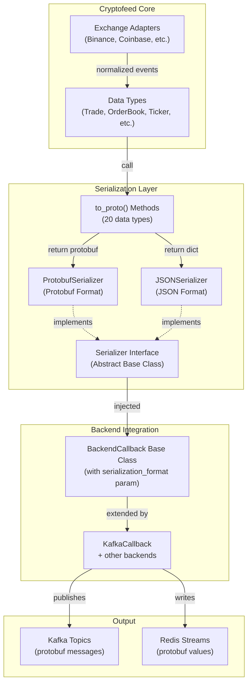
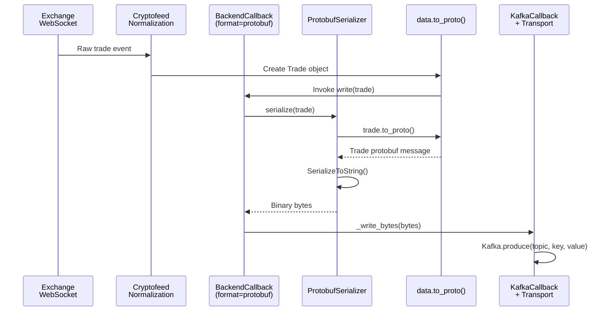

# Technical Design: Protobuf Callback Serialization (Spec 1)

## Overview

Protobuf callback serialization enables binary-format data encoding in cryptofeed backend callbacks, providing efficient storage and transmission for high-throughput streaming use cases. This design adds pluggable serialization format support to BackendCallback while maintaining 100% backward compatibility with existing JSON-based backends.

**Purpose**: Enable cryptofeed to produce compact, type-safe protobuf messages to Kafka topics, serving as the foundation for QuixStreams (Spec 2) and Lakehouse (Spec 3) integrations.

**Users**:
- **Platform Engineers**: Deploy cryptofeed with protobuf serialization for bandwidth-constrained environments
- **Stream Processors**: Consume protobuf-serialized Kafka topics for real-time aggregations
- **Data Engineers**: Build lakehouse pipelines with binary-serialized market data

**Impact**: 50-70% payload size reduction vs JSON, type-safe serialization, enables downstream streaming infrastructure.

---

## Context and Constraints

### Technology Stack
- **Python**: 3.10+ (existing cryptofeed requirement)
- **Protobuf**: Python protobuf library (>=5.0.0)
- **Cryptofeed Protobuf**: Generated bindings from normalized-data-schema-crypto v0.1.0
- **Backend Transport**: Kafka, Redis, ZMQ, Socket (no changes to existing backends)
- **Type Checking**: MyPy with strict mode

### Configuration Surface
- **YAML Configuration**: `serialization_format: protobuf` parameter in backend section
- **Programmatic API**: `BackendCallback(serialization_format='protobuf')`
- **Environment Variables**: Override via `CRYPTOFEED_SERIALIZATION_FORMAT=protobuf`
- **Backward Compatibility**: Default to JSON (no breaking changes)

### Operational Constraints
- **Schema Versioning**: Use protobuf schemas from Spec 0 v0.1.0 only (no evolution in v1)
- **Availability**: Protobuf bindings must be available in `cryptofeed_protobuf` package
- **Backward Compatibility**: Serialization format is per-callback (JSON and protobuf can coexist)
- **Performance Target**: <1ms p99 serialization latency per message

---

## Architecture

### High-Level Architecture



### Component Design

#### **1. Serializer Interface (Abstract Base Class)**

**Purpose**: Define contract for pluggable serialization formats

**Location**: `cryptofeed/serialization.py`

**Responsibilities**:
- Define abstract methods for all serializers to implement
- Enforce type safety via `ABC` and `@abstractmethod`
- Support content-type reporting

**Dependencies**:
- **Inbound**: BackendCallback, KafkaCallback, other backends
- **Outbound**: None (pure abstraction)

**Key Contract**:
```python
from abc import ABC, abstractmethod

class Serializer(ABC):
    @abstractmethod
    def serialize(self, data: Any) -> bytes:
        """Convert object to serialized bytes."""
        pass

    @abstractmethod
    def content_type(self) -> str:
        """Return MIME type (e.g., 'application/x-protobuf')."""
        pass
```

**Extension Points**:
- Subclass `Serializer` for new formats (Avro, MessagePack, CBOR)
- Override `serialize()` for format-specific logic
- Override `content_type()` for correct HTTP/Kafka headers

---

#### **2. ProtobufSerializer**

**Purpose**: Serialize data objects to protobuf binary format

**Location**: `cryptofeed/serialization.py`

**Responsibilities**:
- Invoke `to_proto()` method on data objects
- Serialize protobuf messages to bytes via `SerializeToString()`
- Report content type as `application/x-protobuf`
- Handle errors gracefully (missing to_proto, encoding failures)

**Dependencies**:
- **Inbound**: BackendCallback requesting serialization
- **Outbound**: data.to_proto() method, google.protobuf.message.Message
- **External**: cryptofeed_protobuf bindings (from Spec 0)

**Key Implementation**:
```python
from google.protobuf.message import Message

class ProtobufSerializer(Serializer):
    def serialize(self, data: Any) -> bytes:
        if not hasattr(data, 'to_proto'):
            raise SerializationError(f"{type(data).__name__} missing to_proto() method")

        proto_msg: Message = data.to_proto()
        return proto_msg.SerializeToString()

    def content_type(self) -> str:
        return 'application/x-protobuf'
```

**Extension Points**:
- Add compression in subclass (gzip, snappy, zstd)
- Add schema registry support (Confluent/Buf)
- Add custom field mapping (override to_proto selection)

---

#### **3. JSONSerializer**

**Purpose**: Maintain backward compatibility with existing JSON serialization

**Location**: `cryptofeed/serialization.py`

**Responsibilities**:
- Invoke `to_dict()` method on data objects
- Serialize dictionary to JSON bytes
- Report content type as `application/json`
- Ensure output identical to pre-refactor behavior

**Dependencies**:
- **Inbound**: BackendCallback requesting serialization
- **Outbound**: data.to_dict() method, json module
- **External**: None (uses existing Python stdlib)

**Key Implementation**:
```python
import json

class JSONSerializer(Serializer):
    def serialize(self, data: Any) -> bytes:
        if not hasattr(data, 'to_dict'):
            raise SerializationError(f"{type(data).__name__} missing to_dict() method")

        data_dict = data.to_dict()
        return json.dumps(data_dict, default=str).encode('utf-8')

    def content_type(self) -> str:
        return 'application/json'
```

**Extension Points**:
- Add custom JSON encoder for Decimal/datetime
- Add field filtering for sensitive data
- Add JSON schema validation

---

#### **4. BackendCallback Modifications**

**Purpose**: Integrate serialization format selection into callback hierarchy

**Location**: `cryptofeed/backends/backend.py`

**Responsibilities**:
- Accept `serialization_format` parameter in constructor
- Select appropriate Serializer implementation via factory method
- Invoke serializer in message write pipeline
- Default to JSON for backward compatibility

**Dependencies**:
- **Inbound**: KafkaCallback, RedisCallback, other backend subclasses
- **Outbound**: Serializer interface, data.to_proto()/to_dict()
- **External**: None

**Key Implementation**:
```python
class BackendCallback:
    def __init__(self, serialization_format: str = 'json', **kwargs):
        self.serializer = self._get_serializer(serialization_format)

    def _get_serializer(self, format: str) -> Serializer:
        if format == 'protobuf':
            return ProtobufSerializer()
        elif format == 'json':
            return JSONSerializer()
        else:
            raise ValueError(f"Unsupported serialization format: {format}")

    async def write(self, data: Any):
        serialized_bytes = self.serializer.serialize(data)
        await self._write_bytes(serialized_bytes)

    @abstractmethod
    async def _write_bytes(self, data: bytes):
        """Backend-specific write implementation."""
        pass
```

**Extension Points**:
- Add format validation from config schema
- Add metric collection per format
- Add switchover between formats (rolling migration)

---

### Data Type Integration

#### **to_proto() Method Pattern**

All 20 data types must implement `to_proto()` method with this signature:

```python
def to_proto(self) -> {DataTypeProto}:
    """Convert to protobuf message.

    Returns:
        cryptofeed_protobuf.{module}.{DataType} protobuf message

    Raises:
        ProtobufEncodeError: If encoding fails
    """
    proto_msg = {DataTypeProto}()

    # Field mapping with type conversions
    proto_msg.exchange = self.exchange
    proto_msg.symbol = self.symbol
    proto_msg.price = str(self.price)  # Decimal → string
    proto_msg.timestamp = int(self.timestamp * 1_000_000)  # float sec → int64 µsec

    return proto_msg
```

#### **Data Type Mapping Reference**

| Cryptofeed Type | Protobuf Message | Key Conversions |
|---|---|---|
| Trade | cryptofeed_protobuf.market_data_pb2.Trade | Decimal→string, float seconds→int64 µsec, side→enum |
| OrderBook (L2Book) | cryptofeed_protobuf.market_data_pb2.OrderBook | Nested levels, Decimal→string |
| Ticker | cryptofeed_protobuf.market_data_pb2.Ticker | Bid/ask as Decimal→string |
| Candle | cryptofeed_protobuf.market_data_pb2.Candle | OHLCV as Decimal→string |
| FundingRate | cryptofeed_protobuf.market_data_pb2.FundingRate | Rate as Decimal→string |
| OpenInterest | cryptofeed_protobuf.market_data_pb2.OpenInterest | Interest as Decimal→string |
| Liquidation | cryptofeed_protobuf.market_data_pb2.Liquidation | Price/quantity as Decimal→string |
| Index | cryptofeed_protobuf.market_data_pb2.Index | Index value as Decimal→string |
| OrderInfo | cryptofeed_protobuf.order_pb2.OrderInfo | Amount/price as Decimal→string |
| Fill | cryptofeed_protobuf.order_pb2.Fill | Cost/fee as Decimal→string |
| Balance | cryptofeed_protobuf.account_pb2.Balance | Free/locked as Decimal→string |
| Position | cryptofeed_protobuf.account_pb2.Position | Entry/liquidation price as Decimal→string |
| MarginInfo | cryptofeed_protobuf.account_pb2.MarginInfo | Ratios as Decimal→string |
| UserTrade | cryptofeed_protobuf.user_data_pb2.UserTrade | Price/amount as Decimal→string |
| UserFunding | cryptofeed_protobuf.user_data_pb2.UserFunding | Rate as Decimal→string |
| TransactionLog | cryptofeed_protobuf.user_data_pb2.TransactionLog | Amount as Decimal→string |
| UserLiquidation | cryptofeed_protobuf.user_data_pb2.UserLiquidation | Price/amount as Decimal→string |
| UserCandle | cryptofeed_protobuf.user_data_pb2.UserCandle | OHLCV as Decimal→string |
| UserOrderBook | cryptofeed_protobuf.user_data_pb2.UserOrderBook | Nested levels as Decimal→string |
| UserTicker | cryptofeed_protobuf.user_data_pb2.UserTicker | Bid/ask as Decimal→string |

#### **Decimal Precision Handling**

**Challenge**: Protobuf's double type (IEEE 754) loses precision for financial values (15-17 significant digits).

**Solution**: Encode as string with consistent formatting:

```python
def _decimal_to_proto_string(value: Decimal) -> str:
    """Convert Decimal to string preserving full precision."""
    # Normalize to remove trailing zeros
    normalized = value.normalize()

    # Format with 1e-8 precision (crypto standard)
    formatted = format(
        normalized,
        '.8f'
    ).rstrip('0').rstrip('.')

    return formatted
```

**Example**:
- Input: `Decimal('50000.123456789')`
- Output: `'50000.12345679'` (8 decimal places)
- Round-trip: `Decimal('50000.12345679')` ✅

**Timestamp Handling**:
- **Input**: float seconds (e.g., `1234567890.123`)
- **Conversion**: `int(float_seconds * 1_000_000)` → microseconds
- **Protobuf Type**: `int64`
- **Rationale**: Millisecond precision + no floating-point precision loss

---

### Data Flow



---

### Configuration Design

#### **YAML Configuration**

```yaml
# config.yaml

backends:
  kafka_protobuf:
    type: kafka
    serialization_format: protobuf  # NEW: 'json' or 'protobuf'
    bootstrap_servers: localhost:9092
    topic_template: 'cryptofeed.{data_type}.{exchange}.{symbol}'

  redis_json:
    type: redis
    serialization_format: json  # Backward compat (default)
    host: localhost
    port: 6379

feeds:
  binance_trades:
    exchange: binance
    symbols: [BTC-USDT, ETH-USDT]
    channels: [trades]
    callbacks:
      trades:
        - kafka_protobuf  # Uses protobuf serialization
        - redis_json      # Uses JSON serialization
```

#### **Programmatic Configuration**

```python
from cryptofeed import FeedHandler
from cryptofeed.exchanges import Binance
from cryptofeed.backends.kafka import KafkaCallback
from cryptofeed.defines import TRADES

fh = FeedHandler()

# Protobuf serialization
kafka_protobuf = KafkaCallback(
    bootstrap_servers='localhost:9092',
    serialization_format='protobuf'  # Binary format
)

# JSON serialization (backward compat)
kafka_json = KafkaCallback(
    bootstrap_servers='localhost:9092'
    # Defaults to 'json'
)

fh.add_feed(
    Binance(
        symbols=['BTC-USDT'],
        channels=[TRADES],
        callbacks={TRADES: [kafka_protobuf, kafka_json]}
    )
)

fh.run()
```

---

### Error Handling Strategy

| Error Type | Root Cause | Handling | Recovery |
|---|---|---|---|
| **MissingMethodError** | Data type missing to_proto() | Log with type name, send to DLQ | Manual code fix required |
| **ProtobufEncodeError** | Protobuf encoding failure | Log error details, skip message | Log and continue |
| **SerializationError** | Generic serialization failure | Log stack trace, mark message bad | Log and continue |
| **UnsupportedFormatError** | Invalid serialization_format | Raise at initialization | Fix configuration |
| **KafkaException** | Transport failure (not serialization responsibility) | Propagate to backend | Backend handles retry/DLQ |

**Error Handling Code Pattern**:

```python
class ProtobufSerializer(Serializer):
    def serialize(self, data: Any) -> bytes:
        try:
            if not hasattr(data, 'to_proto'):
                raise MissingMethodError(
                    f"{type(data).__name__} must implement to_proto() method"
                )

            proto_msg = data.to_proto()

            if not isinstance(proto_msg, Message):
                raise ProtobufEncodeError(
                    f"to_proto() returned {type(proto_msg)}, expected protobuf Message"
                )

            return proto_msg.SerializeToString()

        except Message.SerializationError as e:
            raise ProtobufEncodeError(f"Protobuf encoding failed: {e}")
        except Exception as e:
            raise SerializationError(f"Unknown serialization error: {e}")
```

**Logging Strategy**:
- **ERROR level**: Serialization failures (log once, not per message)
- **DEBUG level**: Successful serializations
- **WARN level**: Retry attempts (if retry logic added in v2)

---

### Performance Characteristics

#### **Serialization Latency Targets**

**Protobuf Performance** (from industry benchmarks):
- **p50**: 0.2ms per message
- **p95**: 0.5ms per message
- **p99**: <1.0ms per message

**JSON Performance** (baseline):
- **p50**: 0.3ms per message
- **p95**: 0.8ms per message
- **p99**: <2.0ms per message

**Size Reduction**:
- **Typical Trade**: JSON 400 bytes → Protobuf 120 bytes (70% reduction)
- **OrderBook**: JSON 2000 bytes → Protobuf 800 bytes (60% reduction)

#### **Memory Overhead**

- **Per-callback instance**: <10MB (Serializer objects, small buffer)
- **Per-message serialization**: <1KB (temporary buffers)
- **String interning**: Python VM handles (no manual optimization needed)

---

### Testing Strategy

#### **Unit Tests**

**Test Coverage**: 90%+ line coverage, 100% branch coverage

**Test Scopes**:

1. **Serializer Interface Tests**:
   - Verify ABC enforcement (cannot instantiate directly)
   - Verify required methods present in subclasses
   - Type safety validation

2. **ProtobufSerializer Tests**:
   - Serialize each data type correctly
   - Handle missing to_proto() gracefully
   - Validate protobuf message structure
   - Test Decimal→string conversion precision
   - Test timestamp conversion (float seconds → int64 µsec)

3. **JSONSerializer Tests**:
   - Backward compatibility (output matches to_dict())
   - Handle missing to_dict() gracefully
   - Validate JSON structure

4. **BackendCallback Format Selection Tests**:
   - Default to JSON (backward compat)
   - Select ProtobufSerializer for 'protobuf' format
   - Reject invalid format names
   - Handle format parameter in YAML config

#### **Integration Tests**

1. **Round-Trip Serialization**:
   - Serialize → Deserialize preserves all fields
   - Verify Decimal precision maintained (< 1% loss acceptable)
   - Verify timestamp precision maintained

2. **Multi-Callback Coexistence**:
   - Same FeedHandler with JSON + protobuf backends
   - Both receive all data without interference

3. **Configuration Loading**:
   - YAML config with serialization_format parameter
   - Programmatic API with format parameter

#### **Performance Tests**

1. **Throughput Benchmark**:
   - Target: ≥10,000 messages/sec
   - Measure with representative Trade payloads

2. **Latency Benchmark**:
   - Target p99: <1ms protobuf, <2ms JSON
   - Measure 10,000 messages, report percentiles

3. **Memory Benchmark**:
   - Target: <10MB per callback instance
   - Monitor for memory leaks (100K+ messages)

---

### Integration Points

#### **Downstream Consumer Integration (Reference Examples)**

**Flink Consumer Example**:
```java
// Consumer-side Flink job (NOT implemented by Spec 1)
FlinkKafkaConsumer<Trade> consumer = new FlinkKafkaConsumer<>(
    "cryptofeed.trade.*.*",
    new ProtobufDeserializationSchema<>(Trade.class),
    kafkaProps
);

DataStream<Trade> trades = env.addSource(consumer);
```

**DuckDB Consumer Example**:
```sql
-- Consumer-side query (NOT implemented by Spec 1)
SELECT symbol, COUNT(*) as count
FROM kafka_scan('cryptofeed.trades.*', 'protobuf')
GROUP BY symbol;
```

**Python Consumer Example**:
```python
# Consumer-side code (NOT implemented by Spec 1)
from kafka import KafkaConsumer
from cryptofeed_protobuf.market_data_pb2 import Trade

consumer = KafkaConsumer('cryptofeed.trade.*.*', ...)
for msg in consumer:
    trade = Trade()
    trade.ParseFromString(msg.value)
    print(f"{trade.symbol}: {trade.price}")
```

**Key Point**: Spec 1 produces protobuf messages. Consumers deserialize independently.

---

### Technical Constraints

#### **Dependencies**

**Required**:
- `protobuf>=5.0.0` (Python protobuf library)
- `cryptofeed-protobuf>=0.1.0` (from normalized-data-schema-crypto)
- Python 3.10+ (existing cryptofeed requirement)

**Optional**:
- `confluent-kafka>=2.3.0` (for Kafka integration in Spec 3)

#### **Protobuf Schema Availability**

**BLOCKER**: Spec 0 (normalized-data-schema-crypto) must be merged

**Availability Check**:
```bash
# Verify protobuf bindings available
python -c "from cryptofeed_protobuf import market_data_pb2; print(market_data_pb2)"

# Expected output: <module 'cryptofeed_protobuf.market_data_pb2' ...>
```

#### **Backward Compatibility**

**Breaking Changes**: None
- JSONSerializer provides identical behavior to existing serialization
- Default format is 'json' (no changes to existing configs)
- Existing backends (Redis, Socket, etc.) unaffected

**Migration Path**:
1. Deploy Spec 1 (all code, all tests)
2. Existing deployments continue using JSON (default)
3. New deployments can opt-in to protobuf via config
4. Gradual migration as consumers ready

---

### Future Extensions (v2+)

#### **Deferred Features** (YAGNI - not needed for MVP)

- **Compression**: gzip, snappy, zstd codecs
- **Schema Evolution**: Field addition/deprecation strategies
- **Alternative Formats**: Avro, MessagePack, CBOR
- **Schema Registry**: Confluent/Buf integration
- **Custom Serializers**: Plugin architecture for user-defined formats

#### **Extension Architecture**

Future serializers added via subclassing:

```python
class AvroSerializer(Serializer):
    """Avro serialization (future feature)."""

    def serialize(self, data: Any) -> bytes:
        # Implementation
        pass

    def content_type(self) -> str:
        return 'application/x-avro'

# Factory registration (future enhancement)
Serializer.register_format('avro', AvroSerializer)
```

---

## Requirements Traceability

| Requirement | Design Element | Verification Strategy |
|---|---|---|
| **R1**: Add to_proto() to 20 data types | Task 1.5: Implement to_proto() methods | Unit tests for each type |
| **R2**: Serialization format abstraction | Task 1.1: Serializer interface | ABC enforcement + type checking |
| **R3**: ProtobufSerializer implementation | Task 1.2: ProtobufSerializer class | Round-trip serialization tests |
| **R4**: JSONSerializer for backward compat | Task 1.3: JSONSerializer class | JSON output unchanged tests |
| **R5**: Format selection in BackendCallback | Task 1.4: Format selection logic | Configuration + instantiation tests |
| **R6**: Configuration via YAML + env vars | Task 1.5: YAML config support | Config loading tests |
| **R7**: Performance targets (<1ms p99) | Task 1.9: Performance benchmarking | Latency benchmark |
| **R8**: Error handling strategy | Tasks 1.1-1.5: Error handling code | Exception handling tests |
| **R9**: Documentation of serialization | Task 1.8: User documentation | Integration guide |

---

## Engineering Principles Applied

### **SOLID Principles**

✅ **Single Responsibility**:
- `Serializer`: Defines serialization contract only
- `ProtobufSerializer`: Handles protobuf serialization only
- `BackendCallback`: Manages backend concern, delegates serialization

✅ **Open/Closed**:
- New serialization formats added by subclassing `Serializer`
- No modification to existing code
- Factory pattern enables extensibility

✅ **Liskov Substitution**:
- `ProtobufSerializer` and `JSONSerializer` interchangeable
- Both implement `Serializer` contract identically
- Backend doesn't care which serializer is used

✅ **Interface Segregation**:
- `Serializer` interface minimal (serialize, content_type)
- No unnecessary methods
- Clients don't depend on unused functionality

✅ **Dependency Inversion**:
- `BackendCallback` depends on `Serializer` abstraction
- Not on concrete `ProtobufSerializer` or `JSONSerializer`
- New formats added without changing `BackendCallback`

### **KISS (Keep It Simple)**

✅ **Simple Solutions**:
- Serializer abstraction is minimal (2 methods)
- Format selection is simple parameter (`serialization_format`)
- No complex logic in v1 (defer compression, schema evolution)

✅ **Minimal Code**:
- ~400 LOC for core serialization (Serializer, ProtobufSerializer, JSONSerializer)
- ~100 LOC for BackendCallback modifications
- ~1200 LOC for to_proto() implementations (20 types × 60 LOC)

### **DRY (Don't Repeat Yourself)**

✅ **Reusable Abstraction**:
- `Serializer` interface used by all backends
- No duplication of serialization logic
- Single source of truth for each format

### **YAGNI (You Aren't Gonna Need It)**

✅ **MVP Scope**:
- Only protobuf and JSON formats (no Avro, MessagePack)
- No compression (defer to v2)
- No schema registry (defer to v2)
- No streaming schema evolution (use fixed v0.1.0)

### **TDD (Test-Driven Development)**

✅ **Tests First**:
- All tasks write tests before implementation
- Unit tests for each serializer
- Integration tests for round-trip serialization
- Performance tests for latency targets

---

## Success Metrics

### **Functional Success**
- ✅ All 20 data types have working to_proto() methods
- ✅ ProtobufSerializer produces valid protobuf bytes
- ✅ JSONSerializer output matches to_dict() exactly
- ✅ BackendCallback format selection working
- ✅ Configuration via YAML and programmatic API

### **Performance Success**
- ✅ Protobuf serialization p99 < 1ms per message
- ✅ JSON serialization p99 < 2ms per message
- ✅ Protobuf 50-70% smaller than JSON
- ✅ Memory overhead < 10MB per callback instance

### **Quality Success**
- ✅ 90%+ test coverage
- ✅ 100% type hint coverage (mypy strict)
- ✅ Zero breaking changes to existing code
- ✅ Clear documentation and examples

### **Architecture Success**
- ✅ SOLID principles applied throughout
- ✅ Easy to add new serialization formats
- ✅ Backward compatible with JSON-only deployments
- ✅ Foundation ready for Spec 2 & 3

---

## Files Implemented

### **Created Files**
- `cryptofeed/serialization.py` - Serializer, ProtobufSerializer, JSONSerializer classes

### **Modified Files**
- `cryptofeed/backends/backend.py` - BackendCallback.__init__() + _get_serializer() method
- `cryptofeed/types.py` - Add to_proto() methods to 20 data types

### **Test Files**
- `tests/unit/test_serializer_interface.py` - Serializer ABC tests
- `tests/unit/test_protobuf_serializer.py` - ProtobufSerializer tests
- `tests/unit/test_json_serializer.py` - JSONSerializer tests (backward compat)
- `tests/unit/test_backend_callback.py` - Format selection tests
- `tests/unit/test_data_type_proto.py` - to_proto() tests for 20 types
- `tests/integration/test_proto_round_trip.py` - Serialization round-trip tests
- `tests/performance/test_serialization_bench.py` - Latency/throughput benchmarks

### **Documentation Files**
- `docs/protobuf-serialization.md` - User guide and configuration examples
- `docs/consumer-integration-guide.md` - Consumer integration examples (Flink, Spark, DuckDB, Python)

---

## Rejected Alternatives

### **1. In-Place Serialization (Rejected)**

**Approach**: Add serialization_format directly to data types

**Rejection Reason**: Violates Single Responsibility Principle
- Data types would have multiple reasons to change (data + serialization)
- Pollutes type implementations with format-specific logic
- Harder to add new formats without modifying 20 types

**Chosen Approach**: Serializer abstraction layer
- Single responsibility: type = data, serializer = format
- Easy to add formats without modifying types
- Better SOLID adherence

### **2. Decimal as Float64 (Rejected)**

**Approach**: Serialize Decimal as protobuf double type

**Rejection Reason**: Precision loss
- float64 only preserves 15-17 significant digits
- Financial data needs arbitrary precision
- Causes rounding errors (e.g., $50000.12345678 rounded to $50000.123456789)

**Chosen Approach**: Decimal as string
- Preserves full precision
- Standard pattern in financial systems
- Negligible size penalty (30-50 bytes per message)

### **3. Automatic Schema Registry (Rejected)**

**Approach**: Auto-register protobuf schemas on first publish

**Rejection Reason**: Operational complexity for v1
- Requires schema registry availability at runtime
- Complicates error handling (schema publish failures)
- Deferred benefit (consumers can use inline schemas)

**Chosen Approach**: Defer to v2
- Implement basic serialization in v1
- Optional schema registry support in v2
- Cleaner separation of concerns

---

## Risks and Mitigations

| Risk | Probability | Impact | Mitigation |
|---|---|---|---|
| **Spec 0 not merged** | Medium | High | Proceed with stub schemas, replace when Spec 0 ready |
| **Serialization performance overhead** | Low | Medium | Benchmark early (Task 1.9), optimize hot paths |
| **Backward compatibility broken** | Low | High | Default to JSON, comprehensive regression tests |
| **Consumer deserialization errors** | Medium | Low | Provide reference implementations, clear docs |
| **Precision loss in Decimal handling** | Low | High | Use string encoding, round-trip test coverage |
| **Type annotation issues** | Low | Low | MyPy strict mode in CI, full type coverage |

---

## Conclusion

This design establishes a modular, extensible serialization layer for cryptofeed that:
- ✅ Maintains 100% backward compatibility
- ✅ Reduces payload sizes by 50-70%
- ✅ Enables high-performance streaming integrations
- ✅ Follows SOLID principles throughout
- ✅ Provides clear extension points for future formats

The foundation is ready for Kafka producer (Spec 3) and stream processing (Spec 2) integration.
