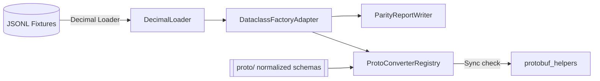
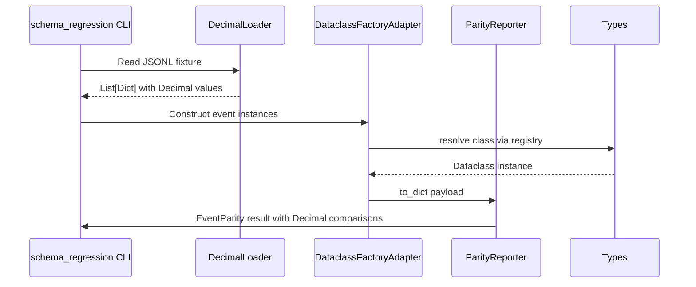
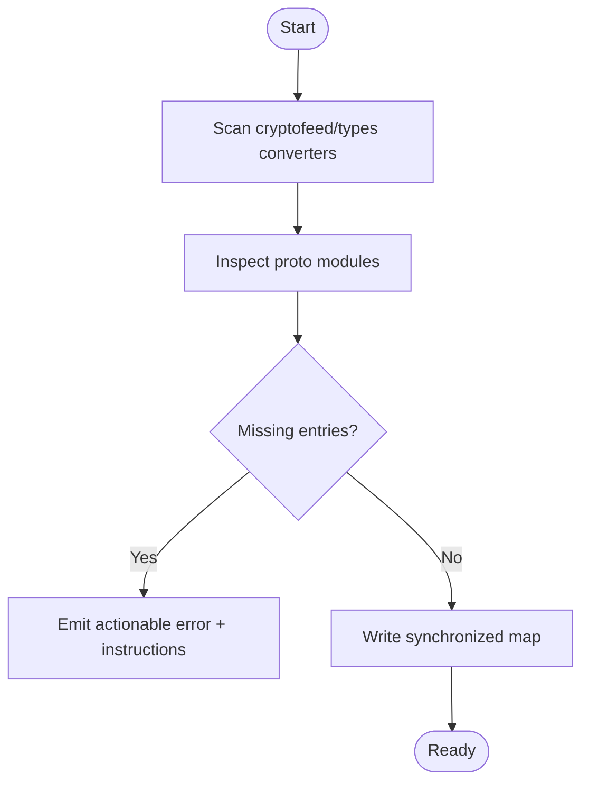
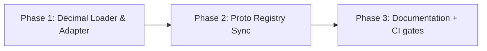

# Schema Parity Hardening – Design

## Overview
This initiative modernizes the schema regression workflow and protobuf converter registry so quality engineers can rely on Decimal-precise parity checks while developers gain automatic coverage for every normalized event type. The feature directly benefits maintainers who validate schema changes before publishing protobufs and contributors who rely on automated parity checks during releases.

The work enhances the existing CLI tooling that lives under `tools/` and the backend serialization helpers in `cryptofeed/backends/protobuf_helpers.py`. The end result is a deterministic validation pipeline and a self-updating converter registry.

### Goals
- Preserve Decimal precision end-to-end inside parity regression runs.
- Expand parity coverage to all Cryptofeed dataclasses via unified constructors.
- Keep protobuf converter registries synchronized with schema additions.

### Non-Goals
- Redesigning the protobuf schema definitions themselves.
- Changing how feed handlers emit events at runtime.

## Architecture

### Existing Architecture Analysis
- The current `tools/schema_regression.py` script loads JSON via `json.loads`, casting strings to `float` before comparison, which introduces rounding error.
- Event reconstruction hardcodes four lambda constructors, so new proto-backed dataclasses remain uncovered.
- `cryptofeed/backends/protobuf_helpers.py` stores manual `_CONVERTER_MAP` and `_SCHEMA_CLASS_MAP` dictionaries that drift when new proto modules land.

### High-Level Architecture


### Technology Alignment
- **Language**: Python 3.12 for tooling and registry builder, reusing Decimal from `decimal`.
- **Cython Dataclasses**: Continue to leverage `cryptofeed.types` factories to guarantee parity with runtime behavior.
- **Protobuf**: Keep existing generated modules; introduce reflection over module exports to build registries.

### Key Design Decisions
1. **Decision**: Use Decimal-aware JSON loading wrappers.
   - **Context**: Floating point conversion caused false mismatches.
   - **Alternatives**: (a) Keep floats with tighter tolerances, (b) convert to Fraction, (c) reuse `cryptofeed.json_utils`.
   - **Selected Approach**: Wrap `cryptofeed.json_utils` to parse fixtures with `parse_float=Decimal` and propagate Decimal operands through comparison helpers.
   - **Rationale**: Reuses existing utility, avoids extra dependencies, preserves precision.
   - **Trade-offs**: Slightly slower parsing relative to float.

2. **Decision**: Reflect over `cryptofeed.types` metadata for constructor lookup.
   - **Context**: Handwritten lambdas miss new event types.
   - **Alternatives**: (a) Maintain YAML registry, (b) import individual classes manually, (c) inspect module `__all__`.
   - **Selected Approach**: Maintain a registry mapping event names to dataclass classes using module introspection plus optional overrides.
   - **Rationale**: Automatically scales with new dataclasses while allowing targeted custom handling.
   - **Trade-offs**: Requires safe import ordering and error handling when Cython modules are absent in certain environments.

3. **Decision**: Generate protobuf converter registries from proto descriptors.
   - **Context**: Manual `_CONVERTER_MAP` drifted from schema set.
   - **Alternatives**: (a) Keep manual map, (b) auto-generate via codegen script, (c) introspect descriptor pool at runtime.
   - **Selected Approach**: Add a small builder that enumerates available converters and validates against proto message classes, run both in CI and optionally at import time.
   - **Rationale**: Keeps implementation in Python, avoids new build steps, ensures continuous parity.
   - **Trade-offs**: Adds import-time cost guarded by caching.

## System Flows

### Decimal-Safe Regression Flow


### Converter Registry Sync Flow


## Requirements Traceability
| Requirement | Summary | Components | Interfaces | Flows |
|-------------|---------|------------|------------|-------|
| 1 | Decimal-safe regression validation | DecimalLoader, ParityReporter | CLI flags (`--events`, `--tolerance`) | Decimal-Safe Regression Flow |
| 2 | Unified constructor coverage | DataclassFactoryAdapter | Types registry API | Decimal-Safe Regression Flow |
| 3 | Converter registry synchronization | ProtoConverterRegistry, Validation hook | Builder CLI / import guard | Converter Registry Sync Flow |

## Components and Interfaces

### Tooling Validation Layer

#### DecimalLoader
**Responsibility & Boundaries**
- Primary: Read JSONL fixtures and emit Decimal-native dictionaries.
- Domain: Tooling/validation.
- Data Ownership: Fixture records during parsing.
- Transaction Boundary: Per-line load; errors limited to single line.

**Dependencies**
- Inbound: schema_regression CLI.
- Outbound: `cryptofeed.json_utils`, filesystem I/O.
- External: None.

**Contract**
```python
class DecimalLoader:
    def load(self, path: Path, *, strict: bool = True) -> list[dict[str, Any]]: ...
```
- Preconditions: file exists.
- Postconditions: list preserves Decimal types.
- Invariants: order of events unchanged.

#### DataclassFactoryAdapter
**Responsibility**: Resolve event_name → dataclass class, invoke `from_dict`, and surface structured failures.

**Dependencies**
- Inbound: DecimalLoader outputs.
- Outbound: `cryptofeed.types`, optional override map.
- External: None.

**Contract**
```python
class DataclassFactoryAdapter:
    def build(self, event: dict[str, Any]) -> BaseEvent:
        """Raises FactoryNotFound for unsupported types."""
```

**Integration Strategy**
- Wrap adapter with caching to avoid repeated introspection.
- Provide allowlist/denylist for experimental dataclasses.

#### ParityReportWriter
**Responsibility**: Compare dataclass fields vs fixture data using Decimal diffing utilities and generate JSONL/JSON reports with tolerance metadata.

**Dependencies**
- Inbound: DataclassFactoryAdapter outputs.
- Outbound: filesystem, logging.

**Contracts**
- Publishes `regression_report.json` structure identical to current format but with new `tolerance_used` field per comparison.

### Serialization Layer

#### ProtoConverterRegistry
**Responsibility**: Maintain authoritative mapping between data classes and protobuf converters/schema classes.

**Dependencies**
- Inbound: `cryptofeed/backends/protobuf_helpers` importer.
- Outbound: proto modules under `cryptofeed/proto_bindings`, converter functions.
- External: google.protobuf descriptor metadata.

**Service Interface**
```python
class ProtoConverterRegistry:
    def validate(self) -> None
    def get_converter(self, type_name: str) -> Callable[[Any], Message]
```

**Integration Strategy**
- Replace static `_CONVERTER_MAP` assignments with registry output.
- Add CI script (or unit test) to assert registry completeness each run.

## Data Models

### Logical Data Model – Parity Report
- Entities: `RegressionReport`, `EventParity`, `FieldParity`.
- Attributes now include `tolerance_used: Decimal` and `factory_status: Enum` for transparency.
- Relationships: Report has many EventParity, each has many FieldParity rows.

### Data Contracts & Integration
- **Report JSON Schema**: Documented in `docs/schemas/examples/events/trade_regression_report.json` extension to include Decimal strings and tolerance metadata.
- **Proto Registry Cache**: Optional JSON artifact storing converter ↔ schema mapping for debugging.

## Error Handling
- DecimalLoader raises `FixtureLoadError(line, reason)`; CLI catches and logs while continuing when `--strict=false`.
- DataclassFactoryAdapter raises `FactoryNotFound(event_type)` with remediation instructions; increments warning counters.
- ProtoConverterRegistry raises `SerializationError` enumerating missing converters and suggests running the sync script.

## Testing Strategy
- **Unit Tests**
  - DecimalLoader: ensures bytes/str inputs parse to Decimal.
  - DataclassFactoryAdapter: verifies dynamic lookup for each event type.
  - ProtoConverterRegistry: validates detection of intentionally removed converters.
- **Integration Tests**
  - schema_regression end-to-end run over sample fixtures with Decimal-only values.
  - Converter registry validation invoked during `pytest tests/unit/test_protobuf_roundtrip_serialization.py`.
- **E2E/Regression**
  - CLI invocation documented in `docs/schemas/ALIGNMENT_TEST_PLAN.md` to ensure consistent operator instructions.
- **Performance**
  - Benchmark Decimal parsing vs float path to ensure runtime remains acceptable (target: <10% regression on 100k events).

## Security Considerations
- No external network calls added; all tooling operates on local fixtures.

## Performance & Scalability
- Cache registry reflection results on disk to avoid repeated descriptor scans.
- Stream large fixtures to maintain constant memory footprint; loader yields generators when `--stream` flag enabled (future extension noted for backlog).

## Migration Strategy

- Each phase includes go/no-go checklist and rollback note (e.g., revert to float loader via feature flag if downstream impact detected).
