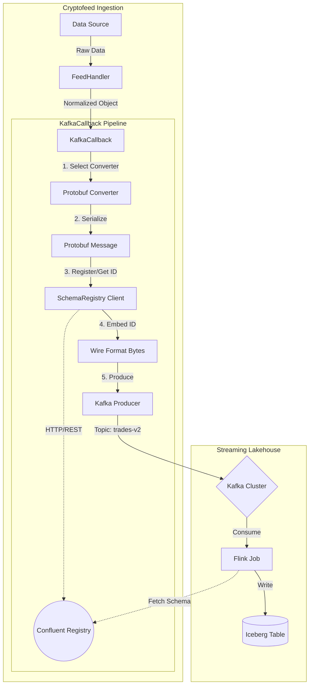
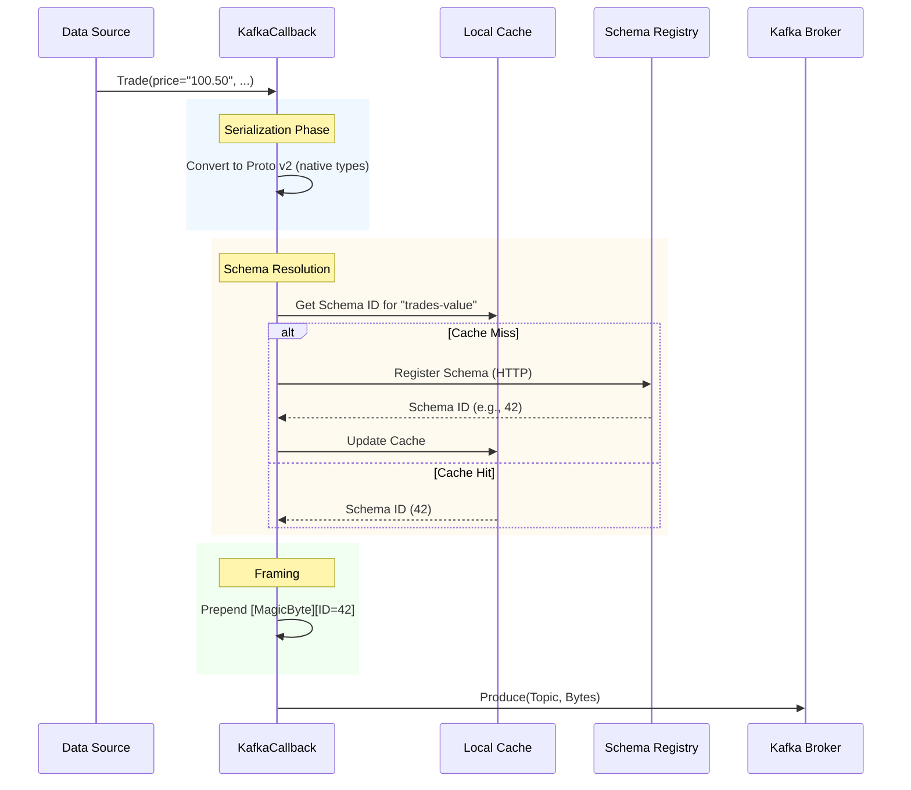

# Design Document: Shift Left Streaming Lakehouse Integration

---
**Document Length Guidelines: Max 1000 lines**

**Purpose**: Provide sufficient detail to ensure implementation consistency across different implementers, preventing interpretation drift.
---

## Overview

This feature integrates Cryptofeed with Confluent Schema Registry to "shift left" data quality and schema enforcement. By implementing strict schema validation at the ingestion source, we enable downstream consumers (like Flink and Iceberg) to reliably consume structured data without manual type conversion or schema inference. This initiative also introduces "v2" Protobuf schemas utilizing native types (`double`, `int64`) instead of strings, significantly improving serialization efficiency and query performance.

### Goals
- **Schema Enforcement**: Prevent "bad data" from entering the data lake by validating messages against a central registry.
- **Native Types**: Reduce message size and compute overhead by using native Protobuf types (v2 schemas).
- **Seamless Integration**: Support Flink/Iceberg streaming patterns via standard Confluent Wire Format.
- **Zero Downtime**: Enable parallel v1 (legacy) and v2 (registry) production during migration.

### Non-Goals
- **Backfilling**: Migrating historical v1 data to v2 format is out of scope.
- **Complex Schema Evolution**: We will target `BACKWARD` compatibility; complex schema migrations are manual.

## Architecture

### High-Level Architecture

The architecture introduces a `SchemaRegistry` component into the `KafkaCallback` pipeline. When enabled, the callback consults the registry to validate schemas and obtain Schema IDs, which are embedded into the message payload using the Confluent Wire Format.



### Technology Alignment
- **Schema Registry Client**: specific implementation in `cryptofeed.backends.kafka_schema` (already exists) using `requests` for registry interaction.
- **Protobuf v2**: New `.proto` definitions in `proto/cryptofeed/normalized/v2/` utilizing `syntax = "proto3"`.
- **Producer**: Existing `KafkaProducer` (wrapping `confluent-kafka`) updated to support headers and binary payloads.

## Key Design Decisions

### 1. Asynchronous Registry Interaction
- **Decision**: Use `asyncio.to_thread` (or `run_in_executor`) for Schema Registry interactions within `KafkaCallback`.
- **Context**: The `SchemaRegistry` client uses `requests` (synchronous blocking I/O). `KafkaCallback` runs on the `asyncio` event loop. Blocking the loop for HTTP calls (even with caching) allows for potential jitter and throughput drops on cache misses.
- **Alternatives**: 
    1. Rewrite `SchemaRegistry` to use `aiohttp` (high effort, duplicates logic).
    2. Block the event loop (unacceptable for high-throughput feeds).
- **Selected Approach**: Wrap the synchronous `register_schema` and `get_schema_by_id` calls in `loop.run_in_executor`.
- **Trade-offs**: Slight overhead for thread context switching vs. blocking the main loop. Mitigated by aggressive in-memory caching in `SchemaRegistry` class.

### 2. Dual Schema Versioning (v1 vs v2)
- **Decision**: Maintain separate parallel Protobuf definitions and converter logic for v1 (string-based) and v2 (native types).
- **Context**: We must support existing consumers relying on v1 while rolling out v2.
- **Selected Approach**: 
    - Create `proto/cryptofeed/normalized/v2/` for new schemas.
    - Create `cryptofeed/backends/protobuf_helpers_v2.py` for v2 converters.
    - `KafkaCallback` will select the appropriate converter based on configuration.
- **Rationale**: cleanly separates legacy and new logic; allows for safe A/B testing and gradual migration.

### 3. Subject Naming Strategy
- **Decision**: Use `TopicNameStrategy` (`<topic>-value`) for Schema Registry subjects.
- **Context**: The Registry needs a stable identifier (Subject) for schema evolution.
- **Selected Approach**: The subject name will be `{topic_name}-value`. For example, if the topic is `cryptofeed.trades.v2`, the subject is `cryptofeed.trades.v2-value`.
- **Rationale**: Standard convention in the Kafka ecosystem; simplifies Flink/Connect integration.

## Detailed Design

### 1. Schema Registry Service (`cryptofeed.backends.kafka_schema`)

Existing implementation is largely sufficient but requires verification of async usage compatibility.
- **Enhancement**: Ensure `SchemaRegistry` methods are thread-safe if accessed via `run_in_executor`. (The current `requests` usage is generally thread-safe, and `_schema_cache` logic should be verified).

### 2. Protobuf v2 Implementation

New `.proto` files will be created mirroring the v1 structure but with native types.

**Example: Trade v2**
```protobuf
// proto/cryptofeed/normalized/v2/trade.proto
syntax = "proto3";
package cryptofeed.normalized.v2;

import "google/protobuf/timestamp.proto";

message Trade {
    string exchange = 1;
    string symbol = 2;
    
    enum Side {
        SIDE_UNSPECIFIED = 0;
        BUY = 1;
        SELL = 2;
    }
    Side side = 3;
    
    double price = 4;      // Changed from string
    double amount = 5;     // Changed from string
    
    string trade_id = 6;
    
    // Standardized Timestamp
    google.protobuf.Timestamp timestamp = 7; // Changed from int64/float
    
    // Gap detection
    uint64 sequence_number = 8;
}
```

### 3. KafkaCallback Updates (`cryptofeed/kafka_callback.py`)

The `KafkaCallback` needs modification to support the "Schema Registry Mode".

**Configuration Changes**:
- `kafka_config` will accept a `schema_registry` section (as defined in requirements).

**Processing Flow (`_process_message`)**:
1. **Schema Resolution**:
   If `schema_registry_enabled` is True:
   - Determine Subject: `f"{topic}-value"`
   - **Async Call**: `await loop.run_in_executor(None, self.schema_registry.register_schema, subject, schema_definition)`
   - *Optimization*: Check local cache in `KafkaCallback` before dispatching to executor to avoid thread overhead for known schemas.
   
2. **Serialization (v2)**:
   - Call `protobuf_helpers_v2.serialize_to_protobuf(obj)` -> returns `bytes` (raw proto).
   
3. **Framing**:
   - Call `self.schema_registry.embed_schema_id_in_message(raw_bytes, schema_id)`.

4. **Headers**:
   - Add `schema_id` to headers (optional, but helpful for debugging).
   - Set `content-type` to `application/vnd.confluent.protobuf`.

### 3b. v2 Message Field Mapping (Authoritative)
- **Trade**: `price`/`amount` = `double`; `timestamp` = `google.protobuf.Timestamp`; `sequence_number` = `uint64` (reuse v1 field numbers where applicable; reserve any removed ids).
- **Ticker**: best bid/ask price & size = `double`; `timestamp` = `google.protobuf.Timestamp`; `sequence_number` = `uint64`.
- **Book (L2 snapshot/delta)**: per-level price/size = `double`; depth arrays remain repeated `double`; `timestamp` = `google.protobuf.Timestamp`; `sequence_number` = `uint64`.
- **Candle**: open/high/low/close/volume = `double`; close/end `timestamp` = `google.protobuf.Timestamp`; `sequence_number` = `uint64`.
- **Decimal fidelity rule**: If an exchange requires > 1e-9 precision, switch the affected numeric fields to `bytes` and add a message-level `int32 scale` describing quantization (per REQ-011); document the choice in this matrix and keep field numbers stable.

#### Field Matrix (baseline, v1 field numbers reused where possible)
| Message | Field | Number | Default Type | Notes |
|---------|-------|--------|--------------|-------|
| Trade   | exchange | 1 | string | unchanged |
| Trade   | symbol | 2 | string | unchanged |
| Trade   | side | 3 | enum | unchanged |
| Trade   | trade_id | 4 | string | unchanged (v1 trade_id) |
| Trade   | price | 5 | double | switch to bytes+scale if precision > 1e-9 |
| Trade   | amount | 6 | double | switch to bytes+scale if precision > 1e-9 |
| Trade   | timestamp | 7 | google.protobuf.Timestamp | standardized from int64 µs |
| Trade   | sequence_number | 8 | uint64 | new for gap detection |
| Ticker  | exchange | 1 | string | unchanged |
| Ticker  | symbol | 2 | string | unchanged |
| Ticker  | best_bid_price | 3 | double | reuses v1 bid slot |
| Ticker  | best_ask_price | 4 | double | reuses v1 ask slot |
| Ticker  | best_bid_size  | 5 | double | new |
| Ticker  | best_ask_size  | 6 | double | new |
| Ticker  | timestamp      | 7 | google.protobuf.Timestamp | replaces optional int64 |
| Ticker  | sequence_number| 8 | uint64 | new |
| Book    | exchange | 1 | string | unchanged |
| Book    | symbol | 2 | string | unchanged |
| Book    | bids | 3 | repeated PriceLevelV2 | price/size = double |
| Book    | asks | 4 | repeated PriceLevelV2 | price/size = double |
| Book    | timestamp      | 5 | google.protobuf.Timestamp | aligns with snapshots/deltas |
| Book    | sequence_number| 6 | uint64 | from optional sequence |
| Book    | checksum | 7 | string | retained |
| Candle  | exchange | 1 | string | unchanged |
| Candle  | symbol | 2 | string | unchanged |
| Candle  | start | 3 | google.protobuf.Timestamp | was int64 µs |
| Candle  | end | 4 | google.protobuf.Timestamp | was int64 µs |
| Candle  | interval | 5 | string | unchanged |
| Candle  | trades | 6 | uint64 | was optional int64 |
| Candle  | open | 7 | double | switch to bytes+scale if precision-critical |
| Candle  | close | 8 | double |  |
| Candle  | high | 9 | double |  |
| Candle  | low | 10 | double |  |
| Candle  | volume | 11 | double |  |
| Candle  | closed | 12 | bool | unchanged |
| Candle  | timestamp | 13 | google.protobuf.Timestamp | close/end time |
| Candle  | sequence_number | 14 | uint64 | new |

> If any field toggles to `bytes`, add `int32 scale = 15;` at message level to avoid renumbering core fields; reserve the unused numbers from v1 to remain backward compatible.

### 4. Converter Logic (`cryptofeed/backends/protobuf_helpers_v2.py`)

New module mirroring `protobuf_helpers.py` but targeting v2 protos.

```python
def trade_to_proto_v2(trade_obj) -> trade_v2_pb2.Trade:
    proto = trade_v2_pb2.Trade()
    proto.exchange = trade_obj.exchange
    proto.symbol = trade_obj.symbol
    proto.price = float(trade_obj.price)  # Native double
    proto.amount = float(trade_obj.amount) # Native double
    
    # Timestamp conversion
    ts_seconds = int(trade_obj.timestamp)
    ts_nanos = int((trade_obj.timestamp - ts_seconds) * 1_000_000_000)
    proto.timestamp.seconds = ts_seconds
    proto.timestamp.nanos = ts_nanos
    
    return proto
```

## Migration Strategy

1. **Deploy v2 Schemas**: Publish v2 schemas to the registry (can be done automatically by the producer on startup/first message).
2. **Dual Production**: Configure `KafkaCallback` to produce to both `cryptofeed.trades` (v1, string) and `cryptofeed.trades.v2` (v2, native) if needed, or simply enable v2 on a new topic prefix.
3. **Consumer Migration**: Point Flink jobs to v2 topics.
4. **Deprecation**: Eventually decommission v1 topics.

## Verification Plan

1. **Unit Tests**:
    - Verify `v2` serialization produces correct bytes.
    - Verify `embed_schema_id_in_message` adds correct Magic Byte and ID.
    - Mock `SchemaRegistry` to verify `KafkaCallback` interaction.
    
2. **Integration Tests**:
    - Spin up local Confluent Schema Registry (Docker).
    - Run `KafkaCallback` with `schema_registry_enabled=True`.
    - Produce messages.
    - Verify schema is registered in Registry.
    - Consume messages using `confluent-kafka` deserializer to verify end-to-end validity.

## System Flows

### Producer Flow with Schema Registry


