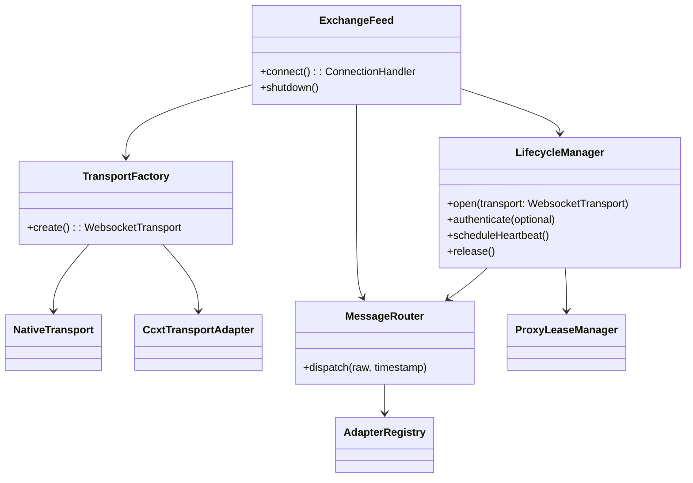
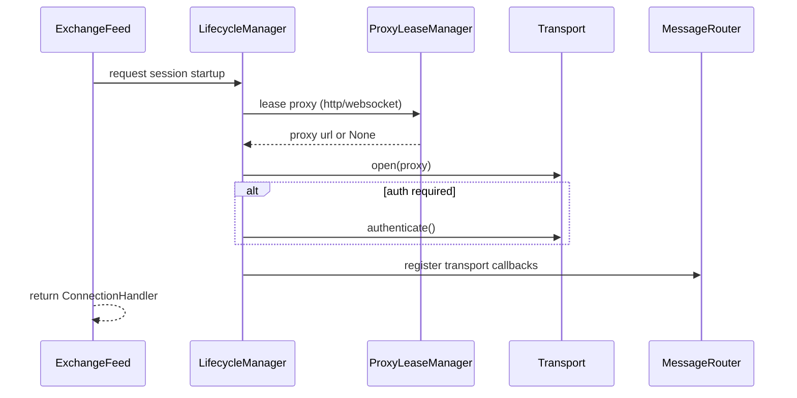
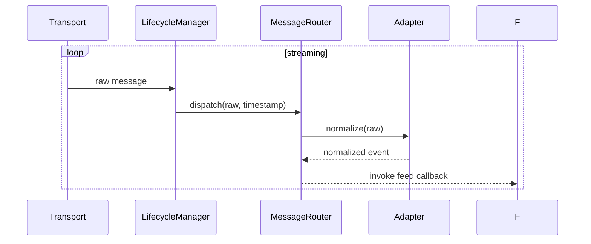

# Technical Design

## Overview
This design establishes a unified exchange feed architecture that exposes a shared lifecycle contract for both native REST/WebSocket integrations and CCXT-backed feeds. The architecture extracts authentication refresh, heartbeat coordination, proxy leasing, and message routing into reusable services. Contributors integrate new exchanges by supplying focused transports and adapters rather than reimplementing boilerplate.

Primary consumers are cryptofeed maintainers and contributors who add or maintain exchange integrations. They benefit from consistent runtime behavior, deterministic tests, and clear onboarding guidance. The change reduces duplicated code, improves fault isolation, and creates a dependable foundation for future exchange work.

### Goals
- Provide a single Exchange Feed Contract that governs lifecycle semantics across native and CCXT integrations.
- Offer reusable transport, routing, and lifecycle helpers that prevent state leakage and proxy misuse.
- Deliver deterministic unit and contract tests that run in CI, coupled with documentation for onboarding new exchanges.

### Non-Goals
- Replace CCXT as a dependency or fork external exchange SDKs.
- Introduce live-integration or long-running tests into the default CI matrix.
- Build scaffolding automation or CLIs beyond providing documentation templates.

## Architecture

### Existing Architecture Analysis
- The current native Backpack feed owns authentication, heartbeat, proxy management, and routing in bespoke classes, leading to tight coupling and limited reuse.
- CCXT feeds wrap transport logic but still replicate symbol normalization and lifecycle behavior within `CcxtFeed.__init__` and companions.
- Proxy management (`HTTPAsyncConn`, `ProxyInjector`) operates independently of exchange session code, allowing stale state leaks.
- Tests rely heavily on live integration paths, providing minimal fast feedback.

### High-Level Architecture

**Architecture Integration**
- Existing Feed base class remains the entry point; new ExchangeFeed contract layers on top without breaking downstream consumers.
- LifecycleManager and ProxyLeaseManager reuse proxy injector logic while guaranteeing release/reset semantics.
- NativeTransport refactors Backpack session logic into a reusable implementation that other native exchanges can adopt with minimal extensions.
- CcxtTransportAdapter translates the shared contract into CCXT REST/WS invocations without changing existing adapter usage.
- Router and AdapterRegistry consolidate transformation logic shared by Backpack and CCXT adapters.

### Compatibility with Existing FeedHandler
- `ExchangeFeed.connect()` returns the same tuple structure `(AsyncConnection, subscribe, handler, authenticate)` expected by FeedHandler, preserving LSP compliance.
- Legacy Feed subclasses can adopt the new abstractions incrementally by delegating to `ExchangeFeed` while keeping existing callback maps intact.
- FeedHandler’s lifecycle (add_feed → connect → handler) remains untouched, ensuring existing deployments require no orchestration changes.

## Technology Alignment
- Implementation stays within the existing Python 3.10+ toolchain, reusing asyncio, aiohttp, and existing proxy utilities.
- No new external dependencies are introduced; CCXT remains the primary third-party SDK for non-native exchanges.
- Documentation updates live alongside existing Markdown guides; no new documentation generators are required.

## Key Design Decisions
1. **Decision:** Introduce `ExchangeFeed` and `LifecycleManager` abstractions to own lifecycle concerns.
   - **Context:** Native and CCXT feeds duplicate lifecycle code, leading to inconsistent behavior and regressions.
   - **Alternatives:** (a) Leave lifecycle management in each feed; (b) Implement mixins per concern; (c) Adopt a dependency-injected lifecycle orchestrator.
   - **Selected Approach:** Create `ExchangeFeed` that composes a `LifecycleManager`. Feeds implement narrow hooks while lifecycle logic remains centralized.
   - **Rationale:** Centralizes authentication, heartbeat, and proxy logic, ensuring consistent behavior and simplifying tests.
   - **Trade-offs:** Slightly increases abstraction depth; requires refactoring existing feeds.

2. **Decision:** Provide dual transport factories (`NativeTransportFactory`, `CcxtTransportFactory`) that emit objects conforming to a shared `WebsocketTransport` protocol.
   - **Context:** Backpack uses bespoke session handling, whereas CCXT uses its own API shapes.
   - **Alternatives:** (a) Maintain separate transport hierarchies; (b) Force CCXT to adapt to native transport signatures; (c) Define a simple protocol and adapt both sides.
   - **Selected Approach:** Adopt a minimal protocol (open, send, recv, close) and create adapters for both contexts.
   - **Rationale:** Promotes Liskov substitution and reduces bespoke code, enabling new transports to plug in easily.
   - **Trade-offs:** Requires adapter layers, but they are lightweight compared to duplicated logic.

3. **Decision:** Build deterministic contract tests with fake transports and routers.
   - **Context:** Current tests rely on live exchanges and proxies, offering limited regression coverage.
   - **Alternatives:** (a) Continue live tests only; (b) Use heavy integration mocks; (c) Provide fake transports with scripted behaviors.
   - **Selected Approach:** Provide fakes that simulate lifecycle events, enabling fast CI tests.
   - **Rationale:** Supports START SMALL, keeps CI green, and documents lifecycle expectations.
   - **Trade-offs:** Requires maintaining fake implementations in tandem with real transports.

## Components and Interfaces

### ExchangeFeed Base
- Extends existing `Feed` but delegates session management to `LifecycleManager`.
- Exposes hooks `_build_transport_factory()`, `_build_router()`, and `_configure_adapters()` for concrete feeds.
- Provides `connect()` that assembles transports, registers callbacks, and returns `ConnectionHandler` instances.

### LifecycleManager
- Responsibilities: open transports, perform optional authentication, manage heartbeat scheduling, handle reconnect logic, and coordinate proxy lease acquisition/release.
- Uses dedicated helpers (`AuthController`, `HeartbeatController`, `ProxyController`) to encapsulate specialized behavior, keeping SRP intact while LifecycleManager orchestrates them.
- Ensures heartbeat tasks are cancelled on failure and state is reset before retries.
- Persistently tracks last authentication timestamp to respect exchange-specific windows.

### Transport Implementations
- **NativeTransport:** Refactors Backpack session into a reusable class that implements the shared protocol. Handles auth headers, heartbeat refresh, subscription registration, and message parsing.
- **CcxtTransportAdapter:** Wraps CCXT `watch_*` and `fetch_*` operations, translating between shared protocol calls and CCXT coroutines.
- Both transports emit structured events that routers consume.

### Transport Protocol
- `open(proxy: Optional[str])`: Establishes the connection using optional proxy metadata.
- `subscribe(topics: Iterable[str])`: Registers channel subscriptions before streaming begins.
- `send(payload: dict)`: Sends control messages (auth refresh, keepalive).
- `recv() -> dict`: Receives the next message payload.
- `close()`: Tears down the session and releases resources.
- `on_auth_refresh()`: Optional hook invoked by `AuthController` to update credentials without reopening the socket.

### MessageRouter and AdapterRegistry
- Router dispatches normalized payloads to adapters keyed by channel or event type.
- AdapterRegistry stores reusable adapters (e.g., trade, l2 book, ticker) shared by native and CCXT feeds.
- Routers record metrics via pluggable hooks for monitoring.

### ProxyLeaseManager
- Encapsulates interactions with `ProxyInjector`, returning scoped release callbacks.
- Resets state when leases are unavailable, preventing reuse of stale proxies.

## System Flows

### Feed Startup Sequence

### Message Dispatch Flow

## Data Models
- **FeedMetadata:** Describes exchange identifiers, available transports, authentication requirements, and proxy preferences.
- **LifecycleState:** Tracks connection status, last authentication timestamp, heartbeat task handles, and proxy lease tokens.
- **AdapterConfig:** Maps exchange channels to adapter implementations and normalization rules.

## Error Handling
- LifecycleManager catches transport exceptions, cancels heartbeat tasks, releases proxy leases, and schedules retries with exponential backoff.
- Shared contract provides typed exceptions (`AuthenticationFailure`, `TransportFailure`) to differentiate retryable vs. fatal errors.
- Router logs normalization errors with structured payloads for observability.

## Testing Strategy
- Unit tests target LifecycleManager using fake transports that simulate auth failures, heartbeat timeouts, and proxy exhaustion.
- Contract tests instantiate ExchangeFeed subclasses (native Backpack and CCXT sample) with fake transports to validate end-to-end lifecycle behavior.
- Regression tests assert that proxy leases are released and stale URLs are not reused across retries.
- Documentation tests ensure onboarding guides stay synchronized with code templates.
- Failure coverage summary:

| Scenario | Fake Transport Behavior | Assertion |
|----------|------------------------|-----------|
| Authentication failure | `open()` raises `AuthenticationFailure` on first call | LifecycleManager cancels heartbeat, resets state, retries with new lease |
| Heartbeat timeout | `recv()` delays beyond interval | HeartbeatController triggers reconnect and metrics increment |
| Proxy exhaustion | Proxy controller returns `None` | Transport opens without proxy and `_request_proxy_kwargs` is empty |
| Subscription failure | `subscribe()` raises transport error | LifecycleManager propagates retryable failure and releases resources |

## Security Considerations
- Secrets (API keys, passphrases) remain outside code; LifecycleManager enforces timely scrubbing of auth payloads after use.
- Proxy usage respects existing settings, preventing accidental reuse of deprecated endpoints.
- Shared contract clarifies where authentication occurs, reducing accidental logging of sensitive headers.

## Performance & Scalability
- LifecycleManager schedules heartbeat tasks using asyncio primitives, minimizing per-feed overhead.
- Router avoids duplicate normalization work by caching adapter lookups and reusing data structures.
- Native and CCXT transports stream messages asynchronously; contract ensures each transport can run at exchange-provided throughput without blocking others.

## Migration Strategy
- Phase 1: Introduce shared abstractions alongside existing Backpack and CCXT feeds, gated behind feature flags or configuration toggles.
- Phase 2: Migrate Backpack to the new native transport implementation, validating parity via deterministic tests.
- Phase 3: Gradually adopt the unified contract across other native exchanges and CCXT integrations, removing legacy lifecycle code.
- Phase 4: Update developer documentation and scaffolds, deprecating bespoke onboarding guides.
- Documentation artifacts will live under `docs/exchanges/unified-feed/` and include scaffolding templates plus steering addenda referencing updated structure/tech principles.

## Requirements Traceability
| Requirement | Requirement Summary | Components | Interfaces | Flows |
|-------------|--------------------|------------|------------|-------|
| 1 | Shared feed contract for native and CCXT integrations | ExchangeFeed, LifecycleManager, MessageRouter | TransportFactory protocol, Router dispatch API | Feed Startup, Message Dispatch |
| 2 | Reusable transports and proxy-safe lifecycle | NativeTransport, CcxtTransportAdapter, ProxyLeaseManager | WebsocketTransport protocol, Proxy leasing API | Feed Startup |
| 3 | Deterministic CI tests | FakeTransports, Contract Test Suite | Test harness API, AdapterRegistry | Feed Startup, Message Dispatch |
| 4 | Repository hygiene and guidance | Documentation templates, Steering updates | Onboarding guide interfaces | N/A |
