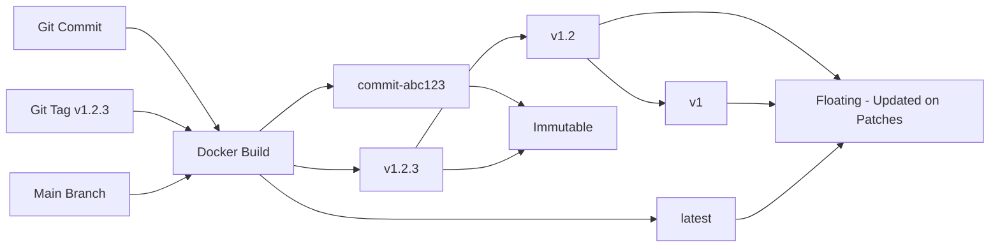

# Docker Image Versioning Convention

This document describes the Docker image tagging strategy and metadata labels for cryptofeed container images.

## Table of Contents

- [Overview](#overview)
- [Tag Naming Convention](#tag-naming-convention)
- [Metadata Labels](#metadata-labels)
- [Build Process](#build-process)
- [Examples](#examples)
- [Best Practices](#best-practices)

## Overview

Cryptofeed Docker images follow a multi-tag strategy aligned with Git semantic versioning. Each image build generates multiple tags and applies comprehensive metadata labels for traceability and version management.

**Key Principles:**
- **Semantic Versioning:** Images follow semver (vX.Y.Z) aligned with Git tags
- **Traceability:** Every image tagged with Git commit SHA for source code tracking
- **Multi-Tag Strategy:** Single build produces multiple tags (latest, semver variants, commit SHA)
- **Metadata Labels:** OCI-compliant labels for version, timestamp, and Git metadata

## Tag Naming Convention

### Standard Tags

| Tag Format | Description | Example | Lifecycle |
|------------|-------------|---------|-----------|
| `latest` | Latest stable build from main branch | `cryptofeed:latest` | Updated on every main branch build |
| `vX.Y.Z` | Full semantic version (patch level) | `cryptofeed:v1.2.3` | Immutable, created on Git tag |
| `vX.Y` | Minor version (patch floating) | `cryptofeed:v1.2` | Updated on patch releases |
| `vX` | Major version (minor/patch floating) | `cryptofeed:v1` | Updated on minor/patch releases |
| `commit-{sha}` | Git commit SHA (12 chars) | `cryptofeed:commit-7d74c6d52b74` | Immutable, unique per commit |
| `dev` | Development/unstaged builds | `cryptofeed:dev` | Ephemeral, manual builds |

### Tag Selection Matrix

| Use Case | Recommended Tag | Rationale |
|----------|----------------|-----------|
| **Production deployments** | `vX.Y.Z` (full semver) | Immutable, predictable, no surprises |
| **Staging environments** | `vX.Y` (minor version) | Auto-receive patch fixes, stable API |
| **Development environments** | `latest` or `commit-{sha}` | Latest features or exact commit reproduction |
| **CI/CD pipelines** | `commit-{sha}` | Reproducible builds, exact source traceability |
| **Quick testing** | `latest` | Fastest to type, always current |

### Tag Lifecycle



## Metadata Labels

### Standard Labels

Every image includes the following metadata labels following [OCI Image Spec](https://github.com/opencontainers/image-spec/blob/main/annotations.md):

| Label Key | Description | Example Value | Source |
|-----------|-------------|---------------|--------|
| `version` | Semantic version or dev version | `v1.2.3` | Git tag or `git describe` |
| `build_timestamp` | ISO 8601 build timestamp | `2025-12-12T10:30:00Z` | Build time (UTC) |
| `git_commit_sha` | Full Git commit SHA (40 chars) | `7d74c6d52b74...` | `git rev-parse HEAD` |
| `git_branch` | Git branch name | `main` | `git rev-parse --abbrev-ref HEAD` |
| `org.opencontainers.image.version` | OCI version label | `v1.2.3` | Same as `version` |
| `org.opencontainers.image.created` | OCI creation timestamp | `2025-12-12T10:30:00Z` | Same as `build_timestamp` |
| `org.opencontainers.image.revision` | OCI revision (commit SHA) | `7d74c6d52b74...` | Same as `git_commit_sha` |
| `org.opencontainers.image.source` | Source code repository | `https://github.com/bmoscon/cryptofeed` | Static |

### Inspecting Image Labels

```bash
# View all labels
docker inspect cryptofeed:latest --format '{{json .Config.Labels}}' | jq

# Extract specific label
docker inspect cryptofeed:latest --format '{{index .Config.Labels "version"}}'
docker inspect cryptofeed:latest --format '{{index .Config.Labels "git_commit_sha"}}'

# View multiple labels in formatted output
docker inspect cryptofeed:latest --format '
Version:         {{index .Config.Labels "version"}}
Build Timestamp: {{index .Config.Labels "build_timestamp"}}
Git Commit:      {{index .Config.Labels "git_commit_sha"}}
Git Branch:      {{index .Config.Labels "git_branch"}}
'
```

## Build Process

### Using the Build Script

The `build.sh` script automates tag generation and metadata label application:

```bash
# Build locally (cryptofeed:latest)
./build.sh

# Build with custom image name
./build.sh myapp

# Build with registry prefix
./build.sh cryptofeed docker.io/myorg

# Build and push to registry
PUSH=true ./build.sh cryptofeed docker.io/myorg
```

### Build Script Behavior

1. **Extract Git Metadata:**
   - Detects semantic version from Git tags (`git describe --tags`)
   - Reads full commit SHA (`git rev-parse HEAD`)
   - Identifies current branch (`git rev-parse --abbrev-ref HEAD`)
   - Generates ISO 8601 build timestamp

2. **Generate Tags:**
   - Always creates: `latest`, `commit-{sha}`
   - If on tagged commit (vX.Y.Z): creates `vX.Y.Z`, `vX.Y`, `vX`
   - If not on tagged commit: uses `git describe` output as version

3. **Build Image:**
   - Passes metadata as `--build-arg` to Dockerfile
   - Applies all tags simultaneously (`-t` flags)
   - Labels runtime stage with metadata

4. **Verify Build:**
   - Lists all created tags
   - Inspects metadata labels
   - Optionally pushes to registry if `PUSH=true`

### Manual Build (without script)

```bash
# Extract Git metadata
VERSION=$(git describe --tags --always)
COMMIT_SHA=$(git rev-parse HEAD)
BRANCH=$(git rev-parse --abbrev-ref HEAD)
BUILD_TIMESTAMP=$(date -u +"%Y-%m-%dT%H:%M:%SZ")

# Build with tags and metadata
docker build \
  -t cryptofeed:latest \
  -t cryptofeed:${VERSION} \
  -t cryptofeed:commit-${COMMIT_SHA:0:12} \
  --build-arg VERSION="${VERSION}" \
  --build-arg BUILD_TIMESTAMP="${BUILD_TIMESTAMP}" \
  --build-arg GIT_COMMIT_SHA="${COMMIT_SHA}" \
  --build-arg GIT_BRANCH="${BRANCH}" \
  .
```

## Examples

### Example 1: Tagged Release (v1.2.3)

```bash
# On Git tag v1.2.3, commit 7d74c6d52b74...
./build.sh

# Creates tags:
#   cryptofeed:latest
#   cryptofeed:v1.2.3
#   cryptofeed:v1.2
#   cryptofeed:v1
#   cryptofeed:commit-7d74c6d52b74

# Metadata labels:
#   version: v1.2.3
#   build_timestamp: 2025-12-12T10:30:00Z
#   git_commit_sha: 7d74c6d52b74dcd4a0346fa9652173be26987f07
#   git_branch: main
```

### Example 2: Development Build (untagged)

```bash
# On branch feature/kafka-proto-backend, commit abc123...
./build.sh

# Creates tags:
#   cryptofeed:latest
#   cryptofeed:commit-abc123def456

# Metadata labels:
#   version: v3.0.0-446-gabc123 (from git describe)
#   build_timestamp: 2025-12-12T11:00:00Z
#   git_commit_sha: abc123def456789012345678901234567890abcd
#   git_branch: feature/kafka-proto-backend
```

### Example 3: CI/CD Pipeline Build

```yaml
# .github/workflows/docker-build.yml
- name: Build and push Docker image
  run: |
    export PUSH=true
    ./build.sh cryptofeed ghcr.io/myorg
```

Creates and pushes:
- `ghcr.io/myorg/cryptofeed:latest`
- `ghcr.io/myorg/cryptofeed:v1.2.3`
- `ghcr.io/myorg/cryptofeed:v1.2`
- `ghcr.io/myorg/cryptofeed:v1`
- `ghcr.io/myorg/cryptofeed:commit-7d74c6d5`

## Best Practices

### For Deployment

1. **Production:** Use full semantic version (`vX.Y.Z`) for predictability
   ```yaml
   # k3s deployment
   spec:
     containers:
     - name: cryptofeed
       image: cryptofeed:v1.2.3  # Immutable, no surprises
   ```

2. **Staging:** Use minor version (`vX.Y`) to auto-receive patch fixes
   ```yaml
   spec:
     containers:
     - name: cryptofeed
       image: cryptofeed:v1.2  # Auto-updates for patches
   ```

3. **Development:** Use `latest` or `commit-{sha}` for rapid iteration
   ```yaml
   # docker-compose.yml
   services:
     cryptofeed:
       image: cryptofeed:latest  # Always current
   ```

### For CI/CD

1. **Reproducibility:** Use `commit-{sha}` tags for exact source tracking
   ```bash
   # Deploy specific commit to staging
   kubectl set image deployment/cryptofeed \
     cryptofeed=cryptofeed:commit-7d74c6d5
   ```

2. **Rollback:** Keep commit tags for easy rollback to known-good versions
   ```bash
   # Rollback to previous commit
   kubectl rollout undo deployment/cryptofeed
   ```

3. **Testing:** Verify image labels before deployment
   ```bash
   # CI pipeline validation
   EXPECTED_SHA="abc123..."
   ACTUAL_SHA=$(docker inspect cryptofeed:latest \
     --format '{{index .Config.Labels "git_commit_sha"}}')

   if [ "$ACTUAL_SHA" != "$EXPECTED_SHA" ]; then
     echo "ERROR: Image SHA mismatch"
     exit 1
   fi
   ```

### For Debugging

1. **Incident Investigation:** Use `git_commit_sha` label to identify exact source
   ```bash
   # Find source code for running container
   COMMIT_SHA=$(docker inspect cryptofeed-container \
     --format '{{index .Config.Labels "git_commit_sha"}}')

   git checkout $COMMIT_SHA
   ```

2. **Version Verification:** Check build timestamp to detect stale images
   ```bash
   # Check image age
   BUILD_TIME=$(docker inspect cryptofeed:latest \
     --format '{{index .Config.Labels "build_timestamp"}}')

   echo "Image built at: $BUILD_TIME"
   ```

3. **Branch Tracking:** Verify image branch matches deployment expectations
   ```bash
   # Ensure production images from main branch
   BRANCH=$(docker inspect cryptofeed:v1.2.3 \
     --format '{{index .Config.Labels "git_branch"}}')

   if [ "$BRANCH" != "main" ]; then
     echo "WARNING: Production image not from main branch"
   fi
   ```

## Troubleshooting

### Issue: Tags not created

**Symptom:** Only `latest` tag created, no semantic version tags

**Cause:** Not on a Git tagged commit

**Solution:**
```bash
# Check current Git state
git describe --tags --always

# If output is like "v3.0.0-446-g7d74c6d5" (not exact tag),
# you are 446 commits ahead of tag v3.0.0

# To create release tag:
git tag -a v1.2.3 -m "Release v1.2.3"
git push origin v1.2.3
```

### Issue: Labels missing or incorrect

**Symptom:** `docker inspect` shows empty labels

**Cause:** Build args not passed to Dockerfile

**Solution:**
```bash
# Use build.sh script (handles args automatically)
./build.sh

# Or pass args manually
docker build \
  --build-arg VERSION="v1.2.3" \
  --build-arg BUILD_TIMESTAMP="$(date -u +"%Y-%m-%dT%H:%M:%SZ")" \
  --build-arg GIT_COMMIT_SHA="$(git rev-parse HEAD)" \
  --build-arg GIT_BRANCH="$(git rev-parse --abbrev-ref HEAD)" \
  .
```

### Issue: Multiple `:latest` tags for different commits

**Symptom:** `docker images` shows multiple images tagged `latest`

**Cause:** Previous builds not cleaned up

**Solution:**
```bash
# Remove dangling images
docker image prune

# Or remove specific old image
docker rmi cryptofeed:latest
./build.sh  # Rebuild
```

## Reference

- [Docker Build Documentation](https://docs.docker.com/engine/reference/commandline/build/)
- [OCI Image Spec Annotations](https://github.com/opencontainers/image-spec/blob/main/annotations.md)
- [Semantic Versioning 2.0.0](https://semver.org/)
- [Docker Image Tagging Best Practices](https://docs.docker.com/develop/dev-best-practices/#tag-naming-convention)
