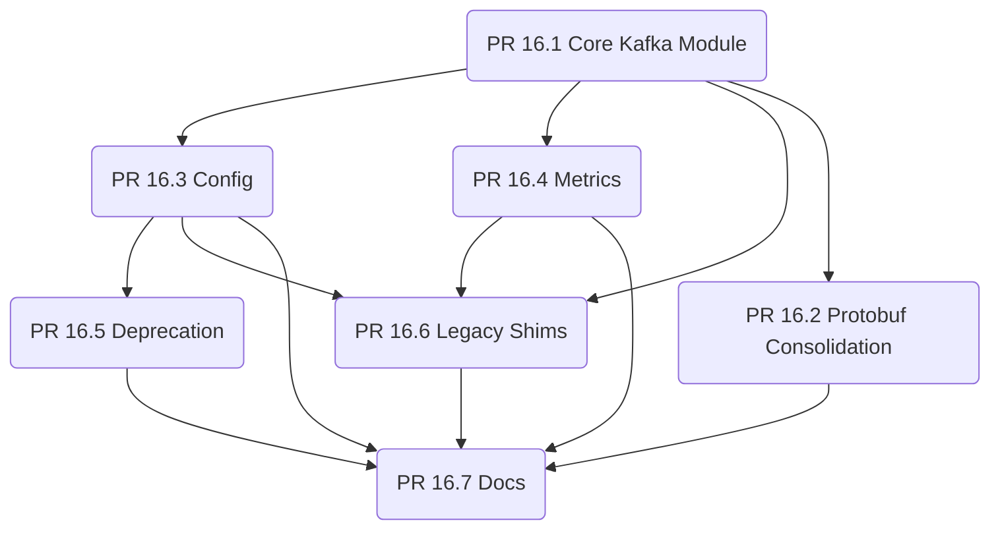

# PR Split Plan for PR #16 (Kafka Backend Refactor)

## Dependency Graph (Mermaid)

## 4-Week Merge Timeline

- **Week 1**: PR 16.1 (Core Kafka Module), PR 16.2 (Protobuf) in parallel
- **Week 2**: PR 16.3 (Config) and PR 16.4 (Metrics) after 16.1
- **Week 3**: PR 16.5 (Deprecation) after 16.3; PR 16.6 (Legacy Shims) after 16.1/16.3/16.4
- **Week 4**: PR 16.7 (Docs) after all prior PRs merged

## Rollback Strategy

- Each PR is independently revertible via `git revert <merge-commit>`.
- If a downstream PR fails tests, revert it without touching earlier merged PRs.
- Keep branches `kafka-backend-1` through `kafka-backend-7` for quick hotfix cherry-picks.

## Integration Test Checkpoints

- After PR 16.1 merge: run core Kafka unit suite and smoke integration (`tests/integration/kafka/test_kafka_protobuf_e2e.py`).
- After PR 16.3 and 16.4 merges: run Kafka integration tests covering config + metrics.
- After PR 16.6 merge: run backward-compatibility and regression stability tests.
- After PR 16.7 merge: run full Kafka integration suite plus `test_kafka_refactor_complete` (to be added in Task 5.3).

## Review Load Guardrails

- Enforce <100 files and <5,000 additions per PR (CI workflow `pr-size-check.yml`).
- Docs-only PRs are exempted automatically.

## Team Coordination Notes

- Parallel review allowed for 16.1 and 16.2 only; all others follow dependency order.
- Assign owners per PR to keep review cycles under 2 hours.
- Document any rebase/cherry-pick in the PR description to preserve traceability.
